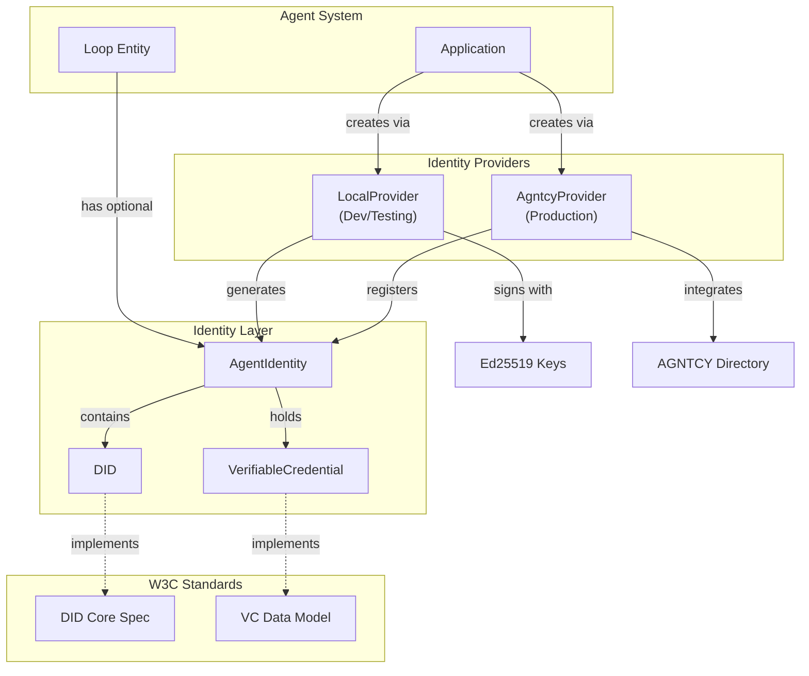

# Agent Identity Package

DID-based cryptographic identity for AGNTCY integration in SemStreams.

## Overview

The `identity` package provides a complete identity layer for agents participating in the AGNTCY (Internet of
Agents) ecosystem. It implements W3C standards for Decentralized Identifiers (DIDs) and Verifiable Credentials (VCs),
enabling agents to establish cryptographically-verifiable identities without centralized registries.

**Key Features:**

- **DID Support**: Multiple DID methods (did:key, did:web, did:agntcy)
- **Verifiable Credentials**: W3C-compliant credential issuance and verification
- **Provider Abstraction**: Pluggable identity providers (local, AGNTCY service)
- **Agent Capabilities**: Credential-based capability attestation
- **Delegation**: Authority delegation between agents

## Architecture



## Core Types

### DID (Decentralized Identifier)

Self-sovereign identifier following W3C DID Core specification.

```go
type DID struct {
    Method   string // "key", "web", "agntcy"
    ID       string // Method-specific identifier
    Fragment string // Optional fragment (e.g., key reference)
}
```

**Format:** `did:method:method-specific-id[#fragment]`

**Examples:**

```go
// Public key-based DID (default for local provider)
did := identity.NewKeyDID("z6MkhaXgBZDvotDkL5257faiztiGiC2QtKLGpbnnEGta2doK")
// did:key:z6MkhaXgBZDvotDkL5257faiztiGiC2QtKLGpbnnEGta2doK

// DNS-based DID
did := identity.NewWebDID("example.com", "agents", "alice")
// did:web:example.com:agents:alice

// AGNTCY-specific DID
did := identity.NewAgntcyDID("agent-123")
// did:agntcy:agent-123

// Parsing DIDs
did, err := identity.ParseDID("did:key:z123#key-1")
if err != nil {
    log.Fatal(err)
}
fmt.Println(did.Method)   // "key"
fmt.Println(did.ID)       // "z123"
fmt.Println(did.Fragment) // "key-1"
```

**Common Operations:**

```go
// String conversion
didStr := did.String() // "did:key:z123"

// Fragment manipulation
withKey := did.WithFragment("key-1")    // Copy with fragment
withoutKey := did.WithoutFragment()     // Copy without fragment

// Comparison
if did1.Equal(did2) {
    // Exact match including fragment
}
if did1.EqualIgnoreFragment(did2) {
    // Match ignoring fragment
}

// Method checking
if did.IsMethod(identity.MethodKey) {
    // This is a did:key
}

// Validation
if err := did.Validate(); err != nil {
    log.Fatal(err)
}
```

### VerifiableCredential

W3C Verifiable Credential for attestations and delegations.

```go
type VerifiableCredential struct {
    Context           []string          // JSON-LD contexts
    ID                string            // Unique credential ID
    Type              []string          // Credential types
    Issuer            string            // Issuer DID
    IssuanceDate      time.Time         // When issued
    ExpirationDate    *time.Time        // Optional expiration
    CredentialSubject json.RawMessage   // Claims
    Proof             *Proof            // Cryptographic proof
    CredentialStatus  *CredentialStatus // Revocation info
}
```

**Credential Types:**

- `AgentCapabilityCredential`: Attests agent capabilities
- `AgentDelegationCredential`: Delegates authority between agents
- `AgentIdentityCredential`: Verifies agent identity

**Creating Credentials:**

```go
// Capability credential
cred, err := identity.NewAgentCapabilityCredential(
    "urn:uuid:"+uuid.New().String(),
    issuerDID.String(),
    agentDID.String(),
    "code-review",
    0.95, // Confidence level
)

// Delegation credential
cred, err := identity.NewAgentDelegationCredential(
    "urn:uuid:"+uuid.New().String(),
    issuerDID.String(),
    delegateDID.String(),
    delegatorDID.String(),
    []string{"deploy", "rollback"},
)

// Generic credential
subject := map[string]any{
    "id": agentDID.String(),
    "skill": "Go development",
}
cred, err := identity.NewVerifiableCredential(
    "urn:uuid:"+uuid.New().String(),
    issuerDID.String(),
    "CustomCredential",
    subject,
)
```

**Working with Credentials:**

```go
// Validation
if err := cred.Validate(); err != nil {
    log.Fatal(err)
}

// Expiration check
if cred.IsExpired() {
    log.Println("Credential expired")
}

// Type checking
if cred.HasType(identity.TypeAgentCapabilityCredential) {
    // This is a capability credential
}

// Extract subject
var subject identity.AgentCapabilitySubject
if err := cred.GetSubject(&subject); err != nil {
    log.Fatal(err)
}
fmt.Println(subject.Capability) // "code-review"
fmt.Println(subject.Confidence) // 0.95

// Add expiration
expiry := time.Now().Add(30 * 24 * time.Hour)
credWithExp := cred.WithExpiration(expiry)

// Add proof
proof := &identity.Proof{
    Type:               "Ed25519Signature2020",
    Created:            time.Now().UTC(),
    VerificationMethod: issuerDID.WithFragment("key-1").String(),
    ProofPurpose:       identity.PurposeAssertionMethod,
    ProofValue:         "base64-encoded-signature",
}
credWithProof := cred.WithProof(proof)
```

### AgentIdentity

Complete agent identity combining DID, credentials, and metadata.

```go
type AgentIdentity struct {
    DID          DID                    // Decentralized identifier
    DisplayName  string                 // Human-readable name
    Credentials  []VerifiableCredential // Held credentials
    InternalRole string                 // Local system role
    Created      time.Time              // Creation timestamp
    Updated      time.Time              // Last update
    Metadata     map[string]any         // Additional metadata
}
```

**Creating and Managing Identities:**

```go
// Create identity
did := identity.NewKeyDID("z123")
agent := identity.NewAgentIdentity(*did, "Code Reviewer")
agent.InternalRole = "reviewer"

// Add capability credential
capCred, _ := identity.NewAgentCapabilityCredential(
    "urn:uuid:cap-1",
    issuerDID.String(),
    agent.DIDString(),
    "code-review",
    0.9,
)
agent.AddCredential(*capCred)

// Get credentials by type
capCreds := agent.GetCredentialsByType(identity.TypeAgentCapabilityCredential)

// Get only valid (non-expired) credentials
validCreds := agent.GetValidCredentials()

// Check capability
if agent.HasCapability("code-review") {
    fmt.Println("Agent can review code")
}

// Get all capabilities
capabilities := agent.GetCapabilities()
// ["code-review", "testing"]

// Remove credential
if agent.RemoveCredential("urn:uuid:cap-1") {
    fmt.Println("Credential removed")
}

// Metadata
agent.SetMetadata("team", "backend")
if team, ok := agent.GetMetadata("team"); ok {
    fmt.Println(team) // "backend"
}

// Validation
if err := agent.Validate(); err != nil {
    log.Fatal(err)
}

// Role modification
updatedAgent := agent.WithInternalRole("senior-reviewer")
```

## Provider Interface

Providers manage the lifecycle of agent identities.

```go
type Provider interface {
    CreateIdentity(ctx context.Context, opts CreateIdentityOptions) (*AgentIdentity, error)
    ResolveIdentity(ctx context.Context, did DID) (*AgentIdentity, error)
    IssueCredential(ctx context.Context, subject DID, credType string, claims any) (*VerifiableCredential, error)
    VerifyCredential(ctx context.Context, cred *VerifiableCredential) (bool, error)
    UpdateIdentity(ctx context.Context, identity *AgentIdentity) error
    DeleteIdentity(ctx context.Context, did DID) error
}
```

## Provider Implementations

### LocalProvider

In-memory provider for development, testing, and single-node deployments.

**Features:**

- Local Ed25519 key generation
- In-memory identity and key storage
- Self-issued credentials with did:key method
- No external dependencies

**Usage:**

```go
// Create provider
provider, err := identity.NewLocalProvider(identity.ProviderConfig{
    ProviderType: "local",
})
if err != nil {
    log.Fatal(err)
}

// Create identity
ctx := context.Background()
agent, err := provider.CreateIdentity(ctx, identity.CreateIdentityOptions{
    DisplayName:         "Code Reviewer",
    InternalRole:        "reviewer",
    InitialCapabilities: []string{"code-review", "testing"},
    Metadata: map[string]any{
        "team": "backend",
    },
})
if err != nil {
    log.Fatal(err)
}

fmt.Println(agent.DIDString())
// did:key:z6MkhaXgBZDvotDkL5257faiztiGiC2QtKLGpbnnEGta2doK

// Resolve identity
resolved, err := provider.ResolveIdentity(ctx, agent.DID)
if err != nil {
    log.Fatal(err)
}

// Issue additional credential
cred, err := provider.IssueCredential(
    ctx,
    agent.DID,
    identity.TypeAgentCapabilityCredential,
    identity.AgentCapabilitySubject{
        ID:         agent.DIDString(),
        Capability: "deployment",
        Confidence: 0.8,
    },
)
if err != nil {
    log.Fatal(err)
}

// Verify credential
valid, err := provider.VerifyCredential(ctx, cred)
if err != nil {
    log.Fatal(err)
}
if !valid {
    log.Fatal("Credential verification failed")
}

// Update identity
agent.DisplayName = "Senior Code Reviewer"
if err := provider.UpdateIdentity(ctx, agent); err != nil {
    log.Fatal(err)
}

// Delete identity
if err := provider.DeleteIdentity(ctx, agent.DID); err != nil {
    log.Fatal(err)
}
```

### AgntcyProvider

Provider for integration with the AGNTCY service (stub implementation).

**Configuration:**

```go
provider, err := identity.NewAgntcyProvider(identity.ProviderConfig{
    ProviderType: "agntcy",
    AgntcyURL:    "https://directory.agntcy.org",
    IssuerDID:    "did:agntcy:my-org",
})
```

**Status:** Stub implementation awaiting AGNTCY SDK integration. All methods currently return
`ErrProviderNotConfigured`.

**Future Integration:**

- DID registration in AGNTCY directory
- Credential issuance via AGNTCY signing service
- DID resolution from AGNTCY directory
- Credential revocation status checks

### Provider Factory

Create providers dynamically based on configuration:

```go
provider, err := identity.DefaultProviderFactory(identity.ProviderConfig{
    ProviderType: "local", // or "agntcy"
})
if err != nil {
    log.Fatal(err)
}
```

**Supported Provider Types:**

- `"local"` or `""` (empty) - LocalProvider
- `"agntcy"` - AgntcyProvider (requires AgntcyURL)

## Integration with Agentic Loop

The `LoopEntity` type includes an optional `Identity` field for AGNTCY integration:

```go
import (
    "github.com/c360/semstreams/agentic"
    "github.com/c360/semstreams/agentic/identity"
)

// Create identity
provider, _ := identity.NewLocalProvider(identity.ProviderConfig{})
ctx := context.Background()
agentIdentity, _ := provider.CreateIdentity(ctx, identity.CreateIdentityOptions{
    DisplayName:         "Architect Agent",
    InternalRole:        "architect",
    InitialCapabilities: []string{"design", "review"},
})

// Create loop with identity
loop := agentic.LoopEntity{
    ID:       "loop-123",
    Identity: agentIdentity,
    Config: agentic.LoopConfig{
        Role:        "architect",
        Description: "System design and API contracts",
    },
}

// Access identity in loop
if loop.Identity != nil {
    fmt.Println("Agent DID:", loop.Identity.DIDString())

    if loop.Identity.HasCapability("design") {
        // Execute design tasks
    }
}
```

## Common Patterns

### Creating Agents with Capabilities

```go
provider, _ := identity.NewLocalProvider(identity.ProviderConfig{})
ctx := context.Background()

// Create developer agent
developer, _ := provider.CreateIdentity(ctx, identity.CreateIdentityOptions{
    DisplayName: "Go Developer",
    InternalRole: "go-developer",
    InitialCapabilities: []string{
        "backend-implementation",
        "unit-testing",
        "api-design",
    },
})

// Create reviewer agent
reviewer, _ := provider.CreateIdentity(ctx, identity.CreateIdentityOptions{
    DisplayName: "Code Reviewer",
    InternalRole: "go-reviewer",
    InitialCapabilities: []string{
        "code-review",
        "performance-analysis",
        "security-audit",
    },
})
```

### Delegating Authority

```go
// Reviewer delegates deployment capability to developer
delegationCred, _ := identity.NewAgentDelegationCredential(
    "urn:uuid:"+uuid.New().String(),
    reviewer.DIDString(),
    developer.DIDString(), // Delegate (receiving authority)
    reviewer.DIDString(),   // Delegator (granting authority)
    []string{"deploy-staging"},
)

// Add delegation credential to developer
developer.AddCredential(*delegationCred)

// Developer can now check delegation
delegations := developer.GetCredentialsByType(identity.TypeAgentDelegationCredential)
for _, cred := range delegations {
    var subject identity.AgentDelegationSubject
    if err := cred.GetSubject(&subject); err == nil {
        fmt.Println("Delegated capabilities:", subject.Capabilities)
    }
}
```

### Capability Verification

```go
// Check if agent has required capability
func canPerformTask(agent *identity.AgentIdentity, task string) bool {
    switch task {
    case "code-review":
        return agent.HasCapability("code-review")
    case "deploy":
        return agent.HasCapability("deployment")
    default:
        return false
    }
}

// Get capability confidence
func getCapabilityConfidence(agent *identity.AgentIdentity, capability string) float64 {
    creds := agent.GetCredentialsByType(identity.TypeAgentCapabilityCredential)
    for _, cred := range creds {
        if cred.IsExpired() {
            continue
        }
        var subject identity.AgentCapabilitySubject
        if err := cred.GetSubject(&subject); err == nil {
            if subject.Capability == capability {
                return subject.Confidence
            }
        }
    }
    return 0.0
}
```

### Credential Lifecycle Management

```go
// Issue time-limited credential
func issueTemporaryAccess(
    provider identity.Provider,
    ctx context.Context,
    agent *identity.AgentIdentity,
    capability string,
    duration time.Duration,
) error {
    cred, err := provider.IssueCredential(
        ctx,
        agent.DID,
        identity.TypeAgentCapabilityCredential,
        identity.AgentCapabilitySubject{
            ID:         agent.DIDString(),
            Capability: capability,
            Confidence: 1.0,
        },
    )
    if err != nil {
        return err
    }

    // Add expiration
    expiry := time.Now().Add(duration)
    credWithExp := cred.WithExpiration(expiry)

    agent.AddCredential(*credWithExp)
    return provider.UpdateIdentity(ctx, agent)
}

// Cleanup expired credentials
func cleanupExpiredCredentials(agent *identity.AgentIdentity) {
    validCreds := agent.GetValidCredentials()
    agent.Credentials = validCreds
    agent.Updated = time.Now().UTC()
}
```

## Error Handling

```go
import "errors"

// Common identity errors
var (
    ErrDisplayNameRequired    = errors.New("display name is required")
    ErrUnknownProviderType    = errors.New("unknown provider type")
    ErrIdentityNotFound       = errors.New("identity not found")
    ErrCredentialInvalid      = errors.New("credential is invalid")
    ErrCredentialExpired      = errors.New("credential has expired")
    ErrSignatureInvalid       = errors.New("signature verification failed")
    ErrKeyNotFound            = errors.New("key not found")
    ErrProviderNotConfigured  = errors.New("provider not configured")
    ErrUnsupportedMethod      = errors.New("unsupported DID method")
)

// Error handling pattern
agent, err := provider.CreateIdentity(ctx, opts)
if err != nil {
    if errors.Is(err, identity.ErrDisplayNameRequired) {
        // Handle validation error
    } else if errors.Is(err, identity.ErrUnsupportedMethod) {
        // Handle unsupported DID method
    } else {
        // Handle other errors
    }
}

// Credential verification
valid, err := provider.VerifyCredential(ctx, cred)
if err != nil {
    if errors.Is(err, identity.ErrCredentialExpired) {
        // Credential expired
    } else if errors.Is(err, identity.ErrSignatureInvalid) {
        // Signature verification failed
    }
}
```

## Testing

### Running Tests

```bash
# Unit tests
go test -v ./agentic/identity/...

# With race detector
go test -race -v ./agentic/identity/...

# Specific test
go test -v -run TestLocalProvider_CreateIdentity ./agentic/identity/
```

### Test Coverage

```bash
# Generate coverage report
go test -coverprofile=coverage.out ./agentic/identity/...
go tool cover -html=coverage.out
```

### Example Test

```go
func TestAgentCapability(t *testing.T) {
    // Setup provider
    provider, err := identity.NewLocalProvider(identity.ProviderConfig{})
    if err != nil {
        t.Fatalf("NewLocalProvider() error = %v", err)
    }

    ctx := context.Background()

    // Create agent with capabilities
    agent, err := provider.CreateIdentity(ctx, identity.CreateIdentityOptions{
        DisplayName:         "Test Agent",
        InitialCapabilities: []string{"testing"},
    })
    if err != nil {
        t.Fatalf("CreateIdentity() error = %v", err)
    }

    // Verify capability
    if !agent.HasCapability("testing") {
        t.Error("expected agent to have 'testing' capability")
    }

    // Verify credential validity
    creds := agent.GetValidCredentials()
    if len(creds) == 0 {
        t.Error("expected at least one valid credential")
    }
}
```

## References

### Standards

- [W3C DID Core Specification](https://www.w3.org/TR/did-core/)
- [W3C Verifiable Credentials Data Model](https://www.w3.org/TR/vc-data-model/)
- [DID Method Registry](https://www.w3.org/TR/did-spec-registries/)

### SemStreams Documentation

- [ADR-019: AGNTCY Integration](/Users/coby/Code/c360/semstreams/docs/adr/019-agntcy-integration.md)
- [DID Identity Concepts](/Users/coby/Code/c360/semstreams/docs/concepts/21-did-identity.md)
- [Agentic Package](/Users/coby/Code/c360/semstreams/agentic/)

### External Resources

- [DID Primer](https://github.com/WebOfTrustInfo/rwot7-toronto/blob/master/topics-and-advance-readings/did-primer.md)
- [Verifiable Credentials Use Cases](https://www.w3.org/TR/vc-use-cases/)
- [Ed25519 Signature Scheme](https://ed25519.cr.yp.to/)

## Security Considerations

### Key Management

**LocalProvider** stores private keys in memory only. For production use:

- Implement persistent key storage with encryption
- Use hardware security modules (HSMs) for key protection
- Rotate keys periodically
- Implement key backup and recovery procedures

### Credential Verification

Always verify credentials before trusting claims:

```go
// Don't trust credentials blindly
valid, err := provider.VerifyCredential(ctx, cred)
if err != nil || !valid {
    return errors.New("credential verification failed")
}

// Check expiration
if cred.IsExpired() {
    return errors.New("credential expired")
}

// Verify issuer is trusted
trustedIssuers := []string{"did:agntcy:my-org", "did:key:trusted-key"}
if !contains(trustedIssuers, cred.Issuer) {
    return errors.New("untrusted issuer")
}
```

### DID Resolution

When resolving DIDs from external sources:

- Implement DID method-specific resolution logic
- Verify DID document signatures
- Check for DID document revocation
- Cache DID documents with appropriate TTL

### Credential Revocation

For production systems, implement credential revocation:

- Use `CredentialStatus` field with revocation list URL
- Check revocation status before accepting credentials
- Implement status list 2021 or similar revocation mechanism

## Future Enhancements

- [ ] Complete AGNTCY service integration in AgntcyProvider
- [ ] Persistent key storage for LocalProvider
- [ ] DID document resolution and verification
- [ ] Credential revocation support (Status List 2021)
- [ ] Additional DID methods (did:peer, did:ethr)
- [ ] Proof generation with actual cryptographic signatures
- [ ] Support for multiple proof formats (JWS, LD Proofs)
- [ ] Credential presentation and selective disclosure
- [ ] Agent reputation scoring based on credential history
