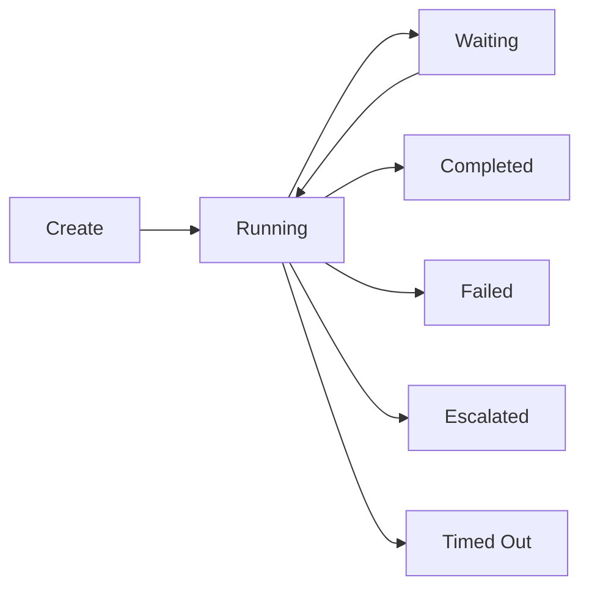

# Reactive Workflow Configuration Reference

Complete reference for configuring and building reactive workflows in SemStreams. The reactive workflow
engine replaces JSON-based DAG workflows with Go code that provides compile-time type safety, direct field
access, and standard Go tooling.

## Overview

Reactive workflows are defined in Go code using the builder pattern. Workflows react to state changes in
NATS KV buckets and messages on JetStream subjects. Rules fire when conditions are met, executing actions
that publish messages, mutate state, or complete execution.

**Key Benefits:**

- **Compile-time validation**: Typos and type mismatches caught by the Go compiler
- **Type-safe field access**: `state.Verdict` instead of `"${steps.review.verdict}"`
- **Go debugging**: Full debugger support with breakpoints and stack traces
- **Minimal serialization**: 2 boundaries instead of 9+, zero `json.RawMessage` needed

## Engine Configuration

### Config Structure

```go
type Config struct {
    // StateBucket is the KV bucket for workflow execution state
    StateBucket string

    // CallbackStreamName is the JetStream stream for callback messages
    CallbackStreamName string

    // EventStreamName is the JetStream stream for workflow events
    EventStreamName string

    // DefaultTimeout is the default timeout for workflows
    DefaultTimeout string  // e.g., "10m"

    // DefaultMaxIterations is the default max iterations for loop workflows
    DefaultMaxIterations int

    // CleanupRetention is how long to retain completed executions
    CleanupRetention string  // e.g., "24h"

    // CleanupInterval is how often to run cleanup
    CleanupInterval string  // e.g., "1h"

    // TaskTimeoutDefault is the default timeout for async tasks
    TaskTimeoutDefault string  // e.g., "5m"

    // ConsumerNamePrefix is prepended to consumer names
    ConsumerNamePrefix string

    // EnableMetrics enables Prometheus metrics
    EnableMetrics bool
}
```

### Default Configuration

```go
config := reactive.DefaultConfig()
// Returns:
// {
//     StateBucket:          "REACTIVE_WORKFLOW_STATE",
//     CallbackStreamName:   "WORKFLOW_CALLBACKS",
//     EventStreamName:      "WORKFLOW_EVENTS",
//     DefaultTimeout:       "10m",
//     DefaultMaxIterations: 10,
//     CleanupRetention:     "24h",
//     CleanupInterval:      "1h",
//     TaskTimeoutDefault:   "5m",
//     EnableMetrics:        true,
// }
```

### Creating the Engine

```go
import (
    "github.com/c360studio/semstreams/processor/reactive"
    "github.com/c360studio/semstreams/natsclient"
)

// Create engine with default config
engine := reactive.NewEngine(
    reactive.DefaultConfig(),
    natsClient,
    reactive.WithEngineLogger(logger),
    reactive.WithEngineMetrics(metrics),
)

// Initialize the engine (creates KV buckets)
if err := engine.Initialize(ctx); err != nil {
    return err
}

// Register workflows
if err := engine.RegisterWorkflow(myWorkflow); err != nil {
    return err
}

// Start the engine (begins consuming messages and watching KV)
if err := engine.Start(ctx); err != nil {
    return err
}

// Later: stop the engine
engine.Stop()
```

## Workflow Definition

Workflows are built using the fluent builder API. Each workflow defines its ID, state type, rules, and
lifecycle configuration.

### Builder Pattern

```go
func ReviewFixCycleWorkflow() *reactive.Definition {
    return reactive.NewWorkflow("review-fix-cycle").
        WithDescription("Review and fix code until approved").
        WithStateBucket("REVIEW_FIX_STATE").
        WithStateFactory(func() any { return &ReviewFixState{} }).
        WithMaxIterations(3).
        WithTimeout(30 * time.Minute).
        WithOnComplete("events.workflow.completed").
        WithOnFail("events.workflow.failed").
        WithOnEscalate("events.workflow.escalated").
        AddRule(requestReviewRule()).
        AddRule(applyFixesRule()).
        AddRule(completeApprovedRule()).
        MustBuild()
}
```

### Workflow Fields

| Method | Parameter | Description |
|--------|-----------|-------------|
| `NewWorkflow` | `id string` | Unique workflow identifier (required) |
| `WithDescription` | `desc string` | Human-readable description |
| `WithStateBucket` | `bucket string` | KV bucket for execution state (required) |
| `WithStateFactory` | `func() any` | Factory for state instances (required) |
| `WithMaxIterations` | `n int` | Maximum loop iterations (0 = unlimited) |
| `WithTimeout` | `duration` | Maximum execution duration |
| `WithOnComplete` | `subject string` | Subject to publish on completion |
| `WithOnFail` | `subject string` | Subject to publish on failure |
| `WithOnEscalate` | `subject string` | Subject to publish on escalation |
| `AddRule` | `RuleDef` | Add a rule to the workflow |

### State Types

Each workflow defines its own state type that embeds `ExecutionState`:

```go
type ReviewFixState struct {
    reactive.ExecutionState
    Code    string        `json:"code"`
    Verdict string        `json:"verdict"`
    Issues  []Issue       `json:"issues"`
}

// StateFactory returns a zero-value instance
func() any { return &ReviewFixState{} }
```

**ExecutionState Fields:**

```go
type ExecutionState struct {
    ID              string            // Unique execution identifier
    WorkflowID      string            // References workflow definition
    Phase           string            // Current execution phase
    Iteration       int               // Loop/retry counter
    Status          ExecutionStatus   // Overall status
    Error           string            // Last error message
    PendingTaskID   string            // Set when waiting for callback
    PendingRuleID   string            // Rule awaiting callback
    CreatedAt       time.Time         // Execution start time
    UpdatedAt       time.Time         // Last state update
    CompletedAt     *time.Time        // Completion time
    Deadline        *time.Time        // Timeout deadline
    Timeline        []TimelineEntry   // Rule firing history
}
```

**Execution Statuses:**

- `StatusPending`: Created but not started
- `StatusRunning`: Actively processing rules
- `StatusWaiting`: Waiting for async callback
- `StatusCompleted`: Finished successfully
- `StatusFailed`: Failed with error
- `StatusEscalated`: Escalated (e.g., max iterations exceeded)
- `StatusTimedOut`: Exceeded timeout

## Rule Definition

Rules define reactive behavior: triggers, conditions, and actions. Built using the rule builder pattern.

### Builder Pattern

```go
func requestReviewRule() reactive.RuleDef {
    return reactive.NewRule("request-review").
        WatchKV("REVIEW_FIX_STATE", "review-fix.*").
        When("phase is reviewing", reactive.PhaseIs("reviewing")).
        When("no pending task", reactive.NoPendingTask()).
        PublishAsync(
            "reviewer.analyze",
            buildReviewRequest,
            "reviewer.verdict.v1",
            applyReviewResult,
        ).
        WithCooldown(5 * time.Second).
        WithMaxFirings(3).
        MustBuild()
}
```

### Rule Fields

| Method | Parameters | Description |
|--------|------------|-------------|
| `NewRule` | `id string` | Unique rule identifier (required) |
| `WatchKV` | `bucket, pattern` | Trigger on KV state changes |
| `OnSubject` | `subject, factory` | Trigger on NATS messages (Core NATS) |
| `OnJetStreamSubject` | `stream, subject, factory` | Trigger on JetStream messages |
| `WithStateLookup` | `bucket, keyFunc` | Load state for message-triggered rules |
| `When` | `description, condition` | Add condition (all must be true) |
| `WhenAll` | | Use AND logic (default) |
| `WhenAny` | | Use OR logic |
| `WithCooldown` | `duration` | Prevent rapid re-firing |
| `WithMaxFirings` | `n int` | Limit firings per execution |

## Triggers

Rules can be triggered by KV state changes, JetStream messages, or both.

### KV Watch Trigger

Triggers when a KV bucket key changes that matches the pattern:

```go
reactive.NewRule("check-temperature").
    WatchKV("ENTITY_STATES", "c360.sensors.>").
    When("temp >= 40F", func(ctx *reactive.RuleContext) bool {
        entity, ok := ctx.State.(*graph.EntityState)
        if !ok {
            return false
        }
        temp, found := entity.GetPropertyValue("sensor.measurement.fahrenheit")
        if !found {
            return false
        }
        return temp.(float64) >= 40.0
    }).
    Publish("alerts.temperature", buildAlert).
    MustBuild()
```

**Pattern Syntax:**

- `foo.bar` - Exact match
- `foo.*` - Single-level wildcard
- `foo.>` - Multi-level wildcard
- `c360.sensors.>` - All sensor keys under `c360.sensors.`

### JetStream Subject Trigger

Triggers when a message arrives on a JetStream subject:

```go
reactive.NewRule("handle-callback").
    OnJetStreamSubject(
        "WORKFLOW_CALLBACKS",
        "workflow.callback.review.>",
        func() any { return &ReviewResult{} },
    ).
    When("task_id matches", func(ctx *reactive.RuleContext) bool {
        result := ctx.Message.(*ReviewResult)
        state := ctx.State.(*ReviewState)
        return result.TaskID == state.PendingTaskID
    }).
    PublishWithMutation("processor.apply", buildApplyRequest, updateState).
    MustBuild()
```

**Message Factory:**

The message factory creates a zero-value instance for deserialization:

```go
func() any { return &ReviewResult{} }
```

The engine uses the payload registry to deserialize `BaseMessage` wrappers into typed payloads.

### Combined Trigger (Message + State)

Triggers on message arrival but loads state for condition evaluation:

```go
reactive.NewRule("correlate-event").
    OnJetStreamSubject(
        "EVENTS",
        "sensor.reading.*",
        func() any { return &SensorReading{} },
    ).
    WithStateLookup(
        "ENTITY_STATES",
        func(msg any) string {
            reading := msg.(*SensorReading)
            return "sensor." + reading.SensorID
        },
    ).
    When("reading exceeds threshold", func(ctx *reactive.RuleContext) bool {
        reading := ctx.Message.(*SensorReading)
        entity := ctx.State.(*graph.EntityState)
        threshold, _ := entity.GetPropertyValue("threshold.max")
        return reading.Value > threshold.(float64)
    }).
    Publish("alerts.threshold", buildThresholdAlert).
    MustBuild()
```

This enables "event + state" patterns where the message is the trigger but conditions evaluate both
message and accumulated state.

## Conditions

Conditions are type-safe Go functions that evaluate `RuleContext`. All conditions must be true for the rule
to fire (AND logic by default).

### Condition Function

```go
type ConditionFunc func(ctx *RuleContext) bool

type RuleContext struct {
    State      any     // Typed execution state (or nil)
    Message    any     // Typed triggering message (or nil)
    KVRevision uint64  // KV revision for optimistic concurrency
    Subject    string  // NATS subject (for message triggers)
    KVKey      string  // KV key (for KV triggers)
}
```

### Common Conditions

```go
// Phase check
When("phase is reviewing", func(ctx *reactive.RuleContext) bool {
    state := ctx.State.(*ReviewFixState)
    return state.Phase == "reviewing"
})

// Field comparison
When("verdict is approved", func(ctx *reactive.RuleContext) bool {
    state := ctx.State.(*ReviewFixState)
    return state.Verdict == "approved"
})

// No pending async task
When("no pending task", func(ctx *reactive.RuleContext) bool {
    es := reactive.ExtractExecutionState(ctx.State)
    return es == nil || es.PendingTaskID == ""
})

// Iteration limit
When("under max iterations", func(ctx *reactive.RuleContext) bool {
    es := reactive.ExtractExecutionState(ctx.State)
    return es != nil && es.Iteration < 3
})

// Message field check
When("task_id matches", func(ctx *reactive.RuleContext) bool {
    result := ctx.Message.(*ReviewResult)
    state := ctx.State.(*ReviewState)
    return result.TaskID == state.PendingTaskID
})
```

### Condition Logic

By default, all conditions must be true (AND logic):

```go
WhenAll()  // Default, explicit
```

Use OR logic to fire when any condition is true:

```go
WhenAny()
```

## Actions

Actions define what happens when a rule fires. The reactive engine supports four action types.

### Publish (Fire-and-Forget)

Publishes a message to NATS and immediately continues. No callback expected.

```go
Publish("alerts.temperature", func(ctx *reactive.RuleContext) (message.Payload, error) {
    entity := ctx.State.(*graph.EntityState)
    return &AlertPayload{
        EntityID:  entity.ID,
        AlertType: "cold-storage-violation",
        Severity:  "critical",
        Timestamp: time.Now(),
        Message:   "Temperature exceeded 40F threshold",
    }, nil
})
```

### Publish with Mutation

Publishes a message and mutates state immediately:

```go
PublishWithMutation(
    "events.sensor.alert",
    func(ctx *reactive.RuleContext) (message.Payload, error) {
        state := ctx.State.(*SensorState)
        return &AlertPayload{
            SensorID: state.SensorID,
            Value:    state.LastReading,
        }, nil
    },
    func(ctx *reactive.RuleContext, result any) error {
        state := ctx.State.(*SensorState)
        state.AlertCount++
        state.LastAlertTime = time.Now()
        return nil
    },
)
```

### PublishAsync (Request-Response)

Publishes a message and waits for a callback result. The execution enters `StatusWaiting` until the
callback arrives.

```go
PublishAsync(
    "reviewer.analyze",
    func(ctx *reactive.RuleContext) (message.Payload, error) {
        state := ctx.State.(*ReviewFixState)
        return &ReviewRequest{
            Code: state.Code,
        }, nil
    },
    "reviewer.verdict.v1",  // Expected callback payload type
    func(ctx *reactive.RuleContext, result any) error {
        state := ctx.State.(*ReviewFixState)
        verdict := result.(*ReviewResult)
        state.Verdict = verdict.Verdict
        state.Issues = verdict.Issues
        state.Phase = "evaluated"
        return nil
    },
)
```

**Callback Correlation:**

The engine automatically injects `CallbackFields` into the published payload:

```go
type CallbackFields struct {
    TaskID          string  // Unique task identifier
    CallbackSubject string  // Where to send the result
    ExecutionID     string  // Workflow execution ID
}
```

The executor must publish the result to the callback subject with the same `TaskID`.

### Mutate (State Update Only)

Updates state without publishing. The state change may trigger other rules via KV watch.

```go
Mutate(func(ctx *reactive.RuleContext, result any) error {
    state := ctx.State.(*ReviewFixState)
    state.Iteration++
    state.Phase = "retrying"
    return nil
})
```

### Complete (Terminal Action)

Marks the execution as completed. Optionally mutates state or publishes a completion event.

```go
// Simple completion
Complete()

// With final state mutation
CompleteWithMutation(func(ctx *reactive.RuleContext, _ any) error {
    state := ctx.State.(*ReviewFixState)
    state.Phase = "completed"
    state.Status = reactive.StatusCompleted
    return nil
})

// With completion event
CompleteWithEvent("events.workflow.completed", func(ctx *reactive.RuleContext) (message.Payload, error) {
    state := ctx.State.(*ReviewFixState)
    return &CompletionPayload{
        WorkflowID: state.WorkflowID,
        Duration:   time.Since(state.CreatedAt),
    }, nil
})
```

## State Management

Execution state is stored in NATS KV buckets. State changes trigger KV watch loops for other rules.

### State Lifecycle



### State Helpers

The `reactive` package provides helpers for accessing and modifying `ExecutionState`:

```go
// Extract ExecutionState from typed state
es := reactive.ExtractExecutionState(ctx.State)

// Update phase
reactive.SetPhase(ctx.State, "reviewing", ruleID, triggerMode, triggerInfo, action)

// Update status
reactive.SetStatus(ctx.State, reactive.StatusRunning)

// Increment iteration
reactive.IncrementIteration(ctx.State)

// Set error
reactive.SetError(ctx.State, "validation failed")

// Clear error
reactive.ClearError(ctx.State)

// Mark as waiting for callback
reactive.SetPendingTask(ctx.State, taskID, ruleID)

// Clear pending task
reactive.ClearPendingTask(ctx.State)

// Check if terminal
if reactive.IsTerminal(ctx.State) {
    // Execution is finished
}

// Check if expired
if reactive.IsExpired(ctx.State) {
    // Execution exceeded deadline
}
```

### State Accessor (Recommended)

Always implement the `StateAccessor` interface for custom state types. This avoids reflection overhead on every state access:

```go
type ReviewFixState struct {
    reactive.ExecutionState
    Code    string
    Verdict string
}

// GetExecutionState implements reactive.StateAccessor to avoid reflection.
func (s *ReviewFixState) GetExecutionState() *reactive.ExecutionState {
    return &s.ExecutionState
}
```

The engine falls back to reflection if `StateAccessor` is not implemented, but this adds overhead on every call to state functions like `SetPhase()`, `SetStatus()`, `IncrementIteration()`, etc.

## Integration with Agentic System

Reactive workflows integrate with the agentic loop system for LLM-powered tasks.

### Agent Completion Events

Agentic loop processors publish completion events when agents finish tasks. Workflows can react to these
via KV watch:

```go
reactive.NewRule("handle-agent-completion").
    WatchKV("AGENT_LOOPS", "agent.task.*").
    When("agent completed", func(ctx *reactive.RuleContext) bool {
        state := ctx.State.(*AgentLoopState)
        return state.Status == "completed"
    }).
    Publish("workflow.agent.result", buildResultPayload).
    MustBuild()
```

The `AGENT_LOOPS` bucket stores agent execution state. When an agent completes, the KV entry is updated,
triggering the workflow rule.

### Workflow Triggers from Rules

The rule processor can trigger workflows using the `trigger_workflow` action:

```go
// In rules configuration (JSON or component config)
{
    "action": {
        "type": "trigger_workflow",
        "workflow_id": "notify-technician",
        "subject": "workflow.trigger.notify-technician"
    }
}
```

The workflow handles the trigger message:

```go
reactive.NewRule("handle-trigger").
    OnJetStreamSubject(
        "WORKFLOW",
        "workflow.trigger.notify-technician",
        func() any { return &rule.WorkflowTriggerPayload{} },
    ).
    When("new trigger", func(ctx *reactive.RuleContext) bool {
        return ctx.Message != nil
    }).
    Publish("alerts.technician", buildAlertPayload).
    Complete().
    MustBuild()
```

## Prometheus Metrics

The reactive engine exposes Prometheus metrics when `EnableMetrics` is true:

| Metric | Type | Labels | Description |
|--------|------|--------|-------------|
| `reactive_workflow_rule_evaluations_total` | Counter | `workflow_id, rule_id, fired` | Rule evaluation count |
| `reactive_workflow_actions_dispatched_total` | Counter | `workflow_id, rule_id, action_type` | Action dispatch count |
| `reactive_workflow_executions_created_total` | Counter | `workflow_id` | Execution creation count |
| `reactive_workflow_executions_completed_total` | Counter | `workflow_id, status` | Execution completion count |
| `reactive_workflow_execution_duration_seconds` | Histogram | `workflow_id, status` | Execution duration |

## Complete Workflow Example

```go
package main

import (
    "time"
    "github.com/c360studio/semstreams/processor/reactive"
    "github.com/c360studio/semstreams/message"
)

// State definition
type ReviewFixState struct {
    reactive.ExecutionState
    Code       string   `json:"code"`
    Verdict    string   `json:"verdict"`
    Issues     []string `json:"issues"`
    FixAttempt int      `json:"fix_attempt"`
}

// Workflow definition
func ReviewFixCycleWorkflow() *reactive.Definition {
    return reactive.NewWorkflow("review-fix-cycle").
        WithDescription("Review and fix code until approved").
        WithStateBucket("REVIEW_FIX_STATE").
        WithStateFactory(func() any { return &ReviewFixState{} }).
        WithMaxIterations(3).
        WithTimeout(30 * time.Minute).
        WithOnComplete("events.workflow.completed").
        WithOnEscalate("events.workflow.escalated").

        // Rule 1: Request review when in reviewing phase
        AddRule(reactive.NewRule("request-review").
            WatchKV("REVIEW_FIX_STATE", "review-fix.*").
            When("phase is reviewing", func(ctx *reactive.RuleContext) bool {
                state := ctx.State.(*ReviewFixState)
                return state.Phase == "reviewing"
            }).
            When("no pending task", func(ctx *reactive.RuleContext) bool {
                es := reactive.ExtractExecutionState(ctx.State)
                return es.PendingTaskID == ""
            }).
            PublishAsync(
                "reviewer.analyze",
                func(ctx *reactive.RuleContext) (message.Payload, error) {
                    state := ctx.State.(*ReviewFixState)
                    return &ReviewRequest{
                        Code: state.Code,
                    }, nil
                },
                "reviewer.verdict.v1",
                func(ctx *reactive.RuleContext, result any) error {
                    state := ctx.State.(*ReviewFixState)
                    verdict := result.(*ReviewResult)
                    state.Verdict = verdict.Verdict
                    state.Issues = verdict.Issues
                    state.Phase = "evaluated"
                    return nil
                },
            ).
            WithCooldown(5 * time.Second).
            MustBuild()).

        // Rule 2: Apply fixes when verdict is needs_work
        AddRule(reactive.NewRule("apply-fixes").
            WatchKV("REVIEW_FIX_STATE", "review-fix.*").
            When("phase is evaluated", func(ctx *reactive.RuleContext) bool {
                state := ctx.State.(*ReviewFixState)
                return state.Phase == "evaluated"
            }).
            When("verdict is needs_work", func(ctx *reactive.RuleContext) bool {
                state := ctx.State.(*ReviewFixState)
                return state.Verdict == "needs_work"
            }).
            When("under max iterations", func(ctx *reactive.RuleContext) bool {
                state := ctx.State.(*ReviewFixState)
                return state.FixAttempt < 3
            }).
            PublishAsync(
                "fixer.repair",
                func(ctx *reactive.RuleContext) (message.Payload, error) {
                    state := ctx.State.(*ReviewFixState)
                    return &FixRequest{
                        Code:   state.Code,
                        Issues: state.Issues,
                    }, nil
                },
                "fixer.result.v1",
                func(ctx *reactive.RuleContext, result any) error {
                    state := ctx.State.(*ReviewFixState)
                    fixed := result.(*FixResult)
                    state.Code = fixed.Code
                    state.Phase = "reviewing"
                    state.FixAttempt++
                    reactive.IncrementIteration(ctx.State)
                    return nil
                },
            ).
            MustBuild()).

        // Rule 3: Complete when approved
        AddRule(reactive.NewRule("complete-approved").
            WatchKV("REVIEW_FIX_STATE", "review-fix.*").
            When("phase is evaluated", func(ctx *reactive.RuleContext) bool {
                state := ctx.State.(*ReviewFixState)
                return state.Phase == "evaluated"
            }).
            When("verdict is approved", func(ctx *reactive.RuleContext) bool {
                state := ctx.State.(*ReviewFixState)
                return state.Verdict == "approved"
            }).
            CompleteWithMutation(func(ctx *reactive.RuleContext, _ any) error {
                state := ctx.State.(*ReviewFixState)
                state.Phase = "completed"
                reactive.SetStatus(ctx.State, reactive.StatusCompleted)
                return nil
            }).
            MustBuild()).

        // Rule 4: Escalate when max iterations exceeded
        AddRule(reactive.NewRule("escalate-max-attempts").
            WatchKV("REVIEW_FIX_STATE", "review-fix.*").
            When("phase is evaluated", func(ctx *reactive.RuleContext) bool {
                state := ctx.State.(*ReviewFixState)
                return state.Phase == "evaluated"
            }).
            When("max iterations exceeded", func(ctx *reactive.RuleContext) bool {
                state := ctx.State.(*ReviewFixState)
                return state.FixAttempt >= 3 && state.Verdict != "approved"
            }).
            CompleteWithMutation(func(ctx *reactive.RuleContext, _ any) error {
                reactive.EscalateExecution(ctx.State, "max fix attempts exceeded")
                return nil
            }).
            MustBuild()).

        MustBuild()
}
```

## Related Documentation

- [ADR-021: Reactive Workflow Engine](../architecture/adr-021-reactive-workflow-engine.md)
- [ADR-022: Workflow Engine Simplification](../architecture/adr-022-workflow-engine-simplification.md)
- [Orchestration Layers](../concepts/14-orchestration-layers.md)
- [Payload Registry Guide](../concepts/15-payload-registry.md)
