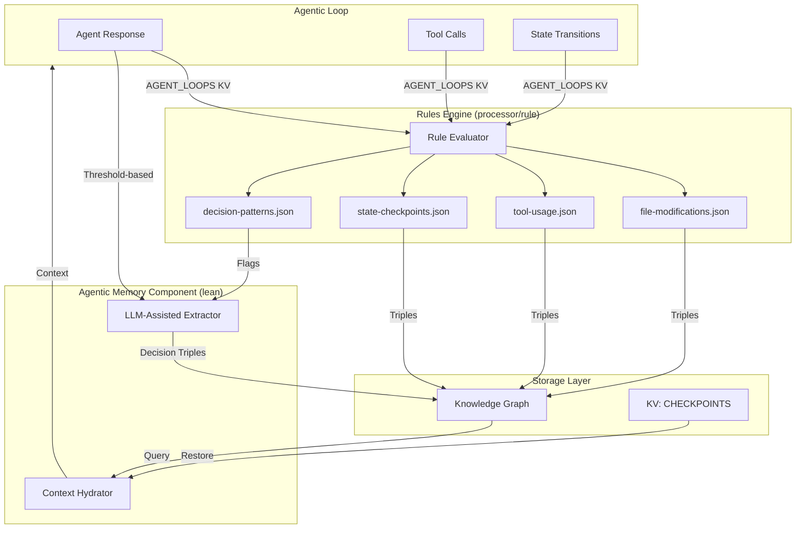
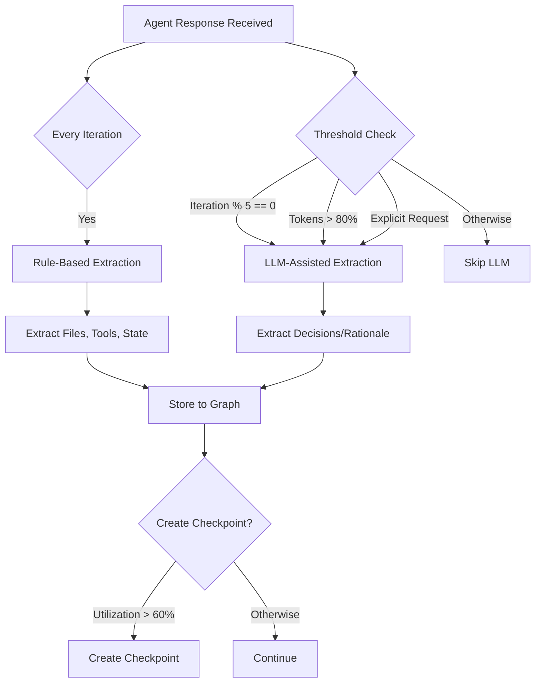
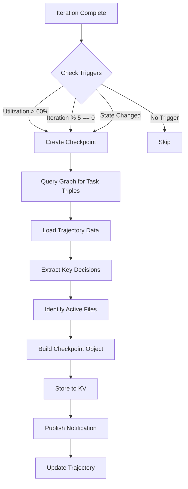
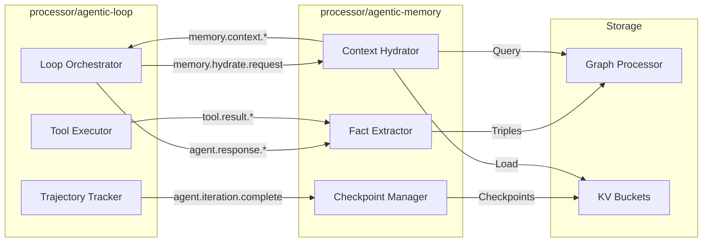

# Agentic Memory Component: Technical Specification

**Version**: 1.0
**Status**: Proposed
**Location**: `processor/agentic-memory/`
**ADR**: [ADR-017: Graph-Backed Agent Memory](../adr-017-graph-backed-agent-memory.md)

---

## Overview

The **agentic-memory** component provides graph-backed external memory for agentic loops, solving the
fundamental context compaction problem that plagues traditional agentic frameworks. By extracting structured
facts from agent execution and storing them as triples in the knowledge graph, it enables stateful recovery
from context loss.

### The Core Problem

Traditional agentic systems compress conversation history into text summaries when context windows fill,
resulting in lossy, unstructured memory that causes agent confusion. Critical details like file paths,
variable names, and decision rationale are lost, leading to post-compaction failures.

### SemStreams' Unique Solution

SemStreams has a **knowledge graph** that enables structured external memory:

- Every decision, file modification, and state change stored as queryable triples
- Graph queries reconstruct relevant context on-demand
- Semantic relationships preserved across iterations
- Context hydration from checkpoints enables compaction recovery

### Key Capabilities

1. **Fact Extraction**: Extract structured facts from agent conversations using hybrid rule-based and
   LLM-assisted strategies
2. **Context Hydration**: Reconstruct context from knowledge graph for task initialization and
   post-compaction recovery
3. **Checkpoint Management**: Create iteration checkpoints for compaction recovery and auditability
4. **Query Interface**: Provide semantic query capabilities for agent introspection

---

## Component Architecture

The agentic-memory component is designed as a **lean component** that focuses on LLM extraction and hydration.
Rule-based extraction is delegated to the existing rules engine via JSON rule definitions.

### Lean Component Structure

```text
processor/agentic-memory/
├── component.go       # Lifecycle, NATS subscriptions
├── llm_extractor.go   # Threshold-triggered LLM extraction
├── hydrator.go        # Query graph → format context
└── config.go          # Configuration types
```

### Rule-Based Extraction (via Rules Engine)

```text
config/rules/agentic-memory/
├── file-modifications.json   # Extract file modification facts
├── tool-usage.json           # Extract tool call patterns
├── state-checkpoints.json    # Extract iteration state
└── decision-patterns.json    # Pattern-match decisions (flags for LLM)
```

### Component Diagram



---

## NATS Message Flows

### Input Ports (Subscriptions)

The agentic-memory component subscribes to these subjects:

```text
agent.response.{loop_id}              - Agent responses for rule-based extraction
agent.iteration.complete.{loop_id}    - Iteration completion for checkpoint creation
agent.complete.{loop_id}              - Task completion for final facts
tool.result.{loop_id}.{call_id}       - Tool results for file tracking
memory.hydrate.request.{loop_id}      - Explicit hydration requests
```

### Output Ports (Publications)

The component publishes to:

```text
graph.mutation.{entity_id}            - Triple insertions to graph processor
memory.context.{loop_id}              - Hydrated context for injection
memory.checkpoint.created.{loop_id}   - Checkpoint creation notifications
memory.extraction.complete.{loop_id}  - Extraction completion events
```

### NATS KV Buckets

```text
AGENT_LOOPS                  - Loop state (read for extraction context)
AGENT_TRAJECTORIES           - Trajectory data (read for token tracking)
AGENT_MEMORY_CHECKPOINTS     - Checkpoint storage (read/write)
```

### Message Flow Example

```mermaid
sequenceDiagram
    participant Loop as Agentic Loop
    participant Memory as Agentic Memory
    participant Graph as Graph Processor
    participant KV as KV: CHECKPOINTS

    Loop->>Memory: agent.response.loop_123
    Memory->>Memory: Rule-based extraction
    Memory->>Graph: graph.mutation.task_123 (triples)

    alt Threshold reached
        Memory->>Memory: LLM-assisted extraction
        Memory->>Graph: graph.mutation.task_123 (decision triples)
    end

    Loop->>Memory: agent.iteration.complete.loop_123
    Memory->>KV: Store checkpoint
    Memory->>Loop: memory.checkpoint.created.loop_123

    alt Context compaction occurs
        Loop->>Memory: memory.hydrate.request.loop_123
        Memory->>Graph: Query for task facts
        Memory->>KV: Load latest checkpoint
        Memory->>Loop: memory.context.loop_123 (reconstructed)
    end
```

---

## Fact Extraction Strategies

The component uses a **hybrid extraction approach** to balance accuracy with cost:

### 1. Rule-Based Extraction (Every Iteration)

Triggered on **every** `agent.response.*` message. Fast, deterministic, zero cost.

#### File Operations

From tool results (`tool.result.*`), extract:

```go
// File modification detected
Triple{
    Subject:    taskEntityID,
    Predicate:  "agentic.file.modified",
    Object:     fileEntityID,  // "file.semstreams.processor.graph.node.go"
    Source:     "tool_result",
    Timestamp:  time.Now(),
    Confidence: 1.0,
}

// File operation details
Triple{
    Subject:    fileEntityID,
    Predicate:  "agentic.modification.type",
    Object:     "bug_fix",  // or "feature", "refactor", "test"
    Source:     "tool_result",
    Timestamp:  time.Now(),
    Confidence: 0.9,
}
```

#### State Transitions

From loop entity state changes:

```go
Triple{
    Subject:    taskEntityID,
    Predicate:  "agentic.state.transitioned",
    Object:     "executing",
    Source:     "loop_state",
    Timestamp:  time.Now(),
    Confidence: 1.0,
}
```

#### Tool Usage Patterns

From tool call tracking:

```go
Triple{
    Subject:    taskEntityID,
    Predicate:  "agentic.tool.invoked",
    Object:     "file_read",
    Source:     "tool_tracker",
    Timestamp:  time.Now(),
    Confidence: 1.0,
}
```

#### Iteration Tracking

From trajectory data:

```go
Triple{
    Subject:    taskEntityID,
    Predicate:  "agentic.checkpoint.iteration",
    Object:     int64(15),
    Source:     "trajectory",
    Timestamp:  time.Now(),
    Confidence: 1.0,
}

Triple{
    Subject:    taskEntityID,
    Predicate:  "agentic.context.tokens_used",
    Object:     int64(85000),
    Source:     "trajectory",
    Timestamp:  time.Now(),
    Confidence: 1.0,
}
```

### 2. LLM-Assisted Extraction (Threshold-Based)

Triggered when **any** of these conditions are met:

- Every N iterations (configurable, default: 5)
- Context tokens exceed threshold (default: 80% of model limit)
- Explicit extraction request via `memory.extract.request.*`

#### Extraction Prompt Pattern

```text
Extract structured facts from this agent response. Focus on decisions, rationale,
and key findings that should be preserved across context compaction.

Agent Response:
{response_content}

Extract:
1. Key decisions made (architecture choices, design patterns, approach selection)
2. Rationale for decisions (why this choice vs alternatives)
3. Alternatives considered (what was rejected and why)
4. Critical findings or discoveries
5. Task blockers or impediments

Return JSON array of facts:
[
  {
    "predicate": "agentic.decision.architecture",
    "object": "Use visitor pattern for graph traversal",
    "confidence": 0.9
  },
  {
    "predicate": "agentic.decision.rationale",
    "object": "Enables extensibility without modifying core node types",
    "confidence": 0.9
  },
  {
    "predicate": "agentic.decision.alternative",
    "object": "Considered inheritance hierarchy but rejected due to tight coupling",
    "confidence": 0.8
  }
]
```

#### LLM Extraction Configuration

```yaml
llm_assisted:
  enabled: true
  model: "fast"  # Model alias from agentic-dispatch config
  trigger_interval: 5  # Every 5 iterations
  trigger_context_threshold: 0.8  # 80% of context window
  max_tokens: 1000
  temperature: 0.2
  cost_limit_per_extraction: 0.01  # Max $0.01 per extraction
```

### 3. Hybrid Extraction Decision Tree



---

## Context Hydration

Context hydration reconstructs relevant task context from the knowledge graph and checkpoints.

### Hydration Strategies

#### 1. Pre-Task Hydration

When a new task arrives (`agent.task.*`), inject relevant context from prior work.

```go
// Query recent tasks in same domain
recentTasks := graph.QueryEntities(QueryCriteria{
    EntityType: "task",
    Limit:      10,
    OrderBy:    "timestamp_desc",
})

// Query file modification history
fileHistory := graph.QueryTriples(TripleCriteria{
    Predicate: "agentic.file.modified",
    Limit:     20,
    OrderBy:   "timestamp_desc",
})

// Query key decisions
decisions := graph.QueryTriples(TripleCriteria{
    PredicatePattern: "agentic.decision.*",
    Limit:            10,
})

// Format context for system prompt injection
contextBlock := fmt.Sprintf(`Recent Work Context:

Modified Files:
%s

Key Decisions:
%s

Tools Used:
%s`, formatFiles(fileHistory), formatDecisions(decisions), formatTools(toolHistory))
```

#### 2. Post-Compaction Recovery

When context compaction occurs, reconstruct critical state from checkpoint and graph.

```go
// Load latest checkpoint
checkpoint := kv.Get("AGENT_MEMORY_CHECKPOINTS", loopID)

// Query triples since checkpoint
recentTriples := graph.QueryTriples(TripleCriteria{
    Subject:      taskEntityID,
    TimestampGTE: checkpoint.Timestamp,
})

// Reconstruct compressed context
recoveryContext := fmt.Sprintf(`Resuming from iteration %d (state: %s).
Context tokens before compaction: %d

Files Modified Since Start:
%s

Key Decisions:
%s

Current State:
- Iteration: %d
- Files in progress: %s
- Tools used: %s`,
    checkpoint.Iteration,
    checkpoint.State,
    checkpoint.ContextTokens,
    formatFileList(checkpoint.ActiveFiles),
    formatDecisionList(checkpoint.KeyDecisions),
    checkpoint.Iteration,
    checkpoint.FilesInProgress,
    checkpoint.ToolsUsed,
)
```

#### 3. On-Demand Query Hydration

Support explicit queries during execution for agent introspection.

```go
// Example: "What files did I modify in the last 3 iterations?"
query := HydrationQuery{
    LoopID:         loopID,
    PredicateMatch: "agentic.file.modified",
    IterationRange: [checkpoint.Iteration-3, checkpoint.Iteration],
}

results := hydrator.Query(query)
```

### Hydration Configuration

```yaml
hydration:
  pre_task:
    enabled: true
    max_context_tokens: 4000
    include_recent_tasks: 10
    include_file_history: true
    include_decisions: true
    relevance_threshold: 0.7
  post_compaction:
    enabled: true
    reconstruct_from_checkpoint: true
    include_recent_iterations: 3
    max_recovery_tokens: 6000
  on_demand:
    enabled: true
    max_query_results: 50
    timeout: "5s"
```

---

## Graph Schema

### Entity Types

The component works with these entity types:

```go
const (
    // Task entity representing an agentic loop execution
    // Format: loop.agentic.task.{task_id}
    // Example: loop.agentic.task.analyze_code_123
    EntityTypeAgenticTask = "task"

    // File entity representing code files
    // Format: file.{org}.{path_components}
    // Example: file.semstreams.processor.graph.node.go
    EntityTypeFile = "file"
)
```

### Predicate Vocabulary

All predicates follow three-level dotted notation: `domain.category.property`

```go
package vocabulary

const (
    // Decision tracking predicates
    PredicateDecisionArchitecture = "agentic.decision.architecture"
    PredicateDecisionRationale    = "agentic.decision.rationale"
    PredicateDecisionAlternative  = "agentic.decision.alternative"
    PredicateDecisionTradeoff     = "agentic.decision.tradeoff"

    // File operation predicates
    PredicateFileModified  = "agentic.file.modified"
    PredicateFileCreated   = "agentic.file.created"
    PredicateFileDeleted   = "agentic.file.deleted"
    PredicateFileRead      = "agentic.file.read"

    // File modification metadata (for file entities)
    PredicateModificationType   = "agentic.modification.type"   // bug_fix, feature, refactor, test
    PredicateModificationReason = "agentic.modification.reason"
    PredicateModificationLines  = "agentic.modification.lines"  // Lines changed

    // State tracking predicates
    PredicateStateTransitioned = "agentic.state.transitioned"
    PredicateStateCheckpoint   = "agentic.checkpoint.state"
    PredicateCheckpointIteration = "agentic.checkpoint.iteration"
    PredicateCheckpointTimestamp = "agentic.checkpoint.timestamp"

    // Tool usage predicates
    PredicateToolInvoked     = "agentic.tool.invoked"
    PredicateToolSuccessCount = "agentic.tool.success_count"
    PredicateToolFailureCount = "agentic.tool.failure_count"
    PredicateToolLatency      = "agentic.tool.latency_ms"

    // Task outcome predicates
    PredicateTaskOutcome    = "agentic.task.outcome"    // complete, failed, cancelled
    PredicateTaskDuration   = "agentic.task.duration_ms"
    PredicateTaskIterations = "agentic.task.iterations"
    PredicateTaskError      = "agentic.task.error"

    // Context management predicates
    PredicateContextCompactedAt = "agentic.context.compacted_at"
    PredicateContextTokensUsed  = "agentic.context.tokens_used"
    PredicateContextCheckpointID = "agentic.context.checkpoint_id"

    // Relationship predicates
    PredicateBlockedBy    = "agentic.blocked.by"
    PredicateDependsOn    = "agentic.depends.on"
    PredicateRelatedTo    = "agentic.related.to"
    PredicateFollowedBy   = "agentic.followed.by"  // Task sequence
)
```

### Example Triple Set

From a real agent execution:

```go
triples := []Triple{
    // Task metadata
    {
        Subject:    "loop.agentic.task.auth_implementation_456",
        Predicate:  "agentic.checkpoint.iteration",
        Object:     int64(8),
        Source:     "trajectory",
        Timestamp:  time.Now(),
        Confidence: 1.0,
    },

    // File modifications
    {
        Subject:    "loop.agentic.task.auth_implementation_456",
        Predicate:  "agentic.file.modified",
        Object:     "file.semstreams.auth.token.go",
        Source:     "tool_result",
        Timestamp:  time.Now(),
        Confidence: 1.0,
    },
    {
        Subject:    "file.semstreams.auth.token.go",
        Predicate:  "agentic.modification.type",
        Object:     "bug_fix",
        Source:     "tool_result",
        Timestamp:  time.Now(),
        Confidence: 0.9,
    },
    {
        Subject:    "file.semstreams.auth.token.go",
        Predicate:  "agentic.modification.reason",
        Object:     "Nil pointer dereference in token validation",
        Source:     "llm_extraction",
        Timestamp:  time.Now(),
        Confidence: 0.85,
    },

    // Decisions
    {
        Subject:    "loop.agentic.task.auth_implementation_456",
        Predicate:  "agentic.decision.architecture",
        Object:     "Use JWT with RS256 signing",
        Source:     "llm_extraction",
        Timestamp:  time.Now(),
        Confidence: 0.9,
    },
    {
        Subject:    "loop.agentic.task.auth_implementation_456",
        Predicate:  "agentic.decision.rationale",
        Object:     "RS256 enables token verification without shared secrets",
        Source:     "llm_extraction",
        Timestamp:  time.Now(),
        Confidence: 0.9,
    },
    {
        Subject:    "loop.agentic.task.auth_implementation_456",
        Predicate:  "agentic.decision.alternative",
        Object:     "Considered HS256 but rejected due to key distribution complexity",
        Source:     "llm_extraction",
        Timestamp:  time.Now(),
        Confidence: 0.8,
    },

    // Tool usage
    {
        Subject:    "loop.agentic.task.auth_implementation_456",
        Predicate:  "agentic.tool.invoked",
        Object:     "file_read",
        Source:     "tool_tracker",
        Timestamp:  time.Now(),
        Confidence: 1.0,
    },
}
```

---

## Checkpoint Management

Checkpoints enable compaction recovery by capturing task state at key points.

### Checkpoint Structure

```go
type MemoryCheckpoint struct {
    CheckpointID      string    `json:"checkpoint_id"`      // chk_{loop_id}_{iteration}
    LoopID            string    `json:"loop_id"`
    Iteration         int       `json:"iteration"`
    State             string    `json:"state"`              // Loop state at checkpoint
    Timestamp         time.Time `json:"timestamp"`

    // Context metrics
    ContextTokens     int       `json:"context_tokens"`
    ContextUtilization float64  `json:"context_utilization"` // Percentage of limit

    // Extracted facts summary
    FactsExtracted    int       `json:"facts_extracted"`
    KeyDecisions      []string  `json:"key_decisions"`      // Summary of major decisions
    ActiveFiles       []string  `json:"active_files"`       // Files currently being worked on
    ToolsUsed         []string  `json:"tools_used"`         // Tools invoked this iteration

    // Recovery metadata
    GraphTripleCount  int       `json:"graph_triple_count"` // Triples stored for this task
    RecoveryReady     bool      `json:"recovery_ready"`     // Can this checkpoint restore state?
}
```

### Checkpoint Creation Triggers

```yaml
checkpoints:
  enabled: true
  triggers:
    - type: utilization
      threshold: 0.6  # 60% context utilization
    - type: iteration
      interval: 5     # Every 5 iterations
    - type: state_transition
      states: ["reviewing", "complete"]
  min_facts_before_checkpoint: 20
  storage_bucket: "AGENT_MEMORY_CHECKPOINTS"
  retention_days: 30
```

### Checkpoint Creation Process



### Checkpoint Restoration

```go
func (h *Hydrator) RestoreFromCheckpoint(loopID string) (*HydratedContext, error) {
    // Load latest checkpoint
    checkpoint, err := h.kv.Get("AGENT_MEMORY_CHECKPOINTS", fmt.Sprintf("latest_%s", loopID))
    if err != nil {
        return nil, fmt.Errorf("load checkpoint: %w", err)
    }

    // Query graph for task facts since checkpoint
    taskEntityID := fmt.Sprintf("loop.agentic.task.%s", loopID)
    triples, err := h.graph.QueryTriples(QueryCriteria{
        Subject:      taskEntityID,
        TimestampGTE: checkpoint.Timestamp,
    })
    if err != nil {
        return nil, fmt.Errorf("query graph: %w", err)
    }

    // Build hydrated context
    return &HydratedContext{
        CheckpointID:     checkpoint.CheckpointID,
        Iteration:        checkpoint.Iteration,
        State:            checkpoint.State,
        KeyDecisions:     checkpoint.KeyDecisions,
        ActiveFiles:      checkpoint.ActiveFiles,
        RecentTriples:    triples,
        ContextSummary:   formatRecoveryContext(checkpoint, triples),
        RecoveryTokens:   calculateTokens(checkpoint, triples),
    }, nil
}
```

---

## Integration with Agentic Loop

The agentic-memory component integrates seamlessly with the existing agentic-loop processor.

### Component Collaboration



### Trajectory Enhancement

Extend the existing `Trajectory` type to reference memory checkpoints:

```go
// In agentic/trajectory.go
type Trajectory struct {
    LoopID         string           `json:"loop_id"`
    StartTime      time.Time        `json:"start_time"`
    EndTime        *time.Time       `json:"end_time,omitempty"`
    Steps          []TrajectoryStep `json:"steps"`
    Outcome        string           `json:"outcome,omitempty"`
    TotalTokensIn  int              `json:"total_tokens_in"`
    TotalTokensOut int              `json:"total_tokens_out"`
    Duration       int64            `json:"duration"`

    // Memory checkpoints (NEW)
    MemoryCheckpoints []MemoryCheckpointRef `json:"memory_checkpoints,omitempty"`
}

type MemoryCheckpointRef struct {
    CheckpointID      string    `json:"checkpoint_id"`
    Iteration         int       `json:"iteration"`
    TriplesCount      int       `json:"triples_count"`
    ContextTokens     int       `json:"context_tokens"`
    Timestamp         time.Time `json:"timestamp"`
    RecoveryAvailable bool      `json:"recovery_available"`
}
```

### Loop State Enhancement

Add memory-related fields to `LoopEntity`:

```go
// In agentic/state.go
type LoopEntity struct {
    // ... existing fields ...

    // Memory tracking (NEW)
    LastCheckpointID   string    `json:"last_checkpoint_id,omitempty"`
    FactsExtracted     int       `json:"facts_extracted,omitempty"`
    CompactionOccurred bool      `json:"compaction_occurred,omitempty"`
    CompactionAt       time.Time `json:"compaction_at,omitempty"`
}
```

---

## Configuration

### Complete Configuration Schema

```yaml
agentic_memory:
  enabled: true

  # Fact extraction configuration
  extraction:
    # Rule-based extraction (always on, zero cost)
    rule_based:
      enabled: true
      track_files: true
      track_tools: true
      track_state: true
      track_errors: true

    # LLM-assisted extraction (threshold-based, cost-controlled)
    llm_assisted:
      enabled: true
      model: "fast"  # Model alias from agentic-dispatch config
      trigger_interval: 5  # Every N iterations
      trigger_context_threshold: 0.8  # Trigger at 80% context utilization
      max_tokens: 1000
      temperature: 0.2
      max_cost_per_extraction: 0.01  # Maximum $0.01 per extraction
      timeout: "30s"

  # Context hydration configuration
  hydration:
    # Pre-task hydration
    pre_task:
      enabled: true
      max_context_tokens: 4000
      include_recent_tasks: 10
      include_file_history: true
      include_decisions: true
      include_tools: true
      relevance_threshold: 0.7

    # Post-compaction recovery
    post_compaction:
      enabled: true
      reconstruct_from_checkpoint: true
      include_recent_iterations: 3
      max_recovery_tokens: 6000
      fallback_to_summary: true

    # On-demand query hydration
    on_demand:
      enabled: true
      max_query_results: 50
      timeout: "5s"
      cache_results: true
      cache_ttl: "5m"

  # Checkpoint configuration
  checkpoints:
    enabled: true

    # Checkpoint triggers
    triggers:
      utilization_threshold: 0.6  # Create at 60% context utilization
      iteration_interval: 5       # Create every 5 iterations
      state_transitions:          # Create on these state changes
        - "reviewing"
        - "complete"

    min_facts_before_checkpoint: 20
    storage_bucket: "AGENT_MEMORY_CHECKPOINTS"
    retention_days: 30
    max_checkpoints_per_loop: 100

  # Storage configuration
  storage:
    graph_bucket: "default"  # Which graph to use
    batch_size: 50           # Triples per batch mutation
    flush_interval: "1s"     # Max time before forced flush

  # Performance tuning
  performance:
    max_concurrent_extractions: 5
    extraction_queue_size: 100
    hydration_cache_size: 1000
    hydration_cache_ttl: "10m"
```

### Environment Variables

```bash
# Optional environment variable overrides
AGENTIC_MEMORY_ENABLED=true
AGENTIC_MEMORY_LLM_MODEL=fast
AGENTIC_MEMORY_LLM_MAX_COST=0.01
AGENTIC_MEMORY_CHECKPOINT_THRESHOLD=0.6
```

---

## Metrics

### Prometheus Metrics

The component exposes these Prometheus metrics:

```go
// Fact extraction metrics
agentic_memory_facts_extracted_total{type="rule|llm", predicate="*"}
agentic_memory_extraction_latency_seconds{type="rule|llm"}
agentic_memory_extraction_errors_total{type="rule|llm", error_type="*"}
agentic_memory_llm_extraction_cost_dollars{model="*"}

// Checkpoint metrics
agentic_memory_checkpoints_created_total{trigger_type="*"}
agentic_memory_checkpoint_size_bytes
agentic_memory_checkpoint_triples_count
agentic_memory_checkpoint_latency_seconds

// Hydration metrics
agentic_memory_hydration_requests_total{type="pre_task|post_compaction|on_demand"}
agentic_memory_hydration_latency_seconds{type="*"}
agentic_memory_hydration_tokens_generated
agentic_memory_hydration_cache_hits_total
agentic_memory_hydration_cache_misses_total

// Recovery metrics
agentic_memory_recovery_attempts_total{success="true|false"}
agentic_memory_recovery_latency_seconds
agentic_memory_recovery_triples_loaded

// Graph interaction metrics
agentic_memory_graph_mutations_total
agentic_memory_graph_queries_total
agentic_memory_graph_query_latency_seconds
```

### Health Checks

The component provides health check endpoints:

```go
type HealthStatus struct {
    Healthy             bool      `json:"healthy"`
    ExtractionActive    bool      `json:"extraction_active"`
    CheckpointsEnabled  bool      `json:"checkpoints_enabled"`
    GraphConnected      bool      `json:"graph_connected"`
    KVConnected         bool      `json:"kv_connected"`
    LastExtractionAt    time.Time `json:"last_extraction_at,omitempty"`
    LastCheckpointAt    time.Time `json:"last_checkpoint_at,omitempty"`
    FactsExtractedTotal int64     `json:"facts_extracted_total"`
    CheckpointsTotal    int64     `json:"checkpoints_total"`
}
```

---

## Testing Strategy

### Unit Tests

**Target**: Individual extraction, hydration, and checkpoint functions

```go
// extractor_test.go
func TestRuleBasedExtraction_FileModification(t *testing.T)
func TestRuleBasedExtraction_StateTransition(t *testing.T)
func TestRuleBasedExtraction_ToolInvocation(t *testing.T)
func TestLLMExtraction_DecisionParsing(t *testing.T)
func TestLLMExtraction_RationaleExtraction(t *testing.T)
func TestLLMExtraction_ErrorHandling(t *testing.T)

// hydrator_test.go
func TestHydration_PreTask(t *testing.T)
func TestHydration_PostCompaction(t *testing.T)
func TestHydration_OnDemandQuery(t *testing.T)
func TestHydration_TokenLimitRespected(t *testing.T)

// checkpoint_test.go
func TestCheckpoint_CreationTriggers(t *testing.T)
func TestCheckpoint_Restoration(t *testing.T)
func TestCheckpoint_Retention(t *testing.T)
```

### Integration Tests

**Target**: Component integration with graph and KV storage (uses testcontainers)

```go
//go:build integration

// integration_test.go
func TestIntegration_ExtractionToGraph(t *testing.T)
func TestIntegration_CheckpointToKV(t *testing.T)
func TestIntegration_HydrationFromGraph(t *testing.T)
func TestIntegration_CompactionRecovery(t *testing.T)
func TestIntegration_ConcurrentExtractions(t *testing.T)
```

### End-to-End Tests

**Target**: Full agentic loop with memory across compaction (requires Docker)

```bash
# E2E test structure
task e2e:memory           # Memory-specific E2E tests
```

```go
// e2e/memory_test.go
func TestE2E_MemoryAcrossCompaction(t *testing.T)
func TestE2E_MultiTaskContextCarryover(t *testing.T)
func TestE2E_CheckpointRecovery(t *testing.T)
func TestE2E_LLMExtractionCost(t *testing.T)
```

### Test Coverage Goals

- Unit tests: 85% coverage minimum
- Integration tests: All NATS flows and storage operations
- E2E tests: Critical path scenarios (compaction recovery, context hydration)
- Race detector: All tests run with `-race` flag

---

## Implementation Phases

### Phase 1: Extraction Rules (MVP)

**Goal**: Rule-based fact extraction via rules engine (no custom code)

**Deliverables**:

- `config/rules/agentic-memory/file-modifications.json`: File tracking rule
- `config/rules/agentic-memory/tool-usage.json`: Tool usage tracking rule
- `config/rules/agentic-memory/state-checkpoints.json`: State tracking rule
- `config/rules/agentic-memory/decision-patterns.json`: Decision detection rule
- Rules engine configuration to load agentic-memory rules

**Acceptance Criteria**:

- Rules engine extracts file modifications from AGENT_LOOPS KV
- Rules engine tracks tool invocations
- Rules engine creates state checkpoint triples
- Decision patterns flagged for LLM extraction

### Phase 2: Lean Component Foundation

**Goal**: Create minimal component for LLM extraction and hydration

**Deliverables**:

- `processor/agentic-memory/component.go`: Lifecycle, NATS subscriptions
- `processor/agentic-memory/config.go`: Configuration types
- Unit tests for component lifecycle
- Integration tests with NATS

**Acceptance Criteria**:

- Component starts and stops cleanly
- Subscribes to compaction and hydration subjects
- Configuration loads and validates

### Phase 3: Context Hydration

**Goal**: Reconstruct context from graph and checkpoints

**Deliverables**:

- `processor/agentic-memory/hydrator.go`: Context hydration logic
- Pre-task hydration implementation
- Post-compaction recovery implementation
- On-demand query support
- Unit tests for hydration strategies
- Integration tests with graph queries

**Acceptance Criteria**:

- Hydrates context for new tasks from recent history
- Reconstructs state from checkpoints post-compaction
- Supports on-demand fact queries
- Respects token limits in hydrated context

### Phase 4: LLM-Assisted Extraction

**Goal**: Extract nuanced decisions and rationale

**Deliverables**:

- `processor/agentic-memory/llm_extractor.go`: LLM-based fact extraction
- Threshold-based triggering logic
- Cost tracking and limiting
- Unit tests for LLM extraction
- Integration tests with mock LLM

**Acceptance Criteria**:

- Extracts decisions and rationale via LLM
- Triggers based on iteration and context thresholds
- Enforces cost limits per extraction
- Falls back gracefully on LLM errors

### Phase 5: End-to-End Validation

**Goal**: Validate full system with real agentic loops

**Deliverables**:

- E2E tests with full stack
- Performance benchmarks
- Cost analysis for LLM extraction
- Documentation and runbooks

**Acceptance Criteria**:

- Agent successfully recovers from context compaction
- Pre-task hydration reduces redundant exploration
- Checkpoints enable mid-task resume
- Cost per extraction within budget

---

## Performance Considerations

### Extraction Performance

**Rule-based extraction**:

- Target: <10ms per extraction
- Strategy: Simple pattern matching and field extraction
- Batching: Accumulate triples, flush every 1s or 50 triples

**LLM-assisted extraction**:

- Target: <2s per extraction (network bound)
- Strategy: Async extraction, don't block loop
- Cost control: Track cost per loop, abort if exceeded

### Hydration Performance

**Graph query latency**:

- Target: <100ms for typical hydration query
- Strategy: Index predicates, limit result sets
- Caching: Cache hydration results with 5m TTL

**Token calculation**:

- Target: <50ms to calculate hydrated context tokens
- Strategy: Pre-calculate token counts, store in checkpoint

### Memory Footprint

**In-memory queues**:

- Extraction queue: 100 items max
- Hydration cache: 1000 entries, ~10MB
- Checkpoint buffer: 50 checkpoints, ~5MB

**Graph storage**:

- Estimated: 100-500 triples per task
- Retention: 30 days default, configurable
- Compaction: Aggregate old triples monthly

---

## Security Considerations

### Sensitive Data Handling

**Risk**: Agent responses may contain secrets or PII

**Mitigation**:

- Redact known secret patterns before extraction (API keys, tokens)
- Scrub PII from decision rationale via regex
- Flag sensitive predicates for restricted access

### Graph Access Control

**Risk**: Knowledge graph contains cross-task information

**Mitigation**:

- Implement predicate-level access control
- Filter hydration results by user permissions
- Audit graph queries for compliance

### Checkpoint Security

**Risk**: Checkpoints contain task state that may be sensitive

**Mitigation**:

- Encrypt checkpoint data at rest in KV
- Set appropriate retention and auto-deletion
- Audit checkpoint access

---

## Observability

### Logging

Structured logs at key points:

```go
log.Info("fact extraction started",
    "loop_id", loopID,
    "iteration", iteration,
    "extraction_type", "rule_based",
)

log.Info("checkpoint created",
    "loop_id", loopID,
    "checkpoint_id", checkpointID,
    "iteration", iteration,
    "context_utilization", 0.65,
    "facts_extracted", 42,
)

log.Info("context hydrated",
    "loop_id", loopID,
    "hydration_type", "post_compaction",
    "triples_loaded", 127,
    "recovery_tokens", 4500,
)
```

### Tracing

OpenTelemetry spans for:

- Extraction pipeline (rule + LLM)
- Checkpoint creation
- Context hydration
- Graph queries

### Alerts

Prometheus alerts:

```yaml
# High extraction error rate
- alert: AgenticMemoryExtractionErrors
  expr: rate(agentic_memory_extraction_errors_total[5m]) > 0.1
  for: 5m

# Checkpoint creation failures
- alert: AgenticMemoryCheckpointFailures
  expr: rate(agentic_memory_checkpoints_created_total{success="false"}[5m]) > 0.05
  for: 5m

# Hydration latency too high
- alert: AgenticMemoryHydrationSlow
  expr: histogram_quantile(0.95, agentic_memory_hydration_latency_seconds) > 1.0
  for: 10m
```

---

## Future Enhancements

### Advanced Extraction

- **Multi-modal extraction**: Extract facts from code diffs, screenshots, diagrams
- **Temporal reasoning**: Infer causality between facts across iterations
- **Contradiction detection**: Flag conflicting decisions or assertions

### Enhanced Hydration

- **Semantic ranking**: Rank hydrated facts by relevance using embeddings
- **Interactive hydration**: Agent queries graph during execution for specific facts
- **Cross-task learning**: Hydrate relevant facts from similar past tasks

### Graph Intelligence

- **Automated summarization**: Periodically summarize old facts for compaction
- **Pattern mining**: Discover common decision patterns across tasks
- **Anomaly detection**: Flag unusual tool usage or decision patterns

### Cost Optimization

- **Adaptive extraction**: Increase LLM extraction frequency on complex tasks
- **Batch extraction**: Accumulate iterations, extract facts in batch
- **Model selection**: Route extraction to cheapest model that meets quality threshold

---

## Appendix: Example Workflows

### Workflow 1: Normal Execution Without Compaction

```mermaid
sequenceDiagram
    participant User
    participant Loop as Agentic Loop
    participant Memory as Agentic Memory
    participant Graph as Knowledge Graph

    User->>Loop: Start task
    Loop->>Memory: agent.response (iteration 1)
    Memory->>Memory: Rule-based extraction
    Memory->>Graph: Store triples

    Loop->>Memory: agent.response (iteration 5)
    Memory->>Memory: Rule + LLM extraction (threshold)
    Memory->>Graph: Store triples
    Memory->>Memory: Create checkpoint

    Loop->>Memory: agent.complete
    Memory->>Graph: Final facts
    Memory->>Memory: Create final checkpoint
```

### Workflow 2: Context Compaction Recovery

```mermaid
sequenceDiagram
    participant Loop as Agentic Loop
    participant Memory as Agentic Memory
    participant Graph as Knowledge Graph
    participant KV as KV: Checkpoints

    Loop->>Memory: agent.response (iteration 15, 85% context)
    Memory->>Memory: Detect threshold
    Memory->>KV: Create checkpoint
    Memory->>Loop: memory.checkpoint.created

    Loop->>Loop: Compaction triggered (90% context)
    Loop->>Memory: memory.hydrate.request

    Memory->>KV: Load latest checkpoint
    Memory->>Graph: Query task triples
    Memory->>Memory: Build recovery context
    Memory->>Loop: memory.context (4000 tokens)

    Loop->>Loop: Replace compacted history with recovery context
    Loop->>Loop: Continue execution with restored state
```

### Workflow 3: Pre-Task Context Injection

```mermaid
sequenceDiagram
    participant User
    participant Loop as Agentic Loop
    participant Memory as Agentic Memory
    participant Graph as Knowledge Graph

    User->>Loop: Start new task (similar to past work)
    Loop->>Memory: memory.hydrate.request (pre_task)

    Memory->>Graph: Query recent tasks in domain
    Memory->>Graph: Query file modification history
    Memory->>Graph: Query key decisions

    Memory->>Memory: Build context (max 4000 tokens)
    Memory->>Loop: memory.context (injected into system prompt)

    Loop->>Loop: Start with pre-loaded context
    Note over Loop: Avoids re-exploring known territory
```

---

## References

- [ADR-017: Graph-Backed Agent Memory](../adr-017-graph-backed-agent-memory.md) - Architecture decision
- [Agentic Loop Spec](./semstreams-agentic-components-spec-v2.md) - Parent component specification
- [Knowledge Graph Package](../../graph/) - Graph storage and query operations
- [Triple Format](../../message/triple.go) - Semantic triple structure
- [NATS JetStream KV](https://docs.nats.io/nats-concepts/jetstream/key-value-store) - Checkpoint storage
- [ADR-013: Content Enrichment Pattern](./adr-013-content-enrichment-pattern.md) - Similar async worker pattern

---

**Document Status**: Ready for implementation planning
**Next Steps**: Create implementation plan in plan mode, assign to agents per TDD workflow
**Estimated Implementation Time**: 2-3 weeks across 5 phases
