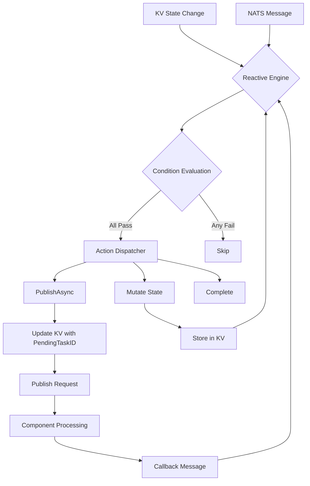

# Workflow Quickstart

Get started with SemStreams reactive workflow orchestration for multi-step processes.

## What are Reactive Workflows?

Reactive workflows are Go-based definitions for multi-step processes that need:

- **Typed state management** with compile-time safety
- **Loop limits** to prevent runaway processes
- **Timeouts** at workflow level
- **Event-driven coordination** using KV watches and NATS messages

Workflows are defined in Go code using a fluent builder API, providing type safety and eliminating
serialization bugs that occur with JSON-based string interpolation.

## When to Use Workflows

| Pattern | Use |
|---------|-----|
| A completes → B starts (no retry) | **Rules** - simple handoff |
| A → B → A → B... (max N times) | **Workflows** - loop with limit |
| Execute LLM call, process tools | **Components** - execution mechanics |

**Quick decision**: If it needs a loop limit, it's a workflow.

## Architecture



## Your First Workflow

### Example: Linear Processing Workflow

A simple workflow that processes input and produces output (pending → processing → completed):

```go
package main

import (
    "time"
    "github.com/c360studio/semstreams/message"
    "github.com/c360studio/semstreams/processor/reactive"
)

// Define typed state struct
type LinearWorkflowState struct {
    reactive.ExecutionState          // Embedded core state (ID, Phase, Status, Iteration)
    Input  string `json:"input"`    // Custom fields
    Output string `json:"output,omitempty"`
}

// Define typed request/response payloads
type ProcessRequest struct {
    TaskID string `json:"task_id"`
    Input  string `json:"input"`
}

func (r *ProcessRequest) Schema() message.Type {
    return message.Type{Domain: "example", Category: "process-request", Version: "v1"}
}

type ProcessResult struct {
    TaskID   string `json:"task_id"`
    Computed string `json:"computed"`
}

func (r *ProcessResult) Schema() message.Type {
    return message.Type{Domain: "example", Category: "process-result", Version: "v1"}
}

// Build workflow using fluent API
func buildLinearWorkflow() *reactive.Definition {
    return reactive.NewWorkflow("linear-example").
        WithDescription("Simple linear workflow: start → process → complete").
        WithStateBucket("EXAMPLE_STATE").
        WithStateFactory(func() any { return &LinearWorkflowState{} }).
        WithTimeout(5 * time.Minute).
        // Rule 1: Start processing when in pending phase
        AddRule(reactive.NewRule("start-processing").
            WatchKV("EXAMPLE_STATE", "linear-example.*").
            When("phase is pending", reactive.PhaseIs("pending")).
            When("no pending task", reactive.NoPendingTask()).
            PublishAsync(
                "processor.input",
                func(ctx *reactive.RuleContext) (message.Payload, error) {
                    state := ctx.State.(*LinearWorkflowState)
                    return &ProcessRequest{
                        TaskID: state.ID,
                        Input:  state.Input,
                    }, nil
                },
                "example.process-result.v1",
                func(ctx *reactive.RuleContext, result any) error {
                    state := ctx.State.(*LinearWorkflowState)
                    if res, ok := result.(*ProcessResult); ok {
                        state.Output = res.Computed
                    }
                    state.Phase = "completed"
                    state.Status = reactive.StatusCompleted
                    return nil
                },
            ).
            MustBuild()).
        MustBuild()
}
```

**Key benefits over JSON workflows**:

- **Type safety**: Compile-time checks catch field reference errors
- **No string interpolation**: Direct Go field access instead of `${steps.X.output.Y}`
- **Fewer serialization boundaries**: 2 instead of 9, eliminating corruption bugs
- **Go debugger support**: Set breakpoints in condition and payload functions
- **Refactoring friendly**: IDE renames propagate correctly

## Workflow Building Blocks

### State Struct

Every workflow needs a state struct that embeds `reactive.ExecutionState`:

```go
type MyWorkflowState struct {
    reactive.ExecutionState          // Core fields: ID, Phase, Status, Iteration, etc.

    // Add custom fields for your workflow
    Input       string   `json:"input"`
    Result      string   `json:"result,omitempty"`
    ErrorDetail string   `json:"error_detail,omitempty"`
}

// GetExecutionState implements reactive.StateAccessor to avoid reflection.
func (s *MyWorkflowState) GetExecutionState() *reactive.ExecutionState {
    return &s.ExecutionState
}
```

Always implement `GetExecutionState()` for your state types. This allows the engine to access the embedded `ExecutionState` without reflection overhead.

### ExecutionState Core Fields

| Field | Type | Description |
|-------|------|-------------|
| `ID` | `string` | Unique execution identifier |
| `WorkflowID` | `string` | Workflow definition ID |
| `Phase` | `string` | Current execution phase (e.g., "pending", "processing") |
| `Status` | `ExecutionStatus` | Running, Completed, Failed, Escalated |
| `Iteration` | `int` | Loop counter for iterative workflows |
| `PendingTaskID` | `string` | Active async task identifier |
| `Error` | `string` | Error message if failed |
| `CreatedAt` | `time.Time` | Workflow start time |
| `UpdatedAt` | `time.Time` | Last state update |
| `Deadline` | `*time.Time` | Timeout deadline |

### Workflow Definition

Use the fluent builder API:

```go
reactive.NewWorkflow("my-workflow").
    WithDescription("Human-readable description").
    WithStateBucket("MY_STATE").                          // KV bucket name
    WithStateFactory(func() any { return &MyState{} }).   // State constructor
    WithMaxIterations(5).                                 // Loop limit
    WithTimeout(10 * time.Minute).                        // Overall timeout
    AddRule(/* ... */).                                   // Add coordination rules
    MustBuild()
```

## Rules and Triggers

### Rule Trigger Modes

| Mode | Description | Use Case |
|------|-------------|----------|
| **KV Watch** | React to state changes in KV | Inter-rule coordination |
| **Subject Consumer** | React to NATS messages | Entry points, external callbacks |
| **Combined** | Message + state condition | Async callback with context |

### KV Watch Trigger

React when state in a KV bucket changes:

```go
reactive.NewRule("on-state-change").
    WatchKV("WORKFLOW_STATE", "workflow.*").
    When("phase is processing", reactive.PhaseIs("processing")).
    // ... actions
```

### Subject Trigger

React to NATS messages:

```go
reactive.NewRule("on-message").
    OnSubject("workflow.trigger.>", func() any { return &TriggerMessage{} }).
    // ... actions
```

### Conditions

Built-in condition helpers:

```go
// Phase and status checks
reactive.PhaseIs("pending")
reactive.StatusIs(reactive.StatusRunning)

// Iteration limits
reactive.IterationLessThan(3)

// Task state
reactive.NoPendingTask()
reactive.HasPendingTask()

// Custom field checks
reactive.StateFieldEquals(
    func(s any) string { return s.(*MyState).Verdict },
    "approved",
)

// Combinators
reactive.And(condA, condB)
reactive.Or(condA, condB)
reactive.Not(cond)
```

## Action Types

### PublishAsync (Request/Response)

Publish a request and wait for callback:

```go
PublishAsync(
    "processor.input",                              // Subject to publish to
    func(ctx *reactive.RuleContext) (message.Payload, error) {
        state := ctx.State.(*MyState)
        return &ProcessRequest{
            TaskID: state.ID,
            Input:  state.Input,
        }, nil
    },
    "example.process-result.v1",                    // Expected result type
    func(ctx *reactive.RuleContext, result any) error {
        state := ctx.State.(*MyState)
        if res, ok := result.(*ProcessResult); ok {
            state.Output = res.Computed
        }
        state.Phase = "completed"
        return nil
    },
)
```

### Mutate (State Update)

Update state without publishing:

```go
Mutate(func(ctx *reactive.RuleContext, _ any) error {
    state := ctx.State.(*MyState)
    state.Phase = "next-phase"
    state.Iteration++
    return nil
})
```

Built-in mutators:

```go
reactive.IncrementIterationMutator()
reactive.PhaseTransition("next-phase")
reactive.ChainMutators(mutator1, mutator2)
```

### Complete

Mark execution as complete:

```go
Complete()
```

### CompleteWithMutation

Mutate state then mark complete:

```go
CompleteWithMutation(func(ctx *reactive.RuleContext, _ any) error {
    state := ctx.State.(*MyState)
    state.Phase = "finished"
    state.Status = reactive.StatusCompleted
    return nil
})
```

## Loop Patterns

For iterative workflows (review → fix → review...), use iteration tracking and max iteration limits:

```go
func buildReviewLoop() *reactive.Definition {
    const maxIterations = 3

    return reactive.NewWorkflow("review-loop").
        WithMaxIterations(maxIterations).
        // Rule 1: Request review (under max iterations)
        AddRule(reactive.NewRule("request-review").
            WatchKV("REVIEW_STATE", "review-loop.*").
            When("phase is reviewing", reactive.PhaseIs("reviewing")).
            When("under max iterations", reactive.IterationLessThan(maxIterations)).
            PublishAsync(/* request review */).
            MustBuild()).
        // Rule 2: Handle "needs work" verdict - loop back
        AddRule(reactive.NewRule("handle-needs-work").
            When("verdict is needs_work", reactive.StateFieldEquals(
                func(s any) string { return s.(*ReviewState).Verdict },
                "needs_work",
            )).
            When("under max iterations", reactive.IterationLessThan(maxIterations)).
            Mutate(reactive.ChainMutators(
                reactive.IncrementIterationMutator(),
                reactive.PhaseTransition("reviewing"),
            )).
            MustBuild()).
        // Rule 3: Handle max iterations exceeded
        AddRule(reactive.NewRule("handle-max-iterations").
            When("verdict is needs_work", /* ... */).
            When("at max iterations", reactive.Not(reactive.IterationLessThan(maxIterations))).
            Mutate(func(ctx *reactive.RuleContext, _ any) error {
                state := ctx.State.(*ReviewState)
                state.Status = reactive.StatusEscalated
                state.Error = "max iterations exceeded"
                return nil
            }).
            MustBuild()).
        MustBuild()
}
```

**Key loop mechanics**:

- Track iterations using `state.Iteration`
- Check `reactive.IterationLessThan(N)` before looping
- Use `reactive.IncrementIterationMutator()` when looping
- Handle max iterations with separate rule (escalate, fail, or notify)

## Testing Workflows

Use the `testutil` package for unit tests without NATS infrastructure:

```go
func TestMyWorkflow(t *testing.T) {
    // Create test engine
    engine := testutil.NewTestEngine(t)
    def := buildMyWorkflow()

    // Register workflow
    if err := engine.RegisterWorkflow(def); err != nil {
        t.Fatalf("RegisterWorkflow failed: %v", err)
    }

    // Create initial state
    state := &MyWorkflowState{
        ExecutionState: reactive.ExecutionState{
            ID:         "exec-001",
            WorkflowID: "my-workflow",
            Phase:      "pending",
            Status:     reactive.StatusRunning,
        },
        Input: "test input",
    }

    // Trigger by storing state in KV
    key := "my-workflow.exec-001"
    err := engine.TriggerKV(context.Background(), key, state)
    if err != nil {
        t.Fatalf("TriggerKV failed: %v", err)
    }

    // Assert state transitions
    engine.AssertPhase(key, "pending")
    engine.AssertStatus(key, reactive.StatusRunning)
    engine.AssertIteration(key, 0)

    // Wait for async operations
    engine.WaitForPhase(key, "completed", 5*time.Second)

    // Assert published messages
    engine.AssertPublished("processor.input")
    engine.AssertPublishedCount("processor.input", 1)

    // Custom state assertions
    engine.AssertStateAs(key, &MyWorkflowState{}, func(t *testing.T, state any) {
        s := state.(*MyWorkflowState)
        if s.Output == "" {
            t.Error("expected output to be set")
        }
    })
}
```

## Common Patterns

### Conditional State Transitions

Execute rules only when specific conditions are met:

```go
AddRule(reactive.NewRule("conditional-step").
    WatchKV("WORKFLOW_STATE", "workflow.*").
    When("phase is check", reactive.PhaseIs("check")).
    When("ready flag is true", reactive.StateFieldEquals(
        func(s any) bool { return s.(*MyState).Ready },
        true,
    )).
    Mutate(reactive.PhaseTransition("execute")).
    MustBuild())
```

### Multi-Phase Linear Pipeline

Chain multiple phases sequentially:

```go
reactive.NewWorkflow("pipeline").
    AddRule(reactive.NewRule("phase-a").
        WatchKV("STATE", "pipeline.*").
        When("phase is pending", reactive.PhaseIs("pending")).
        PublishAsync(/* do A */, func(ctx *reactive.RuleContext, result any) error {
            ctx.State.(*PipelineState).Phase = "phase-b"
            return nil
        }).
        MustBuild()).
    AddRule(reactive.NewRule("phase-b").
        WatchKV("STATE", "pipeline.*").
        When("phase is phase-b", reactive.PhaseIs("phase-b")).
        PublishAsync(/* do B */, func(ctx *reactive.RuleContext, result any) error {
            ctx.State.(*PipelineState).Phase = "phase-c"
            return nil
        }).
        MustBuild()).
    AddRule(reactive.NewRule("phase-c").
        WatchKV("STATE", "pipeline.*").
        When("phase is phase-c", reactive.PhaseIs("phase-c")).
        PublishAsync(/* do C */, func(ctx *reactive.RuleContext, result any) error {
            ctx.State.(*PipelineState).Phase = "completed"
            ctx.State.(*PipelineState).Status = reactive.StatusCompleted
            return nil
        }).
        MustBuild()).
    MustBuild()
```

### Branching Based on Results

Route to different phases based on async results:

```go
// Callback mutator determines next phase
func(ctx *reactive.RuleContext, result any) error {
    state := ctx.State.(*ReviewState)
    if res, ok := result.(*ReviewResult); ok {
        switch res.Verdict {
        case "approved":
            state.Phase = "deploy"
        case "needs_work":
            state.Phase = "fixing"
        case "rejected":
            state.Phase = "failed"
            state.Status = reactive.StatusFailed
        }
    }
    return nil
}
```

## Running Workflows

### Initialize Execution State

Create initial state and store in KV to trigger the workflow:

```go
// Create initial execution state
state := &MyWorkflowState{
    ExecutionState: reactive.ExecutionState{
        ID:         "exec-" + uuid.New().String(),
        WorkflowID: "my-workflow",
        Phase:      "pending",
        Status:     reactive.StatusRunning,
        CreatedAt:  time.Now(),
        UpdatedAt:  time.Now(),
    },
    Input: "user input data",
}

// Store in KV bucket to trigger workflow
key := "my-workflow." + state.ID
data, _ := json.Marshal(state)
_, err := kv.Put(key, data)
```

### Trigger via NATS Message

For workflows with subject triggers:

```go
// Define workflow with subject trigger
reactive.NewRule("on-trigger").
    OnSubject("workflow.trigger.my-workflow", func() any { return &TriggerMessage{} }).
    Mutate(func(ctx *reactive.RuleContext, msg any) error {
        trigger := msg.(*TriggerMessage)
        // Initialize workflow state
        state := &MyWorkflowState{
            ExecutionState: reactive.ExecutionState{
                ID:         "exec-" + uuid.New().String(),
                WorkflowID: "my-workflow",
                Phase:      "pending",
                Status:     reactive.StatusRunning,
            },
            Input: trigger.Input,
        }
        // Store in KV
        return ctx.Store(state)
    }).
    MustBuild()

// Trigger by publishing message
triggerMsg := &TriggerMessage{Input: "data"}
nc.Publish("workflow.trigger.my-workflow", triggerMsg)
```

## Observability and Debugging

### Inspect State in KV

```bash
# List all executions for a workflow
nats kv list MY_STATE

# Get specific execution state
nats kv get MY_STATE my-workflow.exec-001

# Watch state changes in real-time
nats kv watch MY_STATE
```

### Enable Debug Logging

Set log level to debug to see rule evaluation and action dispatch:

```go
import "log/slog"

handler := slog.NewTextHandler(os.Stdout, &slog.HandlerOptions{
    Level: slog.LevelDebug,
})
logger := slog.New(handler)

engine := reactive.NewEngine(nc, logger)
```

### Common Issues

| Symptom | Cause | Fix |
|---------|-------|-----|
| Rule never fires | Condition not met | Check condition logic with unit tests |
| State not updating | KV watch pattern wrong | Verify bucket/pattern match state keys |
| Type assertion panic | State factory returns wrong type | Check `WithStateFactory` returns correct type |
| Infinite loop | No max iterations | Add `WithMaxIterations()` and check in rules |
| Workflow stuck | No matching rule for phase | Add rule for current phase or check phase transitions |

## Why Reactive Over JSON?

The reactive workflow engine replaces JSON-based workflows to eliminate serialization bugs:

| Aspect | JSON Workflows | Reactive Workflows |
|--------|---------------|-------------------|
| Type safety | Runtime (payload registry) | Compile-time (Go types) |
| Field references | String interpolation `${steps.X.output.Y}` | Go field access `state.Output` |
| Conditions | JSON expressions | Go functions |
| Serialization | 9+ boundaries | 2 boundaries |
| Error detection | Load/runtime | Compile time |
| Debugging | String inspection | Go debugger |

**Root cause eliminated**: JSON workflows treated data as opaque blobs flowing through string templates,
causing typed Go structs to dissolve into `map[string]interface{}` at serialization boundaries.
Reactive workflows keep data typed throughout execution, with state "at rest" in KV instead of
"in flight" across message boundaries.

## Next Steps

- [Reactive Workflows Guide](../advanced/10-reactive-workflows.md) — Comprehensive reference documentation
- [Orchestration Layers](../concepts/14-orchestration-layers.md) — When to use rules vs. workflows
- [Agentic Quickstart](07-agentic-quickstart.md) — LLM-powered agents
- Working workflow examples live upstream in
  [semstreams/cmd/e2e-semstreams/workflows.go](https://github.com/c360studio/semstreams/blob/main/cmd/e2e-semstreams/workflows.go)
