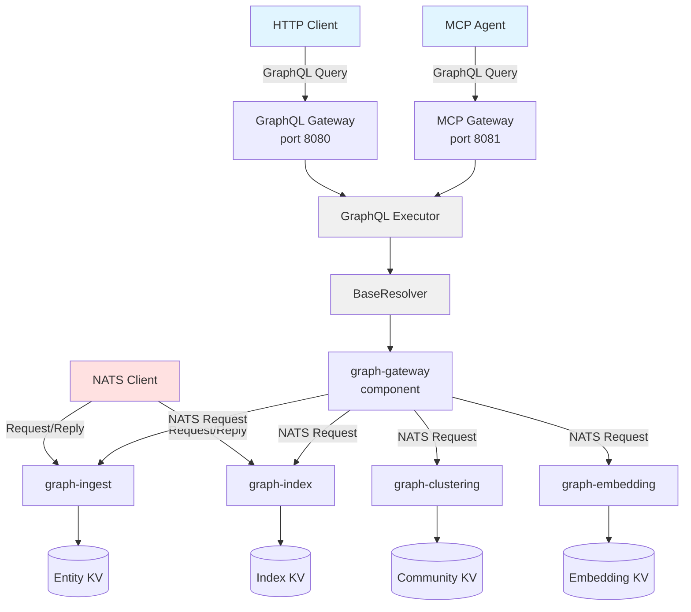

# Query Access

How to query SemStreams knowledge graphs via GraphQL gateways or direct NATS request/reply.

## Access Methods

SemStreams provides three ways to query knowledge graphs:

| Method | Port | Purpose | Audience |
|--------|------|---------|----------|
| GraphQL HTTP | 8080 | Standard GraphQL endpoint | Applications, users |
| MCP Gateway | 8081 | AI agent integration | Claude, LLM agents |
| NATS Request/Reply | N/A | Direct component queries | Internal services, low-latency needs |

The GraphQL methods share the same GraphQL executor and BaseResolver. NATS request/reply provides direct access to
component-owned data without gateway mediation.

## Why GraphQL

GraphQL provides several advantages over REST for knowledge graph access:

### Request Only What You Need

GraphQL lets clients request exactly the fields they need:

```graphql
query {
  entity(id: "sensor-042") {
    id
    type
    properties
  }
}
```

A REST API would return all fields. With large graphs, this bloats responses unnecessarily.

### Structured Queries

Clients express intent through schema-validated queries. The schema documents available operations:

```graphql
type Query {
  entity(id: ID!): Entity
  relationships(entityId: ID!, direction: RelationshipDirection): [Relationship!]!
  semanticSearch(query: String!, limit: Int): [SemanticSearchResult!]!
  localSearch(entityId: ID!, query: String!): LocalSearchResult
  globalSearch(query: String!): GlobalSearchResult
  pathSearch(startEntity: ID!, maxDepth: Int): PathSearchResult
}
```

### Security and Auditability

Every query is:

- **Schema-validated**: Only defined operations are allowed
- **Logged**: Full query text captured for audit
- **Bounded**: Resource limits prevent runaway queries
- **Read-only**: No mutations, no data modification

## GraphQL HTTP Gateway

Standard GraphQL endpoint for applications and users.

### Endpoint

- **Query**: `POST /graphql`
- **Playground**: `GET /` (optional, for exploration)
- **Health**: `GET /health`

### Example Request

```bash
curl -X POST http://localhost:8080/graphql \
  -H "Content-Type: application/json" \
  -d '{
    "query": "{ entity(id: \"sensor-042\") { id type properties } }"
  }'
```

### Response Format

```json
{
  "data": {
    "entity": {
      "id": "sensor-042",
      "type": "Sensor",
      "properties": {"location": "warehouse-a", "model": "TH-200"}
    }
  }
}
```

### GraphQL Playground

When enabled, visiting the root URL opens an interactive GraphQL IDE for exploring the schema and testing queries.

## MCP Gateway

For AI agents using Model Context Protocol.

### What is MCP?

Model Context Protocol is Anthropic's open standard for connecting AI assistants to external data sources. Instead of giving an AI agent arbitrary code execution, MCP provides structured, auditable operations.

### Why MCP for AI Agents?

| Aspect | MCP Gateway | Direct Tools (shell, Python) |
|--------|-------------|------------------------------|
| Capabilities | Defined by schema | Unlimited |
| Auditability | Full query logging | Limited |
| Security | Schema-validated | Trust-based |
| Token efficiency | Request only needed fields | Full responses |
| Error handling | Structured errors | Arbitrary failures |

MCP trades flexibility for safety—ideal for production AI agent deployments.

### Connection

AI agents connect via HTTP with Server-Sent Events (SSE) transport:

- **Endpoint**: `http://localhost:8081/mcp`
- **Protocol**: MCP over SSE

### Tool Interface

The MCP gateway exposes a single `graphql` tool that accepts any valid GraphQL query:

```json
{
  "tool": "graphql",
  "arguments": {
    "query": "{ entity(id: \"sensor-042\") { id type } }",
    "variables": {}
  }
}
```

## NATS Request/Reply Queries

Direct component queries using NATS request/reply pattern. This bypasses the GraphQL gateway and queries components
directly using their native NATS subjects.

### When to Use NATS Request/Reply

| Use Case | Why NATS Request/Reply |
|----------|------------------------|
| Internal service communication | Avoids HTTP overhead, native NATS transport |
| Low-latency queries | Direct component access, no gateway mediation |
| Programmatic access | Simpler protocol than GraphQL for machine clients |
| Component-specific operations | Access operations not exposed through GraphQL |

### Subject Naming Convention

Components expose query endpoints following this pattern:

```text
graph.<component>.query.<operation>
```

Examples:

- `graph.ingest.query.entity` - Get entity by ID
- `graph.ingest.query.batch` - Get multiple entities
- `graph.index.query.outgoing` - Get outgoing relationships
- `graph.index.query.alias` - Resolve alias to entity ID

### Available Queries by Component

#### graph-ingest

| Subject | Operation | Description |
|---------|-----------|-------------|
| `graph.ingest.query.entity` | getEntity | Get single entity by ID |
| `graph.ingest.query.batch` | getBatch | Get multiple entities by IDs |

**Request Example (getEntity):**

```json
{
  "id": "acme.ops.robotics.gcs.drone.001"
}
```

**Response:**

```json
{
  "id": "acme.ops.robotics.gcs.drone.001",
  "triples": [
    {
      "subject": "acme.ops.robotics.gcs.drone.001",
      "predicate": "rdf:type",
      "object": "Drone"
    }
  ],
  "version": 3,
  "updated_at": "2026-01-06T10:30:00Z"
}
```

#### graph-index

| Subject | Operation | Description |
|---------|-----------|-------------|
| `graph.index.query.outgoing` | getOutgoing | Get outgoing relationships for an entity |
| `graph.index.query.incoming` | getIncoming | Get incoming relationships for an entity |
| `graph.index.query.alias` | getAlias | Resolve alias to canonical entity ID |
| `graph.index.query.predicate` | getPredicate | Get entities with a specific predicate |

**Request Example (getOutgoing):**

```json
{
  "entity_id": "acme.ops.robotics.gcs.drone.001"
}
```

**Response:**

```json
[
  {
    "to_entity_id": "acme.ops.robotics.gcs.warehouse.main",
    "predicate": "locatedAt"
  },
  {
    "to_entity_id": "acme.ops.robotics.gcs.mission.42",
    "predicate": "assignedTo"
  }
]
```

### Using NATS CLI

Query components using the `nats` CLI tool:

```bash
# Get single entity
nats req graph.ingest.query.entity '{"id":"acme.ops.robotics.gcs.drone.001"}'

# Get multiple entities
nats req graph.ingest.query.batch '{"ids":["drone.001","drone.002"]}'

# Get outgoing relationships
nats req graph.index.query.outgoing '{"entity_id":"acme.ops.robotics.gcs.drone.001"}'

# Resolve alias
nats req graph.index.query.alias '{"alias":"main-warehouse"}'
```

### Error Handling

Components return structured error responses:

```json
{
  "error": "not found"
}
```

Standard error messages:

- `"invalid request"` - Malformed JSON or missing required fields
- `"not found"` - Entity or resource not found
- `"internal error"` - Component-side failure

### Query Discovery

Components implementing `QueryCapabilityProvider` expose their capabilities via a special discovery endpoint:

```bash
# Discover graph-ingest capabilities
nats req graph.ingest.query.capabilities '{}'
```

**Response:**

```json
{
  "component": "graph-ingest",
  "version": "1.0.0",
  "queries": [
    {
      "subject": "graph.ingest.query.entity",
      "operation": "getEntity",
      "description": "Get single entity by ID",
      "request_schema": {
        "type": "object",
        "properties": {
          "id": {"type": "string", "description": "Entity ID to retrieve"}
        },
        "required": ["id"]
      },
      "response_schema": {
        "$ref": "#/definitions/EntityState"
      }
    }
  ],
  "definitions": {
    "EntityState": {
      "type": "object",
      "properties": {
        "id": {"type": "string"},
        "triples": {"type": "array"},
        "version": {"type": "integer"},
        "updated_at": {"type": "string", "format": "date-time"}
      }
    }
  }
}
```

### NATS vs GraphQL

| Aspect | NATS Request/Reply | GraphQL Gateway |
|--------|-------------------|-----------------|
| Latency | Lower (direct component access) | Higher (gateway mediation) |
| Protocol | NATS native | HTTP + GraphQL |
| Schema | JSON Schema per component | Unified GraphQL schema |
| Field selection | Fixed response structure | Client controls fields |
| Access control | NATS ACLs | HTTP middleware |
| Discovery | Per-component capabilities | GraphQL introspection |
| Best for | Internal services, latency-sensitive | External clients, exploration |

## Available Operations

The GraphQL gateways expose the same operations:

### Entity Operations

| Query | Description |
|-------|-------------|
| `entity(id)` | Get single entity by ID |
| `entityByAlias(aliasOrID)` | Get entity by alias or ID |
| `entities(ids)` | Batch get multiple entities |
| `entitiesByType(type, limit)` | Get all entities of a type |

### Relationship Queries

| Query | Description |
|-------|-------------|
| `relationships(entityId, direction, edgeTypes)` | Query relationships for an entity |
| `pathSearch(startEntity, maxDepth, direction, edgeTypes)` | Bounded graph traversal (PathRAG) |

### Search Operations

| Query | Description |
|-------|-------------|
| `semanticSearch(query, limit)` | Vector similarity search |
| `localSearch(entityId, query)` | Search within entity's community |
| `globalSearch(query, maxCommunities)` | Search across all communities |
| `spatialSearch(north, south, east, west)` | Entities within geographic bounds |
| `temporalSearch(startTime, endTime)` | Entities within time range |

### Community Operations

| Query | Description |
|-------|-------------|
| `community(id)` | Get community by ID |
| `entityCommunity(entityId, level)` | Get community containing an entity |
| `communitiesByLevel(level)` | List all communities at a hierarchy level |

### Snapshot Operations

| Query | Description |
|-------|-------------|
| `graphSnapshot(bounds, timeRange, types)` | Extract bounded subgraph |

## Architecture

The three access methods follow different execution paths:



Key design decisions:

- **GraphQL Path**: HTTP/MCP → GraphQL Executor → BaseResolver → graph-gateway → Component NATS queries
- **Direct NATS Path**: NATS Client → Component query handler → KV bucket
- **Shared executor**: GraphQL HTTP and MCP Gateway use the same GraphQL execution engine
- **In-process execution**: graph-gateway component runs in same process as GraphQL executor
- **Component ownership**: Each component queries only the KV buckets it owns

## When to Use Which

| Use Case | Recommended |
|----------|-------------|
| Application integration | GraphQL HTTP |
| AI agent (Claude, etc.) | MCP Gateway |
| Interactive exploration | GraphQL Playground |
| Automated scripts | GraphQL HTTP |
| Browser-based apps | GraphQL HTTP (with CORS) |
| Internal service calls | NATS Request/Reply |
| Low-latency queries | NATS Request/Reply |
| Bypassing gateway | NATS Request/Reply |
| Component-specific operations | NATS Request/Reply |

## Configuration

Both gateways are configured via the component configuration. See [Configuration Guide](../basics/06-configuration.md) for details.

### Resource Limits

Both gateways enforce the same limits:

| Limit | Default | Description |
|-------|---------|-------------|
| Query timeout | 30s | Maximum query execution time |
| Max results | 1000 | Maximum entities per query |
| Max depth | 10 | Maximum PathRAG traversal depth |

## Related

- [Query Discovery](10-query-discovery.md) - Implementing QueryCapabilityProvider for NATS queries
- [GraphRAG Pattern](07-graphrag-pattern.md) - Community-based search
- [PathRAG Pattern](08-pathrag-pattern.md) - Structural traversal
- [Knowledge Graphs](02-knowledge-graphs.md) - The data model exposed by GraphQL
- [Event-Driven Basics](01-event-driven-basics.md) - HTTP Request/Reply gateway for NATS services
