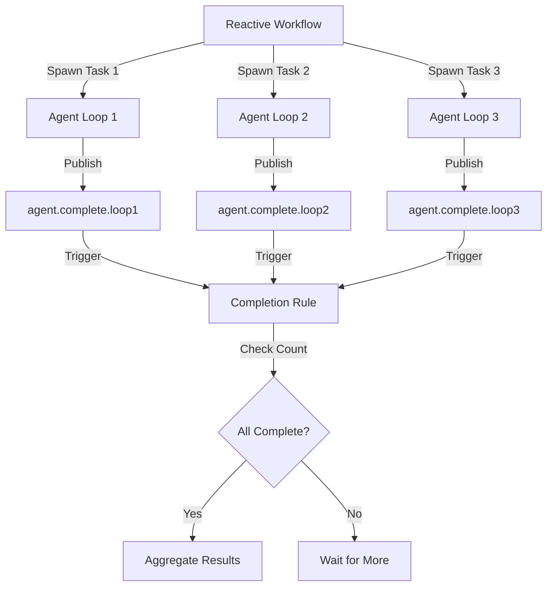

# Parallel Agent Execution

Running multiple agents concurrently using reactive workflows and event-driven coordination.

## Overview

The current architecture executes parallel agents through reactive workflows that spawn multiple `TaskMessage`
payloads and react to their completion events. Unlike the removed DAG-based parallel steps system, this approach
uses pure event-driven orchestration with no callbacks or blocking. Each agent runs independently in an
`agentic-loop`, publishes completion events to NATS subjects, and writes state to the `AGENT_LOOPS` KV bucket.



## Architecture Components

### 1. Agentic Loop (`processor/agentic-loop/`)

Executes individual agent tasks from start to completion. Each loop:

- Consumes `agent.task.*` messages from the `AGENT` stream
- Orchestrates model calls and tool execution
- Publishes `agent.complete.*` or `agent.failed.*` events
- Writes state to `AGENT_LOOPS` KV bucket with keys `LOOP_{loopID}` and `COMPLETE_{loopID}`

Key state fields for workflow correlation:

```go
type LoopEntity struct {
    ID           string    `json:"id"`
    TaskID       string    `json:"task_id"`
    State        LoopState `json:"state"`
    WorkflowSlug string    `json:"workflow_slug,omitempty"` // Workflow identifier
    WorkflowStep string    `json:"workflow_step,omitempty"` // Step identifier for fan-in
    // ... other fields
}
```

### 2. Reactive Workflows (`processor/reactive/`)

Coordinate multiple agents through typed rules and state machines. Workflows:

- Spawn parallel agents via `ActionPublishAsync` rules
- Track completion state in custom KV buckets
- React to agent completion via KV watches or subject consumers
- Implement fan-in aggregation in state mutators

Key reactive primitives:

- **KV Watch Triggers**: Monitor state changes in KV buckets
- **Subject Triggers**: React to agent completion events
- **State Mutators**: Aggregate results when agents complete

### 3. Pure Event Model

No blocking or callback registration. All coordination happens through:

- **Events**: `LoopCompletedEvent`, `LoopFailedEvent`, `LoopCancelledEvent` published to NATS subjects
- **KV State**: Loop entities and completion state written to `AGENT_LOOPS` bucket
- **Correlation**: `WorkflowSlug` and `WorkflowStep` fields link agents to workflows

## Spawning Parallel Agents

Use reactive workflow rules with `ActionPublishAsync` to spawn multiple agent tasks.

### Example: Three-Agent Fan-Out

```go
// Custom workflow state tracks agent completions
type MultiAgentState struct {
    reactive.ExecutionState

    TaskIDs       []string          `json:"task_ids"`
    Completions   map[string]string `json:"completions"`   // loopID -> result
    AgentsNeeded  int               `json:"agents_needed"`
    AgentsComplete int              `json:"agents_complete"`
}

// Rule 1: Spawn three agents on workflow start
NewRuleBuilder("spawn-agents").
    TriggerOnKV(stateBucket, "exec-*").
    When(func(ctx *reactive.RuleContext) bool {
        state := ctx.State.(*MultiAgentState)
        return state.Phase == "start" && len(state.TaskIDs) == 0
    }).
    PublishAsync(
        "agent.task.parallel",
        "agentic.task.v1",
        func(ctx *reactive.RuleContext) (message.Payload, error) {
            state := ctx.State.(*MultiAgentState)

            // Spawn first agent
            task := &agentic.TaskMessage{
                TaskID:       uuid.New().String(),
                Role:         "security_reviewer",
                Model:        "claude-sonnet-4",
                Prompt:       "Review code for security vulnerabilities",
                WorkflowSlug: "multi-agent-review",
                WorkflowStep: "reviewer-1", // Used for correlation
            }

            state.TaskIDs = append(state.TaskIDs, task.TaskID)
            return task, nil
        },
        func(ctx *reactive.RuleContext, result any) error {
            state := ctx.State.(*MultiAgentState)
            state.AgentsNeeded = 3
            state.Completions = make(map[string]string)
            state.Phase = "spawning"
            return nil
        },
    ).
    Build()

// Note: This example shows spawning one agent. To spawn three agents,
// you would either:
// 1. Fire the rule three times with MaxFirings: 3
// 2. Create three separate rules with different WorkflowStep values
// 3. Publish three TaskMessages in the BuildPayload function
```

## Reacting to Agent Completions

Reactive workflows can monitor agent completion using KV watches or subject consumers.

### Fan-In Pattern: KV Watch

Monitor the `AGENT_LOOPS` bucket for `COMPLETE_{loopID}` keys:

```go
// Rule 2: React to agent completion via KV watch
NewRuleBuilder("agent-completed").
    TriggerOnKV("AGENT_LOOPS", "COMPLETE_*").
    When(func(ctx *reactive.RuleContext) bool {
        // KV watch triggers when COMPLETE_{loopID} is written
        completion := ctx.State.(*agentic.LoopCompletedEvent)

        // Only process completions from our workflow
        return completion.WorkflowSlug == "multi-agent-review"
    }).
    Mutate(func(ctx *reactive.RuleContext, result any) error {
        // Load workflow execution state
        completion := ctx.State.(*agentic.LoopCompletedEvent)

        // Get execution ID from WorkflowStep or other correlation field
        execID := completion.WorkflowStep // or derive from LoopID

        // Load and update workflow state
        var workflowState MultiAgentState
        // ... load from workflow's state bucket using execID

        workflowState.Completions[completion.LoopID] = completion.Result
        workflowState.AgentsComplete++

        if workflowState.AgentsComplete >= workflowState.AgentsNeeded {
            workflowState.Phase = "aggregating"
        }

        // ... save updated state
        return nil
    }).
    Build()
```

### Fan-In Pattern: Subject Consumer

React to completion events via NATS subjects:

```go
// Rule 2: React to agent completion via subject
NewRuleBuilder("agent-completed").
    TriggerOnSubject("AGENT", "agent.complete.>").
    WithStateLookup("WORKFLOW_STATE", func(msg any) string {
        completion := msg.(*agentic.LoopCompletedEvent)
        // Extract execution ID from WorkflowSlug or custom field
        return "exec-" + completion.WorkflowSlug
    }).
    When(func(ctx *reactive.RuleContext) bool {
        completion := ctx.Message.(*agentic.LoopCompletedEvent)
        state := ctx.State.(*MultiAgentState)

        // Only process completions for our agents
        return completion.WorkflowSlug == state.ID
    }).
    Mutate(func(ctx *reactive.RuleContext, result any) error {
        completion := ctx.Message.(*agentic.LoopCompletedEvent)
        state := ctx.State.(*MultiAgentState)

        // Aggregate result
        state.Completions[completion.LoopID] = completion.Result
        state.AgentsComplete++

        if state.AgentsComplete >= state.AgentsNeeded {
            state.Phase = "aggregating"
        }

        return nil
    }).
    Build()
```

## Aggregation Patterns

### Union: Collect All Results

Wait for all agents to complete, then combine results:

```go
NewRuleBuilder("aggregate-all").
    TriggerOnKV(stateBucket, "exec-*").
    When(func(ctx *reactive.RuleContext) bool {
        state := ctx.State.(*MultiAgentState)
        return state.Phase == "aggregating" &&
               state.AgentsComplete == state.AgentsNeeded
    }).
    Mutate(func(ctx *reactive.RuleContext, result any) error {
        state := ctx.State.(*MultiAgentState)

        // Combine all agent results
        combinedResults := make([]string, 0, len(state.Completions))
        for _, result := range state.Completions {
            combinedResults = append(combinedResults, result)
        }

        state.FinalResult = strings.Join(combinedResults, "\n\n")
        state.Phase = "complete"
        return nil
    }).
    Build()
```

### First: Return on First Success

Complete as soon as any agent succeeds:

```go
NewRuleBuilder("first-success").
    TriggerOnKV("AGENT_LOOPS", "COMPLETE_*").
    When(func(ctx *reactive.RuleContext) bool {
        completion := ctx.State.(*agentic.LoopCompletedEvent)
        return completion.WorkflowSlug == "multi-agent-review" &&
               completion.Outcome == agentic.OutcomeSuccess
    }).
    Mutate(func(ctx *reactive.RuleContext, result any) error {
        completion := ctx.State.(*agentic.LoopCompletedEvent)

        // Load workflow state and mark complete with first result
        // ... (state loading logic)

        workflowState.FinalResult = completion.Result
        workflowState.Phase = "complete"
        return nil
    }).
    Build()
```

### Majority: Require Consensus

Wait until more than 50% complete successfully:

```go
NewRuleBuilder("majority-consensus").
    TriggerOnKV(stateBucket, "exec-*").
    When(func(ctx *reactive.RuleContext) bool {
        state := ctx.State.(*MultiAgentState)
        successCount := 0
        for _, status := range state.CompletionStatus {
            if status == "success" {
                successCount++
            }
        }

        threshold := (state.AgentsNeeded / 2) + 1
        return successCount >= threshold
    }).
    Mutate(func(ctx *reactive.RuleContext, result any) error {
        state := ctx.State.(*MultiAgentState)

        // Aggregate successful results only
        successResults := []string{}
        for loopID, status := range state.CompletionStatus {
            if status == "success" {
                successResults = append(successResults, state.Completions[loopID])
            }
        }

        state.FinalResult = aggregateResults(successResults)
        state.Phase = "complete"
        return nil
    }).
    Build()
```

## Correlation Strategies

Use `WorkflowSlug` and `WorkflowStep` fields to correlate agent completions back to workflow executions.

### Pattern 1: Slug-Based Correlation

Use `WorkflowSlug` as the execution ID:

```go
// When spawning agents
task := &agentic.TaskMessage{
    TaskID:       uuid.New().String(),
    WorkflowSlug: executionID, // e.g., "exec-12345"
    WorkflowStep: "step-1",
}

// When reacting to completion
completion := msg.(*agentic.LoopCompletedEvent)
execKey := "exec-" + completion.WorkflowSlug
```

### Pattern 2: Step-Based Fan-In

Use `WorkflowStep` to identify which parallel branch completed:

```go
// Spawn three agents with different steps
tasks := []agentic.TaskMessage{
    {TaskID: uuid1, WorkflowSlug: execID, WorkflowStep: "reviewer-security"},
    {TaskID: uuid2, WorkflowSlug: execID, WorkflowStep: "reviewer-style"},
    {TaskID: uuid3, WorkflowSlug: execID, WorkflowStep: "reviewer-sop"},
}

// Track completions by step
completion := msg.(*agentic.LoopCompletedEvent)
state.CompletionsByStep[completion.WorkflowStep] = completion.Result
```

### Pattern 3: TaskID Lookup

Store `TaskID -> ExecutionID` mapping:

```go
// When spawning
task := &agentic.TaskMessage{TaskID: taskID}
state.TaskToExecMap[taskID] = state.ID

// When completing
completion := msg.(*agentic.LoopCompletedEvent)
execID := lookupExecID(completion.TaskID)
```

## Complete Example: Multi-Reviewer Workflow

Full reactive workflow that spawns three reviewers and aggregates results:

```go
package myworkflows

import (
    "github.com/c360studio/semstreams/agentic"
    "github.com/c360studio/semstreams/message"
    "github.com/c360studio/semstreams/processor/reactive"
    "github.com/google/uuid"
)

// ReviewState tracks multi-agent review execution
type ReviewState struct {
    reactive.ExecutionState

    CodeRef         string            `json:"code_ref"`
    ReviewerTasks   []string          `json:"reviewer_tasks"`
    ReviewResults   map[string]string `json:"review_results"`
    ReviewersNeeded int               `json:"reviewers_needed"`
    ReviewersDone   int               `json:"reviewers_done"`
    FinalVerdict    string            `json:"final_verdict"`
}

// MultiReviewWorkflow spawns parallel agents and aggregates results
func MultiReviewWorkflow() *reactive.Definition {
    return &reactive.Definition{
        ID:          "code-review-multi",
        Description: "Multi-agent code review with aggregation",
        StateBucket: "CODE_REVIEWS",
        StateFactory: func() any { return &ReviewState{} },
        MaxIterations: 10,

        Rules: []reactive.RuleDef{
            // Rule 1: Spawn three reviewers on start
            reactive.NewRuleBuilder("spawn-reviewers").
                TriggerOnKV("CODE_REVIEWS", "review-*").
                When(func(ctx *reactive.RuleContext) bool {
                    state := ctx.State.(*ReviewState)
                    return state.Phase == "start" && len(state.ReviewerTasks) == 0
                }).
                Publish("agent.task.reviews", func(ctx *reactive.RuleContext) (message.Payload, error) {
                    state := ctx.State.(*ReviewState)

                    // Spawn all three reviewers
                    state.ReviewerTasks = []string{
                        uuid.New().String(),
                        uuid.New().String(),
                        uuid.New().String(),
                    }
                    state.ReviewersNeeded = 3
                    state.ReviewResults = make(map[string]string)

                    // This example publishes one task; in practice, loop and publish three
                    // or use MaxFirings to fire this rule three times
                    task := &agentic.TaskMessage{
                        TaskID:       state.ReviewerTasks[0],
                        Role:         "security_reviewer",
                        Model:        "claude-sonnet-4",
                        Prompt:       "Review code: " + state.CodeRef,
                        WorkflowSlug: state.ID,
                        WorkflowStep: "security",
                    }

                    return task, nil
                }, func(ctx *reactive.RuleContext, result any) error {
                    state := ctx.State.(*ReviewState)
                    state.Phase = "reviewing"
                    return nil
                }).
                Build(),

            // Rule 2: React to reviewer completions
            reactive.NewRuleBuilder("reviewer-complete").
                TriggerOnKV("AGENT_LOOPS", "COMPLETE_*").
                When(func(ctx *reactive.RuleContext) bool {
                    completion := ctx.State.(*agentic.LoopCompletedEvent)
                    return completion.WorkflowSlug != "" &&
                           completion.Outcome == agentic.OutcomeSuccess
                }).
                Mutate(func(ctx *reactive.RuleContext, result any) error {
                    completion := ctx.State.(*agentic.LoopCompletedEvent)

                    // Load review state by WorkflowSlug
                    // This is simplified; actual implementation needs KV lookup
                    var state ReviewState
                    // ... load state from CODE_REVIEWS using completion.WorkflowSlug

                    state.ReviewResults[completion.WorkflowStep] = completion.Result
                    state.ReviewersDone++

                    if state.ReviewersDone >= state.ReviewersNeeded {
                        state.Phase = "aggregating"
                    }

                    // ... save state
                    return nil
                }).
                Build(),

            // Rule 3: Aggregate all reviews
            reactive.NewRuleBuilder("aggregate-reviews").
                TriggerOnKV("CODE_REVIEWS", "review-*").
                When(func(ctx *reactive.RuleContext) bool {
                    state := ctx.State.(*ReviewState)
                    return state.Phase == "aggregating" &&
                           state.ReviewersDone == state.ReviewersNeeded
                }).
                Mutate(func(ctx *reactive.RuleContext, result any) error {
                    state := ctx.State.(*ReviewState)

                    // Simple aggregation: all must approve
                    allApproved := true
                    for _, result := range state.ReviewResults {
                        if result != "approved" {
                            allApproved = false
                            break
                        }
                    }

                    if allApproved {
                        state.FinalVerdict = "approved"
                    } else {
                        state.FinalVerdict = "rejected"
                    }

                    state.Phase = "complete"
                    state.Status = reactive.StatusCompleted
                    return nil
                }).
                Build(),
        },
    }
}
```

## Error Handling

Handle agent failures gracefully:

```go
// React to both success and failure events
reactive.NewRuleBuilder("agent-result").
    TriggerOnSubject("AGENT", "agent.complete.>", "agent.failed.>").
    WithStateLookup("WORKFLOW_STATE", func(msg any) string {
        switch evt := msg.(type) {
        case *agentic.LoopCompletedEvent:
            return "exec-" + evt.WorkflowSlug
        case *agentic.LoopFailedEvent:
            return "exec-" + evt.WorkflowSlug
        }
        return ""
    }).
    When(func(ctx *reactive.RuleContext) bool {
        return ctx.Message != nil
    }).
    Mutate(func(ctx *reactive.RuleContext, result any) error {
        state := ctx.State.(*MultiAgentState)

        switch evt := ctx.Message.(type) {
        case *agentic.LoopCompletedEvent:
            state.Completions[evt.LoopID] = evt.Result
            state.CompletionStatus[evt.LoopID] = "success"
        case *agentic.LoopFailedEvent:
            state.Completions[evt.LoopID] = evt.Error
            state.CompletionStatus[evt.LoopID] = "failed"
        }

        state.AgentsComplete++
        return nil
    }).
    Build()
```

## Observability

Monitor parallel agent execution:

### Metrics

Track agent lifecycle events:

```go
// Agent loop metrics (built-in)
semstreams_agentic_loop_loops_created_total
semstreams_agentic_loop_loops_completed_total
semstreams_agentic_loop_loops_failed_total

// Workflow metrics (custom)
workflow_agents_spawned_total{workflow="code-review-multi"}
workflow_agents_completed_total{workflow="code-review-multi"}
workflow_completion_time_seconds{workflow="code-review-multi"}
```

### KV State Inspection

Query agent state directly:

```bash
# List all agent loops
nats kv ls AGENT_LOOPS

# Get specific loop state
nats kv get AGENT_LOOPS LOOP_abc123

# Watch for completions
nats kv watch AGENT_LOOPS --filter "COMPLETE_*"
```

### Event Tracing

Follow event chain through NATS:

```bash
# Subscribe to agent events
nats sub "agent.>"

# Watch specific workflow's agents
nats sub "agent.complete.*" | grep "workflow_slug.*code-review-multi"
```

## Best Practices

### 1. Use Correlation Fields

Always set `WorkflowSlug` and `WorkflowStep` when spawning agents:

```go
task := &agentic.TaskMessage{
    TaskID:       uuid.New().String(),
    WorkflowSlug: executionID,      // Required for correlation
    WorkflowStep: "reviewer-security", // Identifies parallel branch
}
```

### 2. Track Completion Count

Maintain counters to avoid race conditions:

```go
type State struct {
    reactive.ExecutionState
    AgentsNeeded  int `json:"agents_needed"`   // Set when spawning
    AgentsComplete int `json:"agents_complete"` // Increment on completion
}
```

### 3. Handle Partial Failures

Do not block indefinitely if some agents fail:

```go
When(func(ctx *reactive.RuleContext) bool {
    state := ctx.State.(*MultiAgentState)

    // Proceed if all done OR timeout OR majority failed
    return state.AgentsComplete >= state.AgentsNeeded ||
           time.Since(state.CreatedAt) > 5*time.Minute ||
           state.FailureCount > state.AgentsNeeded/2
})
```

### 4. Use Timeouts

Set execution deadlines:

```go
&reactive.Definition{
    Timeout: 10 * time.Minute, // Workflow-level timeout
}
```

### 5. Idempotent State Mutations

Handle duplicate completion events:

```go
Mutate(func(ctx *reactive.RuleContext, result any) error {
    state := ctx.State.(*MultiAgentState)
    completion := ctx.Message.(*agentic.LoopCompletedEvent)

    // Only count each agent once
    if _, exists := state.Completions[completion.LoopID]; !exists {
        state.Completions[completion.LoopID] = completion.Result
        state.AgentsComplete++
    }

    return nil
})
```

## Related Documentation

- [Agentic Systems](11-agentic-systems.md) - Core agentic concepts and loop architecture
- [Reactive Workflows](../architecture/adr-021-reactive-workflows.md) - Reactive workflow engine design
- [Orchestration Layers](12-orchestration-layers.md) - When to use rules vs workflows
- [Payload Registry](13-payload-registry.md) - Message type registration for deserialization

## Migration from DAG Workflows

The old parallel steps feature (`type: "parallel"` with nested steps and aggregators) has been removed. To migrate:

1. **Replace parallel steps with reactive rules** that publish multiple `TaskMessage` payloads
2. **Replace aggregators with state mutators** that collect results in workflow state
3. **Use KV watches or subject triggers** instead of callback-based coordination
4. **Track completion count** in workflow state instead of relying on workflow engine to track substeps

Example migration:

```json
// OLD: DAG parallel step
{
  "name": "parallel_review",
  "type": "parallel",
  "steps": [...],
  "wait": "all",
  "aggregator": "union"
}
```

```go
// NEW: Reactive rules with state tracking
reactive.NewRuleBuilder("spawn-agents").
    PublishAsync(...).
    Build()

reactive.NewRuleBuilder("agent-completed").
    TriggerOnKV("AGENT_LOOPS", "COMPLETE_*").
    Mutate(func(ctx *reactive.RuleContext, result any) error {
        // Aggregate results in state
        state := ctx.State.(*ReviewState)
        state.Results = append(state.Results, result)
        return nil
    }).
    Build()
```

The reactive approach provides more flexibility, better observability, and clearer control flow at the cost of
requiring explicit state management.
