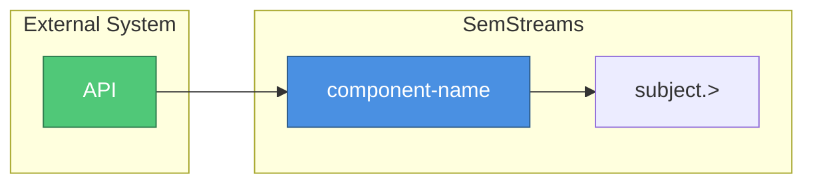

# Optional Integration Documentation Pattern

This guide establishes conventions for documenting optional integrations like AGNTCY and future external system bridges.

## Package Structure

Optional integrations should follow this structure:

```
/input/<integration>/
├── component.go      # Main component implementation
├── component_test.go # Unit tests
├── config.go         # Configuration struct and validation
├── factory.go        # Component registration
├── doc.go            # Go package documentation (technical)
└── README.md         # User guide (setup, config, troubleshooting)

/output/<integration>/
└── (same structure)

/processor/<integration>/
└── (same structure)
```

## Documentation Files

### doc.go (Go Package Documentation)

Technical documentation for Go developers, rendered by `go doc`.

**Required sections:**

1. **Package summary** (1-2 sentences)
2. **Architecture** (ASCII diagram showing data flow)
3. **Features** (bullet list)
4. **Configuration** (JSON example)
5. **Thread Safety** (concurrency guarantees)
6. **Error Handling** (error patterns and behavior)
7. **Metrics** (Prometheus metrics list)
8. **Usage** (typical deployment pattern)
9. **Testing** (how to run tests)
10. **See Also** (related packages)

**Length guideline:** 100-200 lines

**Example structure:**

```go
// Package example provides an Example integration component.
//
// Brief description of what this component does and why.
//
// # Architecture
//
//	┌─────────────────┐     ┌──────────────────┐
//	│   Source        │────▶│  Component       │
//	└─────────────────┘     └──────────────────┘
//
// # Features
//
//   - Feature one
//   - Feature two
//
// # Configuration
//
//	{
//	    "key": "value"
//	}
//
// # Thread Safety
//
// Description of thread safety guarantees.
//
// # Error Handling
//
// How errors are handled.
//
// # Metrics
//
// Prometheus metrics (namespace: semstreams, subsystem: example):
//
//   - metric_name: Description
//
// # See Also
//
//   - related/package: Description
package example
```

### README.md (User Guide)

User-facing documentation with setup instructions and troubleshooting.

**Required sections:**

1. **Title and summary** (what this component does)
2. **Overview** (why you'd use it, what problems it solves)
3. **Architecture** (Mermaid diagram)
4. **Features** (bullet list)
5. **Quick Start** (minimal working config)
6. **Configuration** (basic and advanced examples)
7. **Configuration Options** (table with all options)
8. **NATS Topology** (input/output subjects)
9. **Data Flow** (sequence diagram)
10. **Metrics** (Prometheus metrics table)
11. **Troubleshooting** (common issues and solutions)
12. **Example** (real-world use case)
13. **See Also** (links to related docs)

**Length guideline:** 200-400 lines

**Mermaid diagram template:**

```markdown
## Architecture


```

**Troubleshooting template:**

```markdown
## Troubleshooting

### Problem Name

**Symptoms**: What the user observes

**Checks**:
1. First thing to verify
2. Second thing to verify
3. Third thing to verify

**Solution**: How to fix it
```

## When to Create Both Files

| Scenario | doc.go | README.md |
|----------|--------|-----------|
| Simple internal component | Required | Optional |
| External integration | Required | Required |
| Complex configuration | Required | Required |
| User-facing component | Required | Required |

External integrations (AGNTCY, etc.) should always have both files because:

- **doc.go**: Developers extending or debugging the component
- **README.md**: Operators configuring and troubleshooting deployments

## Cross-Referencing

### From doc.go

Use relative package paths:

```go
// # See Also
//
//   - output/example: Export entities to external system
//   - vocabulary/example: URI/EntityID translation
```

### From README.md

Use relative file paths:

```markdown
## See Also

- [Example Output](../../output/example/README.md)
- [Integration Guide](../../docs/concepts/20-agntcy-integration.md)
```

## Integration-Specific Documentation

For integrations that span multiple components (e.g., with input/output/vocab packages), also create:

### Integration Guide

Location: `/docs/integration/<integration>-integration.md`

Content:
- End-to-end setup instructions
- Deployment patterns (unidirectional, bidirectional)
- Configuration examples for each pattern
- Security considerations
- Performance tuning

### Architecture Spec (for complex integrations)

Location: `/docs/architecture/specs/<integration>-spec.md`

Content:
- Detailed design decisions
- API contracts
- Data model mappings
- Error handling strategy
- Future roadmap

## Checklist for New Integrations

- [ ] `doc.go` with all required sections
- [ ] `README.md` with all required sections
- [ ] Mermaid architecture diagram in README
- [ ] Configuration options table
- [ ] Troubleshooting section with common issues
- [ ] Prometheus metrics documented in both files
- [ ] Integration guide in `/docs/integration/` (if multi-component)
- [ ] Links to external documentation
- [ ] Example configuration for real-world use case

## Examples

Reference implementations:

- **Directory Bridge**: `output/directory-bridge/`
- **WebSocket**: `output/websocket/`, `input/websocket/`
