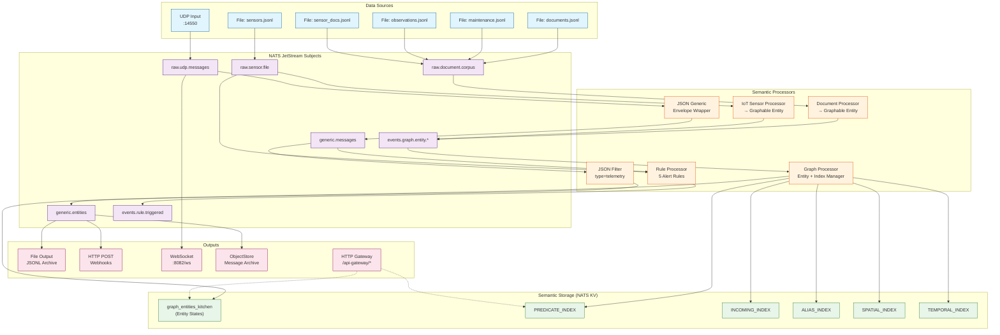

# Semantic Kitchen Sink: The Complete Framework Story

## Overview

The Kitchen Sink scenario demonstrates the full SemStreams capability stack through two variants:
- **Core**: CI-safe, no ML dependencies (BM25 lexical search)
- **ML**: Full semantic search with embeddings (requires semembed service)

## The Problem: Data Without Meaning

Traditional stream processing treats data as opaque bytes flowing through pipes. You can filter, transform, and route messages—but the system has no understanding of *what* the data represents or *how* entities relate to each other.

Consider a logistics operation with:
- **IoT sensors** reporting temperature, humidity, and pressure readings
- **Maintenance records** documenting equipment repairs
- **Safety observations** from inspectors
- **Operational documents** like manuals and procedures

In a traditional system, these are just separate data streams. When a cold storage temperature spikes, you might trigger an alert—but you can't automatically answer:
- *"What maintenance was recently done on this unit?"*
- *"Are there related safety observations?"*
- *"What's the trend across all sensors in this zone?"*

## The Solution: Semantic Streaming

SemStreams transforms raw data streams into a **knowledge graph** that understands entities, relationships, and meaning. Every piece of data becomes a node in a queryable graph with:

- **Federated Entity IDs**: `{org}.{platform}.{domain}.{type}.{instance}`
- **Semantic Triples**: Subject-Predicate-Object facts about each entity
- **Multiple Indexes**: Predicate, incoming, alias, spatial, temporal
- **Search**: BM25 lexical (core) or embedding-based semantic (ML)

## Kitchen Sink Architecture

The kitchen sink scenario demonstrates the complete SemStreams capability stack:



## Data Flow Explained

### 1. Ingestion Layer

**Real-time Telemetry (UDP Path)**
```
UDP :14550 → raw.udp.messages → json_generic → generic.messages → json_filter(type=telemetry) → generic.entities
                                                    ↓
                                              rule_processor → events.rule.triggered
```
Live telemetry arrives via UDP, wrapped in an envelope, filtered by type, and routed to outputs. The rule processor also evaluates incoming messages for alert conditions.

**Document Corpus (File Inputs)**
```
documents.jsonl    ┐
maintenance.jsonl  ├→ raw.document.corpus → document_processor → events.graph.entity.document
observations.jsonl │
sensor_docs.jsonl  ┘
```
Rich text content (manuals, work orders, inspection reports, sensor metadata) is transformed into Graphable entities with semantic predicates.

**Sensor Readings (File Input)**
```
sensors.jsonl → raw.sensor.file → iot_sensor → events.graph.entity.sensor
                      ↓
                rule_processor → events.rule.triggered (if thresholds exceeded)
```
Time-series sensor data becomes queryable entities. The rule processor also monitors sensor streams for threshold violations.

### 2. Semantic Processing Layer

**Document Processor** transforms incoming JSON into federated entities:
```json
// Input
{"id": "doc-001", "title": "Safety Manual", "category": "safety"}

// Output Entity ID
"c360.logistics.content.document.safety.doc-001"

// Generated Triples
[
  {"subject": "c360.logistics...", "predicate": "content.title", "object": "Safety Manual"},
  {"subject": "c360.logistics...", "predicate": "content.type", "object": "document"},
  {"subject": "c360.logistics...", "predicate": "content.category", "object": "safety"}
]
```

**IoT Sensor Processor** transforms readings into temporal entities:
```json
// Input
{"sensor_id": "temp-001", "reading": 72.5, "unit": "fahrenheit", "location": "warehouse-a"}

// Output Entity ID
"c360.logistics.environmental.sensor.temperature.temp-001"

// Generated Triples
[
  {"subject": "c360.logistics...", "predicate": "sensor.measurement.fahrenheit", "object": 72.5},
  {"subject": "c360.logistics...", "predicate": "geo.location.zone", "object": "warehouse-a"},
  {"subject": "c360.logistics...", "predicate": "time.observation.recorded", "object": "2024-01-15T10:30:00Z"}
]
```

**Rule Processor** evaluates 5 domain-specific rules:

| Rule | Conditions | Severity |
|------|------------|----------|
| `low-battery-alert` | `battery.level <= 20` | Warning |
| `high-temperature-alert` | `data.temperature >= 50.0` | Critical |
| `cold-storage-temp-alert` | `reading >= 40.0 AND unit = "fahrenheit" AND location contains "cold-storage"` | Critical |
| `high-humidity-alert` | `reading >= 50.0 AND type = "humidity"` | Warning |
| `low-air-pressure-alert` | `reading < 100.0 AND type = "pressure"` | Warning |

**Note:** The test data includes a cold storage temperature trend from 36.5°F to 48.2°F, which should trigger `cold-storage-temp-alert` after readings exceed 40°F.

### 3. Graph Storage Layer

The **Graph Processor** maintains entity state and relationships:

**Entity Storage (NATS KV: ENTITY_STATES)**
```json
{
  "entity_id": "c360.logistics.environmental.sensor.temperature.temp-001",
  "triples": [...],
  "version": 42,
  "updated_at": "2024-01-15T10:30:00Z"
}
```

**Index Types:**

| Index | Purpose | Example Query |
|-------|---------|---------------|
| PREDICATE_INDEX | Find entities by attribute | "All entities with temperature readings" |
| INCOMING_INDEX | Find entities pointing to X | "What references warehouse-a?" |
| ALIAS_INDEX | Resolve alternate identifiers | "temp-001" → full entity ID |
| SPATIAL_INDEX | Geographic queries | "Sensors within 100m of loading dock" |
| TEMPORAL_INDEX | Time-range queries | "Events in last 24 hours" |

### 4. Query & Output Layer

**HTTP Gateway** exposes semantic search:
```bash
# Semantic similarity search
curl -X POST http://localhost:8080/search/semantic \
  -d '{"query": "cold storage temperature problems", "limit": 10}'

# Entity lookup
curl http://localhost:8080/entity/c360.logistics.environmental.sensor.temperature.temp-001
```

**Multi-destination Output:**
- **File**: JSONL archive for batch analysis
- **HTTP POST**: Webhooks for external integrations
- **WebSocket**: Real-time browser dashboards
- **ObjectStore**: Immutable message archive

## Why This Matters

### Before: Disconnected Data Silos

```
Sensors → Time-series DB → Dashboard
Documents → Search Engine → Portal
Maintenance → ERP System → Reports
```
Each system has its own data model. Correlating across silos requires custom ETL.

### After: Unified Knowledge Graph

```
All Sources → SemStreams → Knowledge Graph → Any Query
```

**One query can now answer:**
- *"Show me all temperature sensors in warehouse-a with readings above normal, including related maintenance records and safety observations"*
- *"Find documents semantically similar to 'forklift safety procedures' across all content types"*
- *"What entities are related to equipment that triggered alerts this week?"*

## Running the Kitchen Sink

```bash
# Core variant (CI-safe, no ML dependencies)
task e2e:semantic-kitchen-sink-core

# ML variant (with semembed for embeddings)
task e2e:semantic-kitchen-sink-ml

# Compare both variants
task e2e:semantic-kitchen-compare
```

### Manual Execution

```bash
# Core variant
docker compose -f docker-compose.semantic-kitchen.yml up -d --wait
cd cmd/e2e && ./e2e --scenario semantic-kitchen-sink --variant core

# ML variant (requires semembed)
docker compose -f docker-compose.semantic-kitchen.yml --profile ml up -d --wait
cd cmd/e2e && ./e2e --scenario semantic-kitchen-sink --variant ml
```

### What the Test Validates

| Stage | Validation | What It Proves |
|-------|------------|----------------|
| verify-components | Required components registered | Framework wiring works |
| send-mixed-data | 20 UDP messages sent | Input pipeline accepts data |
| validate-processing | Graph processor healthy | Semantic processing running |
| test-semantic-search | semembed health check | Embedding service available (ML) |
| test-http-gateway | `/search/semantic` returns 200 | Query API operational |
| test-embedding-fallback | Graph healthy w/o semembed | BM25 fallback works (Core) |
| validate-rules | Rule metrics present | Rule processor running |
| validate-metrics | 4 required metrics exposed | Observability working |
| verify-outputs | 4 output components present | Output pipeline configured |

### Key Metrics

| Metric | Description |
|--------|-------------|
| `indexengine_events_processed_total` | Entities successfully processed by graph |
| `indexengine_index_updates_total` | Index update operations performed |
| `semstreams_cache_hits_total` | L1/L2 cache hits in DataManager |
| `semstreams_cache_misses_total` | Cache misses requiring KV lookups |

## Component Reference

### Services (4)
| Service | Port | Description |
|---------|------|-------------|
| service-manager | :8080 | HTTP API + Swagger UI |
| component-manager | - | Lifecycle orchestration |
| metrics | :9090 | Prometheus metrics endpoint |
| message-logger | - | Debug logging with KV query support |

### Inputs (6)
| Component | Type | Subject | Description |
|-----------|------|---------|-------------|
| udp | UDP | `raw.udp.messages` | Real-time telemetry on :14550 |
| file_documents | File | `raw.document.corpus` | documents.jsonl (12 docs) |
| file_maintenance | File | `raw.document.corpus` | maintenance.jsonl (16 records) |
| file_observations | File | `raw.document.corpus` | observations.jsonl (15 records) |
| file_sensors | File | `raw.sensor.file` | sensors.jsonl (30 readings) |
| file_sensor_docs | File | `raw.document.corpus` | sensor_docs.jsonl (15 docs) |

### Processors (6)
| Component | Input | Output | Description |
|-----------|-------|--------|-------------|
| json_generic | `raw.udp.messages` | `generic.messages` | Envelope wrapper |
| json_filter | `generic.messages` | `generic.entities` | Filters type=telemetry |
| document_processor | `raw.document.corpus` | `events.graph.entity.document` | Document → Graphable |
| iot_sensor | `raw.sensor.>` | `events.graph.entity.sensor` | Sensor → Graphable |
| rule | `generic.messages`, `raw.sensor.>` | `events.rule.triggered` | 5 alert rules |
| graph | `events.graph.entity.*` | KV buckets | Entity + Index management |

### Outputs (4)
| Component | Source | Destination | Description |
|-----------|--------|-------------|-------------|
| file | `generic.entities` | /tmp/*.jsonl | JSONL archive |
| httppost | `generic.entities` | localhost:9999 | Webhook delivery |
| websocket | `raw.udp.messages` | :8082/ws | Real-time streaming |
| objectstore | `generic.entities` | NATS ObjectStore | Message archive |

### Gateways (1)
| Component | Routes | Description |
|-----------|--------|-------------|
| api-gateway | `/search/semantic`, `/entity/:id` | REST API for queries |

### Storage (NATS KV Buckets)
| Bucket | Purpose |
|--------|---------|
| graph_entities_kitchen | Entity state storage |
| PREDICATE_INDEX | Query by predicate |
| INCOMING_INDEX | Query incoming relationships |
| ALIAS_INDEX | Resolve alternate identifiers |
| SPATIAL_INDEX | Geographic queries |
| TEMPORAL_INDEX | Time-range queries |

## Framework Story: What Kitchen Sink Proves

### Core Variant (CI-Safe)

The core variant proves that SemStreams can:

1. **Ingest heterogeneous data** - Multiple input types (UDP, File) with different formats
2. **Transform to semantic model** - Raw JSON becomes federated entities with triples
3. **Persist to knowledge graph** - Entities stored in NATS KV with versioning
4. **Index for queries** - Multiple index types enable different query patterns
5. **Evaluate rules** - Threshold-based alerting on streaming data
6. **Route to outputs** - Fan-out to multiple destinations (file, HTTP, WebSocket)
7. **Expose query API** - HTTP gateway for semantic queries using BM25 lexical search

### ML Variant (Full Stack)

The ML variant adds:

1. **Embedding generation** - Text content vectorized via semembed service
2. **Semantic search** - Find similar entities by meaning, not just keywords
3. **Hybrid retrieval** - Combine BM25 lexical with embedding similarity

### Test Data Story

The logistics warehouse scenario tells a coherent story:

1. **Baseline Setup** (file inputs at startup):
   - 12 operational documents (safety manuals, SOPs, procedures)
   - 16 maintenance records (equipment repairs, inspections)
   - 15 safety observations (incidents, near-misses, violations)
   - 15 sensor documentation (metadata about monitoring equipment)
   - 30 sensor readings (temperature, humidity, pressure trends)

2. **Live Operations** (UDP stream during test):
   - 20 mixed messages (10 telemetry, 10 regular)
   - Telemetry messages create/update entity state
   - Regular messages filtered, routed to outputs only

3. **Alert Scenario**:
   - Cold storage sensor (`temp-sensor-001`) shows temperature rising
   - Readings: 36.5°F → 37.1°F → 38.2°F → 41.2°F → 45.1°F → 48.2°F
   - `cold-storage-temp-alert` should trigger when reading >= 40°F

4. **Query Scenario** (what you can ask):
   - "What maintenance was done on cold storage equipment?"
   - "Are there safety observations related to temperature?"
   - "Find all sensors in zone-a"
   - "What documents mention forklift safety?"

## Assertion Gaps (Future Improvements)

Current test validates presence but not behavior. To fully prove the framework story:

### Entity Storage Assertions (Priority: High)

```go
// Verify entities were persisted
entities, _ := kvClient.Keys("graph_entities_kitchen")
assert.GreaterOrEqual(len(entities), 58) // 12+16+15+15 from file inputs

// Verify specific entity exists
entity, _ := kvClient.Get("c360.logistics.content.document.safety.doc-safety-001")
assert.NotNil(entity)
```

### Index Population Assertions (Priority: High)

```go
// Verify predicate index populated
predicates, _ := kvClient.Keys("PREDICATE_INDEX")
assert.Contains(predicates, "content.category")
assert.Contains(predicates, "sensor.type")

// Verify spatial index for sensors with coordinates
spatialKeys, _ := kvClient.Keys("SPATIAL_INDEX")
assert.GreaterOrEqual(len(spatialKeys), 15) // sensors have lat/lon
```

### Rule Triggering Assertions (Priority: Medium)

```go
// Subscribe to rule output and verify cold-storage alert fired
sub := nc.Subscribe("events.rule.triggered")
// Send sensor reading > 40F for cold-storage-1
// Assert: received message with rule_id="cold-storage-temp-alert"
```

### Search Quality Assertions (Priority: High for ML)

```go
// Query and verify relevance
results := gateway.SemanticSearch("forklift safety procedures")
assert.GreaterOrEqual(len(results), 2)
assert.Contains(results[0].EntityID, "forklift") // Most relevant
```

### End-to-End Flow Assertions (Priority: Medium)

```go
// Verify file output received data
files, _ := filepath.Glob("/tmp/semstreams-kitchen-sink*.jsonl")
assert.GreaterOrEqual(len(files), 1)
content, _ := os.ReadFile(files[0])
assert.Contains(string(content), "telemetry") // filtered messages
```

## Next Steps

- [Semantic Search Guide](../guides/semantic-search.md) - Deep dive into query capabilities
- [Custom Processors](../guides/custom-processors.md) - Build your own Graphable transformers
- [Rule Engine](../guides/rules.md) - Complex event processing
- [Federation](../scenarios/federation.md) - Edge-to-cloud data flow
