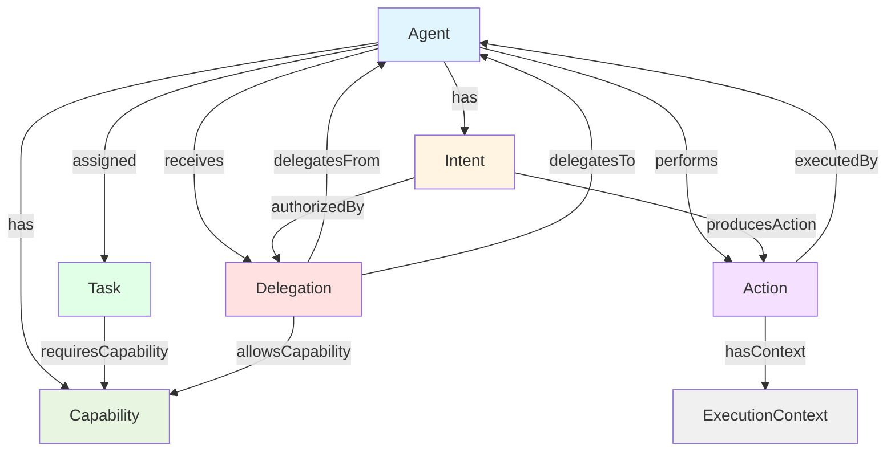

# Agentic Vocabulary

Standardized predicates and IRIs for AI agent interoperability aligned with the W3C S-Agent-Comm ontology.

## Overview

The `vocabulary/agentic` package provides a pragmatic semantic web approach to expressing agent behaviors, capabilities, delegations, and accountability in knowledge graphs. It bridges internal event processing with external standards compliance.

### Design Philosophy

SemStreams uses a dual-representation strategy:

- **Internal predicates**: Dotted notation (e.g., `agent.intent.goal`) for NATS compatibility and efficient querying
- **IRI constants**: W3C S-Agent-Comm URIs for standards compliance and interoperability
- **Registry integration**: Links both representations, enabling internal processing and external export

This approach provides the flexibility of local predicate design with the interoperability of semantic web standards.

### Standards Alignment

The predicates map to the W3C Semantic Agent Communication Community Group (SAC-CG) ontology modules:

- **core**: Agent, Action, Intent, Capability, Delegation, ExecutionContext
- **intent**: IntentType, IntentParameter, ActionType
- **capability**: Skill, CapabilityConstraint
- **delegation**: DelegationScope, DelegationChain
- **accountability**: AccountabilityEvent, ResponsibilityAttribution
- **execution-context**: ExecutionEnvironment, SecurityContext

## Predicate Categories

The vocabulary organizes agent concepts into seven categories:

| Category | Purpose | Predicates | Standards Reference |
|----------|---------|------------|-------------------|
| **Intent** | Goals and objectives | 5 predicates | [intent#](https://w3id.org/agent-ontology/intent#) |
| **Capability** | Skills and constraints | 7 predicates | [capability#](https://w3id.org/agent-ontology/capability#) |
| **Delegation** | Authority transfer | 7 predicates | [delegation#](https://w3id.org/agent-ontology/delegation#) |
| **Accountability** | Responsibility tracking | 6 predicates | [accountability#](https://w3id.org/agent-ontology/accountability#) |
| **Execution** | Runtime environment | 7 predicates | [execution-context#](https://w3id.org/agent-ontology/execution-context#) |
| **Action** | Concrete executions | 5 predicates | [core#](https://w3id.org/agent-ontology/core#) |
| **Task** | Work unit management | 5 predicates | [core#](https://w3id.org/agent-ontology/core#) |

## Usage Examples

### Basic Triple Creation

Use predicates directly in triples to express agent properties:

```go
import (
    "github.com/c360studio/semstreams/message"
    "github.com/c360studio/semstreams/vocabulary/agentic"
)

// Express an agent's intent
intent := message.Triple{
    Subject:   "acme.ai.agent.llm.architect.agent-001",
    Predicate: agentic.IntentGoal,
    Object:    "analyze customer feedback and summarize themes",
}

// Express a capability with confidence
capability := message.Triple{
    Subject:   "acme.ai.agent.llm.architect.agent-001",
    Predicate: agentic.CapabilityConfidence,
    Object:    0.95,
}
```

### Implementing Graphable Entities

Domain entities implement the `Graphable` interface to become graph entities:

```go
type Agent struct {
    ID          string
    Role        string
    Capabilities []string
    Confidence  float64
}

func (a *Agent) EntityID() string {
    return a.ID
}

func (a *Agent) Triples() []message.Triple {
    triples := []message.Triple{
        {
            Subject:   a.ID,
            Predicate: agentic.CapabilityName,
            Object:    a.Role,
        },
        {
            Subject:   a.ID,
            Predicate: agentic.CapabilityConfidence,
            Object:    a.Confidence,
        },
    }

    // Add capability relationships
    for _, cap := range a.Capabilities {
        triples = append(triples, message.Triple{
            Subject:   a.ID,
            Predicate: agentic.CapabilitySkill,
            Object:    cap,
        })
    }

    return triples
}
```

### Delegation Chain

Express authority delegation with validity periods:

```go
// Create a delegation from manager to worker agent
delegationID := "acme.ai.delegation.task.review.del-001"

delegationTriples := []message.Triple{
    {
        Subject:   delegationID,
        Predicate: agentic.DelegationFrom,
        Object:    "acme.ai.agent.manager.mgr-001",
    },
    {
        Subject:   delegationID,
        Predicate: agentic.DelegationTo,
        Object:    "acme.ai.agent.worker.wkr-001",
    },
    {
        Subject:   delegationID,
        Predicate: agentic.DelegationScope,
        Object:    "repository:acme/project",
    },
    {
        Subject:   delegationID,
        Predicate: agentic.DelegationValidFrom,
        Object:    time.Now(),
    },
    {
        Subject:   delegationID,
        Predicate: agentic.DelegationValidUntil,
        Object:    time.Now().Add(24 * time.Hour),
    },
}
```

### Registry Integration

Register predicates at application startup to enable IRI export:

```go
import "github.com/c360studio/semstreams/vocabulary/agentic"

func init() {
    // Register all agentic predicates with IRI mappings
    agentic.Register()
}

// Later, retrieve metadata including IRI mapping
meta := vocabulary.GetPredicateMetadata(agentic.IntentGoal)
fmt.Println(meta.StandardIRI)  // https://w3id.org/agent-ontology/core#Intent
```

## Conceptual Model

The agentic vocabulary expresses relationships between core agent concepts:



## IRI Mapping

Internal predicates map to S-Agent-Comm ontology IRIs for standards-compliant export:

### Intent Predicates

| Predicate | IRI | Data Type |
|-----------|-----|-----------|
| `agent.intent.goal` | `agent-ontology:Intent` | string |
| `agent.intent.type` | `agent-ontology:hasIntentType` | string |
| `agent.intent.parameter` | `agent-ontology:hasParameter` | string |
| `agent.intent.authorized` | `agent-ontology:authorizedBy` | entity ID |
| `agent.intent.produces` | `agent-ontology:producesAction` | entity ID |

### Capability Predicates

| Predicate | IRI | Data Type |
|-----------|-----|-----------|
| `agent.capability.name` | `agent-ontology:Capability` | string |
| `agent.capability.expression` | `agent-ontology:capabilityExpression` | string |
| `agent.capability.confidence` | `agent-ontology:capabilityConfidence` | float64 (0-1) |
| `agent.capability.skill` | `agent-ontology:hasSkill` | entity ID |
| `agent.capability.constraint` | `agent-ontology:CapabilityConstraint` | string |
| `agent.capability.permission` | `agent-ontology:requiresPermission` | string |

### Delegation Predicates

| Predicate | IRI | Data Type |
|-----------|-----|-----------|
| `agent.delegation.from` | `agent-ontology:delegatedBy` | entity ID |
| `agent.delegation.to` | `agent-ontology:delegatesTo` | entity ID |
| `agent.delegation.scope` | `agent-ontology:DelegationScope` | string |
| `agent.delegation.capability` | `agent-ontology:allowedCapability` | entity ID |
| `agent.delegation.valid_from` | `agent-ontology:validFrom` | time.Time |
| `agent.delegation.valid_until` | `agent-ontology:validUntil` | time.Time |
| `agent.delegation.chain` | `agent-ontology:DelegationChain` | entity ID |

### Accountability Predicates

| Predicate | IRI | Data Type |
|-----------|-----|-----------|
| `agent.accountability.actor` | `agent-ontology:actor` | entity ID |
| `agent.accountability.assigned` | `agent-ontology:assignedTo` | entity ID |
| `agent.accountability.rationale` | `agent-ontology:rationale` | string |
| `agent.accountability.compliance` | `agent-ontology:ComplianceAssessment` | string |

### Execution Predicates

| Predicate | IRI | Data Type |
|-----------|-----|-----------|
| `agent.execution.environment` | `agent-ontology:ExecutionEnvironment` | string |
| `agent.execution.security` | `agent-ontology:SecurityContext` | string |
| `agent.execution.constraint` | `agent-ontology:ResourceConstraint` | string |
| `agent.execution.rate_limit` | `agent-ontology:RateLimit` | string |
| `agent.execution.budget` | `agent-ontology:Budget` | string |

### Action Predicates

| Predicate | Data Type |
|-----------|-----------|
| `agent.action.type` | string |
| `agent.action.executed_by` | entity ID |
| `agent.action.produced` | entity ID |
| `agent.action.context` | entity ID |
| `agent.action.trace` | entity ID |

### Task Predicates

| Predicate | Data Type |
|-----------|-----------|
| `agent.task.assigned` | entity ID |
| `agent.task.capability` | entity ID |
| `agent.task.subtask` | entity ID |
| `agent.task.dependency` | entity ID |
| `agent.task.status` | string |

## Conceptual Alignments

While the primary IRI mappings use S-Agent-Comm, these conceptual equivalences enable reasoning across ontologies:

| Agentic Predicate | Aligned Standard | Relationship |
|-------------------|------------------|--------------|
| `agent.intent.goal` | `prov:Plan` (PROV-O) | Both represent planned objectives |
| `agent.capability.name` | `cco:Capability` (CCO) | Both represent agent abilities |
| `agent.delegation.from` | `prov:actedOnBehalfOf` (PROV-O) | Both express delegation |
| `agent.accountability.actor` | `prov:wasAssociatedWith` (PROV-O) | Both link agents to actions |

### PROV-O Alignment

The PROV-O (Provenance Ontology) provides complementary concepts for tracking the provenance of agent actions:

```text
S-Agent-Comm                    PROV-O
────────────                    ──────
agent.intent.goal       ≈       prov:Plan
agent.action.executed_by ≈      prov:wasAssociatedWith
agent.delegation.from   ≈       prov:actedOnBehalfOf
agent.action.produced   ≈       prov:generated
```

### CCO Alignment

The Common Core Ontologies (CCO) provide upper-level concepts that align with agent capabilities:

```text
S-Agent-Comm                    CCO
────────────                    ───
agent.capability.name   ≈       cco:Capability
agent.action.type       ≈       cco:Act
agent.task.assigned     ≈       cco:Agent
```

## Practical Patterns

### Capability Discovery

Use capability expressions for semantic matching:

```go
// Agent publishes capabilities
triples := []message.Triple{
    {
        Subject:   agentID,
        Predicate: agentic.CapabilityName,
        Object:    "text-summarization",
    },
    {
        Subject:   agentID,
        Predicate: agentic.CapabilityExpression,
        Object:    "analyze text extract themes identify patterns",
    },
    {
        Subject:   agentID,
        Predicate: agentic.CapabilityConfidence,
        Object:    0.92,
    },
}

// Query via semantic similarity on capability expressions
// (requires embeddings tier)
```

### Delegation Chains

Track multi-level authority delegation:

```go
// First delegation: user -> supervisor agent
delegation1 := []message.Triple{
    {Subject: "del-001", Predicate: agentic.DelegationFrom, Object: "user-123"},
    {Subject: "del-001", Predicate: agentic.DelegationTo, Object: "agent-supervisor-001"},
}

// Second delegation: supervisor -> worker agent
delegation2 := []message.Triple{
    {Subject: "del-002", Predicate: agentic.DelegationFrom, Object: "agent-supervisor-001"},
    {Subject: "del-002", Predicate: agentic.DelegationTo, Object: "agent-worker-001"},
    {Subject: "del-002", Predicate: agentic.DelegationChain, Object: "del-001"},
}

// Query: Find all agents authorized by user-123 (direct or transitive)
```

### Accountability Audit

Track action responsibility with rationale:

```go
// Record an accountability event
accountabilityTriples := []message.Triple{
    {
        Subject:   "event-001",
        Predicate: agentic.AccountabilityActor,
        Object:    "agent-worker-001",
    },
    {
        Subject:   "event-001",
        Predicate: agentic.AccountabilityAction,
        Object:    "action-file-write-001",
    },
    {
        Subject:   "event-001",
        Predicate: agentic.AccountabilityAssigned,
        Object:    "user-123",
    },
    {
        Subject:   "event-001",
        Predicate: agentic.AccountabilityRationale,
        Object:    "Agent executed action under delegated authority from user",
    },
    {
        Subject:   "event-001",
        Predicate: agentic.AccountabilityTimestamp,
        Object:    time.Now(),
    },
}
```

### Execution Context Constraints

Express resource limits and security boundaries:

```go
// Define execution constraints
contextTriples := []message.Triple{
    {
        Subject:   "context-001",
        Predicate: agentic.ExecutionEnvironment,
        Object:    "sandbox",
    },
    {
        Subject:   "context-001",
        Predicate: agentic.ExecutionSecurity,
        Object:    "restricted",
    },
    {
        Subject:   "context-001",
        Predicate: agentic.ExecutionConstraint,
        Object:    "memory_limit=1GB",
    },
    {
        Subject:   "context-001",
        Predicate: agentic.ExecutionRateLimit,
        Object:    "100/minute",
    },
    {
        Subject:   "context-001",
        Predicate: agentic.ExecutionBudget,
        Object:    "tokens=100000",
    },
}
```

## Integration with SemStreams

### Predicate Registration

Call `agentic.Register()` during application initialization to register all predicates with metadata:

```go
package main

import (
    "github.com/c360studio/semstreams/vocabulary/agentic"
)

func init() {
    agentic.Register()
}
```

This enables:

- Metadata lookup via `vocabulary.GetPredicateMetadata()`
- IRI mapping for export to standards-compliant formats
- Description and type information for documentation

### Query Patterns

Use predicate indexes for efficient queries:

```go
// Find all agents with a specific capability
agents := graph.QueryByPredicate(agentic.CapabilityName, "text-summarization")

// Find all tasks assigned to an agent
tasks := graph.QueryByIncoming(agentID, agentic.TaskAssigned)

// Find all delegations from a user
delegations := graph.QueryByOutgoing(userID, agentic.DelegationTo)
```

### Event-Driven Processing

Agentic predicates flow through SemStreams tiers like any other domain predicates:

```text
Event Stream → Graphable → Triples → Graph Processor
                                      ├─ Structural inference
                                      ├─ Statistical analysis
                                      └─ Semantic reasoning
```

See [Agentic Systems](../concepts/13-agentic-systems.md) for integration with the agentic-loop component.

## References

- [W3C SAC-CG](https://www.w3.org/community/sac-cg/) - Semantic Agent Communication Community Group
- [S-Agent-Comm Ontology](https://w3id.org/agent-ontology/) - Agent interoperability ontology
- [PROV-O](https://www.w3.org/TR/prov-o/) - Provenance Ontology
- [CCO](https://github.com/CommonCoreOntology/CommonCoreOntologies) - Common Core Ontologies
- [Knowledge Graphs](../concepts/04-knowledge-graphs.md) - Triple model and indexes
- [Vocabulary Patterns](../basics/04-vocabulary.md) - Predicate design conventions
