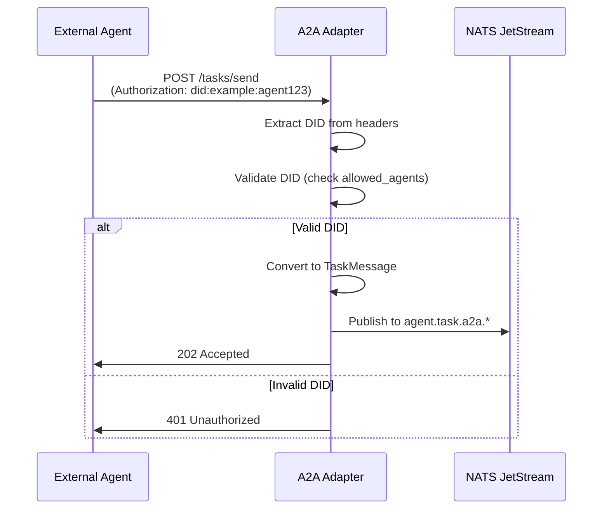

# A2A Protocol Adapter

The A2A (Agent-to-Agent) adapter is a SemStreams input component that enables external agents to delegate tasks using
the A2A protocol specification. It receives task requests via HTTP or SLIM transport, converts them to SemStreams
TaskMessages, and publishes them to NATS for processing by the agentic system.

## Overview

The A2A adapter acts as a protocol bridge between external agent systems and SemStreams' internal agentic architecture.
It handles authentication, task mapping, agent card generation, and bidirectional communication with external agents.

### Key Features

- **A2A Protocol Compliance**: Full implementation of A2A task submission, status queries, and cancellation endpoints
- **Multi-Transport Support**: HTTP (RESTful) and SLIM (MLS-encrypted group messaging)
- **Agent Card Generation**: Automatic generation of A2A agent cards from OASF records
- **DID Authentication**: Decentralized identifier-based authentication for agent-to-agent trust
- **Task Mapping**: Bidirectional conversion between A2A tasks and SemStreams TaskMessages
- **NATS Integration**: Publishes tasks to JetStream for reliable processing

## Architecture

```mermaid
flowchart TD
    A[External Agent] -->|A2A Task Request| B[A2A Adapter]
    B -->|Authenticate| C{DID Validation}
    C -->|Valid| D[Task Mapper]
    C -->|Invalid| E[Return 401]
    D -->|Convert to TaskMessage| F[NATS JetStream]
    F -->|agent.task.a2a.*| G[Agent Dispatch]
    G -->|Process Task| H[Agent Loop]
    H -->|agent.complete.*| I[Response Listener]
    I -->|Convert to A2A Result| J[External Agent]

    K[OASF Records] -->|Generate| L[Agent Card]
    L -->|Serve| M[/.well-known/agent.json]

    style B fill:#4a90e2
    style F fill:#50c878
    style L fill:#f39c12
```

## Configuration

### HTTP Transport

```json
{
  "transport": "http",
  "listen_address": ":8080",
  "agent_card_path": "/.well-known/agent.json",
  "enable_authentication": true,
  "request_timeout": "30s",
  "max_concurrent_tasks": 10,
  "oasf_bucket": "OASF_RECORDS",
  "ports": {
    "inputs": [
      {
        "name": "a2a_requests",
        "subject": "a2a.request.>",
        "type": "nats",
        "description": "Incoming A2A task requests"
      }
    ],
    "outputs": [
      {
        "name": "task_messages",
        "subject": "agent.task.a2a.>",
        "type": "jetstream",
        "stream_name": "AGENT_TASKS",
        "required": true,
        "description": "Task messages to agent dispatch"
      },
      {
        "name": "a2a_responses",
        "subject": "a2a.response.>",
        "type": "nats",
        "description": "Outgoing A2A task responses"
      }
    ]
  }
}
```

### SLIM Transport

```json
{
  "transport": "slim",
  "slim_group_id": "did:agntcy:group:tenant-123",
  "enable_authentication": true,
  "request_timeout": "30s",
  "max_concurrent_tasks": 10
}
```

### Configuration Options

| Field | Type | Default | Description |
|-------|------|---------|-------------|
| `transport` | string | `"http"` | Transport type: `"http"` or `"slim"` |
| `listen_address` | string | `":8080"` | HTTP listen address (HTTP transport only) |
| `agent_card_path` | string | `"/.well-known/agent.json"` | Agent card endpoint path |
| `slim_group_id` | string | - | SLIM group DID (SLIM transport only, required if transport=slim) |
| `request_timeout` | duration | `"30s"` | Request processing timeout |
| `max_concurrent_tasks` | int | `10` | Maximum concurrent task executions |
| `enable_authentication` | bool | `true` | Enable DID-based authentication |
| `allowed_agents` | []string | `[]` | Allowed agent DIDs (empty = all authenticated agents) |
| `oasf_bucket` | string | `"OASF_RECORDS"` | KV bucket for OASF records (agent card generation) |

## HTTP Endpoints

### Agent Card

**GET** `/.well-known/agent.json`

Returns the agent card describing this agent's capabilities.

**Response:**

```json
{
  "name": "SemStreams Agent",
  "description": "A2A-compatible agent powered by SemStreams",
  "url": "http://localhost:8080",
  "version": "1.0",
  "capabilities": [
    {
      "name": "task-execution",
      "description": "Execute delegated tasks"
    }
  ],
  "defaultInputModes": ["text"],
  "defaultOutputModes": ["text"],
  "authentication": {
    "schemes": ["did"],
    "credentials": {
      "did": "did:example:agent123"
    }
  },
  "skills": [
    {
      "id": "skill-001",
      "name": "Data Analysis",
      "description": "Analyze structured and unstructured data"
    }
  ]
}
```

### Send Task

**POST** `/tasks/send`

Submit a new task for execution.

**Headers:**

- `Authorization`: DID or bearer token (if authentication enabled)
- `X-Agent-DID`: Alternative header for agent DID
- `Content-Type`: `application/json`

**Request Body:**

```json
{
  "id": "task-123",
  "sessionId": "session-456",
  "status": {
    "state": "submitted",
    "timestamp": "2025-01-15T10:30:00Z"
  },
  "message": {
    "role": "user",
    "parts": [
      {
        "type": "text",
        "text": "Analyze this dataset and provide insights"
      }
    ]
  },
  "metadata": {
    "role": "architect",
    "model": "gpt-4"
  }
}
```

**Response:** `202 Accepted`

```json
{
  "id": "task-123",
  "status": {
    "state": "submitted",
    "message": "Task accepted for processing",
    "timestamp": "2025-01-15T10:30:01Z"
  }
}
```

### Get Task Status

**GET** `/tasks/get?id=<task_id>`

Query the status of a submitted task.

**Response:**

```json
{
  "id": "task-123",
  "status": {
    "state": "working",
    "message": "Task is being processed",
    "timestamp": "2025-01-15T10:30:15Z"
  }
}
```

**Task States:**

- `submitted`: Task accepted, queued for processing
- `working`: Task in progress
- `completed`: Task successfully completed
- `failed`: Task execution failed
- `canceled`: Task canceled by requester

### Cancel Task

**POST** `/tasks/cancel`

Request cancellation of a running task.

**Headers:**

- `Authorization`: DID or bearer token (if authentication enabled)
- `Content-Type`: `application/json`

**Request Body:**

```json
{
  "id": "task-123"
}
```

**Response:**

```json
{
  "id": "task-123",
  "status": {
    "state": "canceled",
    "message": "Task cancellation requested",
    "timestamp": "2025-01-15T10:31:00Z"
  }
}
```

## Task Mapping

The adapter translates between A2A task format and SemStreams TaskMessage format.

### A2A Task → TaskMessage

```go
// A2A Task (input)
{
  "id": "task-123",
  "sessionId": "session-456",
  "message": {
    "role": "user",
    "parts": [{"type": "text", "text": "Analyze data"}]
  },
  "metadata": {
    "role": "architect",
    "model": "gpt-4"
  }
}

// SemStreams TaskMessage (output)
{
  "task_id": "task-123",
  "prompt": "Analyze data",
  "role": "architect",
  "model": "gpt-4",
  "channel_type": "a2a",
  "channel_id": "session-456",
  "user_id": "did:example:agent123"
}
```

**Mapping Rules:**

- `task.id` → `task_id`
- `task.message.parts[].text` → `prompt` (concatenated with newlines)
- `task.metadata.role` → `role` (with fallback to "general")
- `task.metadata.model` → `model` (with fallback to "default")
- `task.sessionId` → `channel_id`
- Requester DID (from auth) → `user_id`
- Fixed `channel_type` = "a2a"

### TaskResult → A2A Result

```go
// SemStreams result
TaskID: "task-123"
Result: "Analysis complete: 3 key insights found"
Error: nil

// A2A TaskResult (output)
{
  "task_id": "task-123",
  "status": {
    "state": "completed",
    "timestamp": "2025-01-15T10:35:00Z"
  },
  "artifacts": [
    {
      "name": "result",
      "description": "Task execution result",
      "parts": [
        {
          "type": "text",
          "text": "Analysis complete: 3 key insights found"
        }
      ],
      "index": 0
    }
  ]
}
```

## Agent Card Generation

Agent cards are automatically generated from OASF (Open Agent Skills Format) records stored in the OASF_RECORDS KV
bucket. The card describes the agent's capabilities for discovery by external agents.

### OASF Record → Agent Card

```go
// OASF Record (input from processor/oasf-generator)
{
  "name": "DataAnalysisAgent",
  "description": "Expert in data analysis and visualization",
  "skills": [
    {
      "id": "skill-001",
      "name": "Statistical Analysis",
      "description": "Perform statistical analysis on datasets",
      "confidence": 0.95
    },
    {
      "id": "skill-002",
      "name": "Data Visualization",
      "description": "Create charts and visualizations",
      "confidence": 0.90
    }
  ]
}

// Agent Card (output)
{
  "name": "DataAnalysisAgent",
  "description": "Expert in data analysis and visualization",
  "url": "http://localhost:8080",
  "version": "1.0",
  "capabilities": [
    {"name": "Statistical Analysis", "description": "Perform statistical analysis on datasets"},
    {"name": "Data Visualization", "description": "Create charts and visualizations"}
  ],
  "skills": [
    {
      "id": "skill-001",
      "name": "Statistical Analysis",
      "description": "Perform statistical analysis on datasets"
    },
    {
      "id": "skill-002",
      "name": "Data Visualization",
      "description": "Create charts and visualizations"
    }
  ],
  "defaultInputModes": ["text"],
  "defaultOutputModes": ["text"],
  "authentication": {
    "schemes": ["did"],
    "credentials": {"did": "did:example:agent123"}
  }
}
```

### Updating Agent Cards

```go
// Generate card from OASF record
generator := NewAgentCardGenerator("http://localhost:8080", "YourOrg")
generator.AgentDID = "did:example:agent123"

card, err := generator.GenerateFromOASF(oasfRecord)
if err != nil {
    log.Fatal(err)
}

// Update component's cached card
component.UpdateAgentCard(card)
```

## NATS Topology

### Published Messages

**Subject Pattern:** `agent.task.a2a.<task_id>`

Published to the `AGENT_TASKS` JetStream stream for durable task processing.

**Message Structure:**

```json
{
  "type": {
    "domain": "agentic",
    "category": "task",
    "version": "v1"
  },
  "payload": {
    "task_id": "task-123",
    "prompt": "Analyze this dataset",
    "role": "architect",
    "model": "gpt-4",
    "channel_type": "a2a",
    "channel_id": "session-456",
    "user_id": "did:example:agent123"
  }
}
```

### Subscribed Messages

**Subject Pattern:** `agent.complete.*`

Listens for task completion events to send responses back to external agents.

**Expected Message Structure:**

```json
{
  "type": {
    "domain": "agentic",
    "category": "complete",
    "version": "v1"
  },
  "payload": {
    "task_id": "task-123",
    "result": "Analysis complete: 3 key insights found",
    "status": "success"
  }
}
```

## Authentication

When `enable_authentication` is `true`, the adapter validates incoming requests using DID-based authentication.

### Authentication Flow



### DID Headers

The adapter checks for DIDs in the following order:

1. `Authorization` header (e.g., `Authorization: did:example:agent123`)
2. `X-Agent-DID` header (e.g., `X-Agent-DID: did:example:agent123`)

### Allowed Agents

If `allowed_agents` is configured, only DIDs in the list can submit tasks:

```json
{
  "enable_authentication": true,
  "allowed_agents": [
    "did:example:agent123",
    "did:example:agent456"
  ]
}
```

If `allowed_agents` is empty, all authenticated agents are allowed.

## Usage Example

### Component Registration

```go
package main

import (
    "github.com/c360studio/semstreams/component"
    "github.com/c360studio/semstreams/input/a2a"
)

func main() {
    registry := component.NewRegistry()

    // Register A2A adapter
    if err := a2a.Register(registry); err != nil {
        log.Fatalf("Failed to register A2A adapter: %v", err)
    }

    // Component is now available as "a2a-adapter"
}
```

### Flow Configuration

```yaml
components:
  - name: external-agent-gateway
    type: a2a-adapter
    config:
      transport: http
      listen_address: ":8080"
      enable_authentication: true
      allowed_agents:
        - "did:example:trusted-agent"
      request_timeout: "60s"
      max_concurrent_tasks: 20
```

### Programmatic Usage

```go
package main

import (
    "context"
    "encoding/json"
    "log"

    "github.com/c360studio/semstreams/component"
    "github.com/c360studio/semstreams/input/a2a"
    "github.com/c360studio/semstreams/natsclient"
)

func main() {
    // Create NATS client
    natsClient, err := natsclient.NewClient("nats://localhost:4222")
    if err != nil {
        log.Fatal(err)
    }

    // Configure component
    config := a2a.DefaultConfig()
    config.ListenAddress = ":9090"
    config.EnableAuthentication = true

    rawConfig, _ := json.Marshal(config)

    // Create dependencies
    deps := component.Dependencies{
        NATSClient: natsClient,
    }

    // Create component
    comp, err := a2a.NewComponent(rawConfig, deps)
    if err != nil {
        log.Fatal(err)
    }

    // Initialize and start
    a2aComp := comp.(*a2a.Component)
    if err := a2aComp.Initialize(); err != nil {
        log.Fatal(err)
    }

    ctx := context.Background()
    if err := a2aComp.Start(ctx); err != nil {
        log.Fatal(err)
    }

    log.Println("A2A adapter running on :9090")

    // Run until interrupted
    select {}
}
```

## Testing

### Unit Tests

Run unit tests for the package:

```bash
task test -- ./input/a2a/...
```

### Integration Tests

Integration tests require Docker (testcontainers for NATS):

```bash
task test:integration -- ./input/a2a/...
```

### Test Coverage

```bash
go test -cover ./input/a2a/...
```

### Manual Testing with curl

Start the adapter, then test endpoints:

```bash
# Get agent card
curl http://localhost:8080/.well-known/agent.json

# Send a task
curl -X POST http://localhost:8080/tasks/send \
  -H "Content-Type: application/json" \
  -H "X-Agent-DID: did:example:test-agent" \
  -d '{
    "id": "test-task-001",
    "sessionId": "test-session",
    "status": {"state": "submitted"},
    "message": {
      "role": "user",
      "parts": [{"type": "text", "text": "Hello from A2A!"}]
    }
  }'

# Get task status
curl http://localhost:8080/tasks/get?id=test-task-001

# Cancel task
curl -X POST http://localhost:8080/tasks/cancel \
  -H "Content-Type: application/json" \
  -H "X-Agent-DID: did:example:test-agent" \
  -d '{"id": "test-task-001"}'
```

### Testing with Authentication Disabled

For local testing, disable authentication:

```json
{
  "enable_authentication": false
}
```

This allows requests without DIDs, useful for development and debugging.

## Related Components

- **input/slim**: SLIM bridge for encrypted cross-organizational agent messaging
- **output/directory-bridge**: Registers agents with AGNTCY directories for discovery
- **processor/oasf-generator**: Generates OASF records used for agent card creation
- **processor/agentic-dispatch**: Routes TaskMessages to appropriate agent roles
- **agentic/identity**: DID and verifiable credential management

## Protocol References

- [A2A Protocol Specification](https://github.com/AgentProtocol/A2A)
- [OASF (Open Agent Skills Format)](https://github.com/AgentProtocol/OASF)
- [DID (Decentralized Identifiers)](https://www.w3.org/TR/did-core/)
- [SemStreams A2A Integration Guide](../../docs/concepts/23-a2a-protocol.md)

## Limitations and Future Work

### Current Limitations

- Task status queries return placeholder data (TODO: integrate with task storage)
- Task cancellation is acknowledged but not propagated to running tasks
- SLIM transport is not yet implemented (placeholder)
- DID signature verification is simplified (production needs full verification)

### Planned Features

- Full SLIM transport implementation for encrypted agent messaging
- Task state persistence in NATS KV for status queries
- Task cancellation propagation via agent.cancel.* subjects
- Complete DID verification with public key validation
- Agent card caching with TTL and automatic refresh
- Webhook support for push-based task completion notifications
- Rate limiting per agent DID
- Task priority levels from A2A metadata

## Performance Considerations

- **Concurrent Tasks**: `max_concurrent_tasks` limits simultaneous task processing to prevent resource exhaustion
- **Request Timeout**: `request_timeout` ensures requests don't block indefinitely
- **Body Size Limit**: HTTP requests limited to 1MB to prevent DoS attacks
- **NATS Backpressure**: JetStream provides durable queuing and backpressure handling

## Security Considerations

- **Authentication**: Enable `enable_authentication` in production environments
- **Allowed Agents**: Use `allowed_agents` to whitelist trusted agent DIDs
- **HTTPS**: Deploy behind a reverse proxy with TLS termination
- **DID Verification**: Implement full signature verification for production use
- **Rate Limiting**: Consider adding rate limiting per agent DID
- **Input Validation**: All task inputs are validated before processing
- **NATS Security**: Use NATS authentication and TLS for internal communication

## Troubleshooting

### Adapter Won't Start

**Error:** `failed to listen on :8080: address already in use`

**Solution:** Port 8080 is already bound. Change `listen_address` or stop the conflicting service.

### Authentication Failures

**Error:** `401 Unauthorized`

**Solution:** Ensure requests include valid DID headers (`Authorization` or `X-Agent-DID`).

### Tasks Not Appearing in NATS

**Check:**

1. NATS client is connected: `nc.Status()`
2. JetStream stream exists: `nats stream ls`
3. Subject matches expected pattern: `agent.task.a2a.*`

### Agent Card Not Updating

**Solution:** Agent cards are generated from OASF records. Ensure OASF_RECORDS KV bucket contains valid records.
Call `UpdateAgentCard()` after generating a new card.

## Contributing

When contributing to the A2A adapter, follow SemStreams development standards:

- Add tests for new features (unit + integration)
- Update this README for API or configuration changes
- Follow Go coding standards and pass `task lint`
- Document complex mapping logic in code comments
- Update protocol references if A2A spec changes

## License

Part of the SemStreams project. See root LICENSE file.
