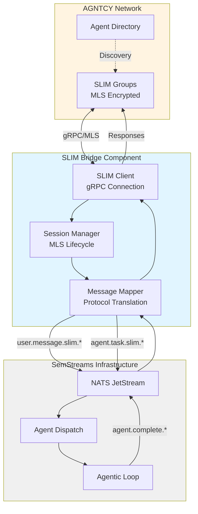
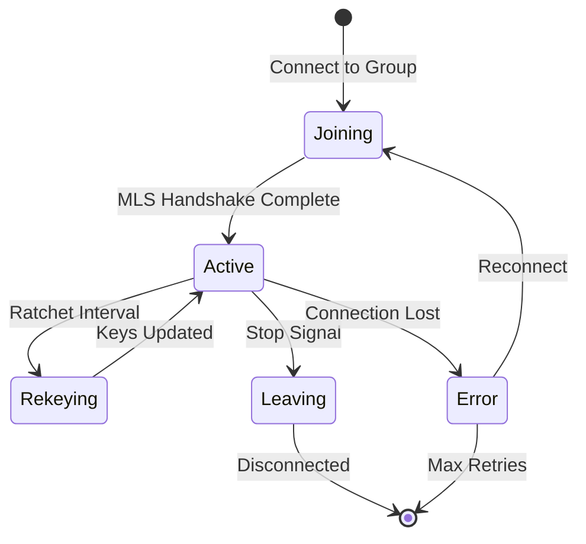
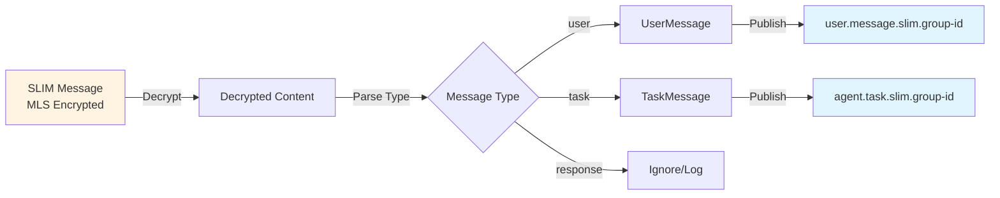
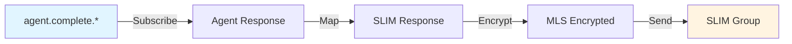

# SLIM Bridge Input Component

Bidirectional bridge between AGNTCY's SLIM (Secure Low-Latency Interactive Messaging) network and SemStreams'
internal NATS infrastructure, enabling cross-organizational agent communication.

## Overview

The SLIM bridge enables SemStreams agents to participate in the Internet of Agents ecosystem by connecting to
SLIM groups and translating messages between SLIM's encrypted messaging protocol and SemStreams' internal NATS
message format. SLIM provides end-to-end encrypted group messaging using the MLS (Messaging Layer Security)
protocol with quantum-safe security options.

**Key Capabilities:**

- **Cross-Organizational Messaging**: Secure agent communication across organizational boundaries
- **MLS Encryption**: End-to-end encryption with forward secrecy through key ratcheting
- **DID-Based Identity**: Decentralized identifiers for cryptographic agent verification
- **Protocol Translation**: Seamless mapping between SLIM messages and SemStreams message types
- **Session Management**: Automatic MLS session lifecycle management and key ratcheting

## Architecture



## Configuration

### Basic Configuration

```json
{
  "slim_endpoint": "wss://slim.agntcy.dev",
  "group_ids": ["did:agntcy:group:tenant-123"],
  "key_ratchet_interval": "1h",
  "reconnect_interval": "5s",
  "max_reconnect_attempts": 10,
  "identity_provider": "local"
}
```

### Configuration Fields

| Field | Type | Default | Description |
|-------|------|---------|-------------|
| `slim_endpoint` | string | - | SLIM service WebSocket or gRPC endpoint URL |
| `group_ids` | []string | [] | SLIM group DIDs to join on startup |
| `key_ratchet_interval` | duration | `1h` | How often to ratchet MLS keys for forward secrecy |
| `reconnect_interval` | duration | `5s` | Delay between reconnection attempts |
| `max_reconnect_attempts` | int | `10` | Maximum reconnection attempts before failure |
| `message_buffer_size` | int | `1000` | Internal message buffer size for async processing |
| `identity_provider` | string | `local` | Identity provider for DID resolution |

### Port Configuration

The component defines input and output ports for NATS connectivity:

**Input Ports:**

- `slim_messages` - Receives control messages on `slim.message.>` (optional)

**Output Ports:**

- `user_messages` - Publishes to `user.message.slim.>` on `USER_MESSAGES` stream (required)
- `task_delegations` - Publishes to `agent.task.slim.>` on `AGENT_TASKS` stream (optional)

### Example Full Configuration

```json
{
  "ports": {
    "inputs": [
      {
        "name": "slim_messages",
        "subject": "slim.message.>",
        "type": "nats",
        "required": false,
        "description": "Messages from SLIM groups"
      }
    ],
    "outputs": [
      {
        "name": "user_messages",
        "subject": "user.message.slim.>",
        "type": "jetstream",
        "stream_name": "USER_MESSAGES",
        "required": true,
        "description": "User messages to agent dispatch"
      },
      {
        "name": "task_delegations",
        "subject": "agent.task.slim.>",
        "type": "jetstream",
        "stream_name": "AGENT_TASKS",
        "required": false,
        "description": "Task delegations from external agents"
      }
    ]
  },
  "slim_endpoint": "wss://slim.agntcy.dev",
  "group_ids": [
    "did:agntcy:group:org-platform",
    "did:agntcy:group:cross-team-collab"
  ],
  "key_ratchet_interval": "30m",
  "reconnect_interval": "10s",
  "max_reconnect_attempts": 5,
  "message_buffer_size": 500,
  "identity_provider": "local"
}
```

## Session Management

The SLIM bridge manages MLS group sessions with automatic lifecycle handling and periodic key ratcheting for
forward secrecy.

### Session States



| State | Description |
|-------|-------------|
| `joining` | Establishing MLS session with group |
| `active` | Session ready for sending/receiving messages |
| `rekeying` | Performing MLS key ratcheting |
| `leaving` | Gracefully terminating session |
| `error` | Session error, attempting recovery |

### MLS Key Ratcheting

The session manager automatically ratchets MLS keys at the configured interval to maintain forward secrecy.
This ensures that compromise of current keys does not expose past messages.

**Key Ratchet Process:**

1. Session transitions to `rekeying` state
2. SLIM client generates new epoch keys
3. New keys distributed to group members via MLS protocol
4. Session returns to `active` state
5. Old keys are discarded

**Configuration**: Set `key_ratchet_interval` to balance security (shorter interval) vs. performance (longer
interval). Default is `1h`.

## Message Mapping

The message mapper translates between SLIM message formats and SemStreams message types.

### Inbound Message Flow



### Message Type Detection

SLIM messages contain a `type` field that determines routing:

```json
{
  "type": "user",
  "content": "Hello, agent!",
  "attachments": [],
  "metadata": {}
}
```

| SLIM Type | SemStreams Type | NATS Subject Pattern | Description |
|-----------|-----------------|----------------------|-------------|
| `user` or plain text | `agentic.UserMessage` | `user.message.slim.{group_id}` | User chat messages |
| `task` | `agentic.TaskMessage` | `agent.task.slim.{group_id}` | Task delegations from external agents |
| `response` | - | - | Outbound only, logged if received |
| `task_result` | - | - | Outbound only, logged if received |

### Outbound Message Flow



### UserMessage Mapping

**SLIM → SemStreams:**

```json
{
  "type": "user",
  "content": "What's the status?",
  "attachments": [
    {
      "name": "report.pdf",
      "mime_type": "application/pdf",
      "data": "base64...",
      "size": 12345
    }
  ],
  "reply_to": "msg-123",
  "thread_id": "thread-456"
}
```

Maps to:

```go
agentic.UserMessage{
    MessageID:   "generated-uuid",
    Content:     "What's the status?",
    ChannelType: "slim",
    ChannelID:   "did:agntcy:group:tenant-123",
    UserID:      "did:agntcy:agent:sender",
    Timestamp:   time.Now(),
    Attachments: []agentic.Attachment{...},
    Metadata: map[string]string{
        "slim_group_id": "did:agntcy:group:tenant-123",
        "slim_sender_did": "did:agntcy:agent:sender",
        "slim_reply_to": "msg-123",
        "slim_thread_id": "thread-456",
    },
}
```

### TaskMessage Mapping

**SLIM → SemStreams:**

```json
{
  "type": "task",
  "task_id": "task-789",
  "prompt": "Analyze this dataset",
  "role": "analyst",
  "model": "claude-3-5-sonnet-20241022",
  "requesting_agent_did": "did:agntcy:agent:requester",
  "target_capabilities": ["data-analysis", "visualization"],
  "priority": "high",
  "deadline": "2026-02-13T12:00:00Z"
}
```

Maps to:

```go
agentic.TaskMessage{
    TaskID:      "task-789",
    Prompt:      "Analyze this dataset",
    Role:        "analyst",
    Model:       "claude-3-5-sonnet-20241022",
    ChannelType: "slim",
    ChannelID:   "did:agntcy:group:tenant-123",
    UserID:      "did:agntcy:agent:requester",
}
```

### Response Mapping

**SemStreams → SLIM:**

```go
agentic.UserResponse{
    Type:      "message",
    InReplyTo: "msg-123",
    Content:   "Status report: all systems operational",
}
```

Maps to SLIM response message:

```json
{
  "type": "response",
  "in_reply_to": "msg-123",
  "status": "success",
  "content": "Status report: all systems operational"
}
```

## NATS Topology

The SLIM bridge integrates with SemStreams' NATS subject hierarchy.

### Subject Patterns

```text
Inbound (SLIM → NATS):
  user.message.slim.<group_id>     - User messages from SLIM groups
  agent.task.slim.<group_id>       - Task delegations from external agents

Outbound (NATS → SLIM):
  agent.complete.*                 - Agent completion events (monitored for responses)
```

### Stream Configuration

The component requires these JetStream streams to be configured:

**USER_MESSAGES Stream:**

```text
Name: USER_MESSAGES
Subjects: user.message.>
Storage: File
Retention: Interest
```

**AGENT_TASKS Stream:**

```text
Name: AGENT_TASKS
Subjects: agent.task.>
Storage: File
Retention: Interest
```

### Group ID Sanitization

SLIM group IDs (DIDs) contain characters invalid in NATS subjects (`:` and `.`). The bridge sanitizes them:

```text
did:agntcy:group:tenant-123  →  did-agntcy-group-tenant-123
org.platform.group.dev       →  org-platform-group-dev
```

This ensures valid NATS subject names while preserving uniqueness.

## Usage

### Registration

Register the component with the component registry:

```go
import (
    "github.com/c360studio/semstreams/input/slim"
    "github.com/c360studio/semstreams/component"
)

func main() {
    registry := component.NewRegistry()

    if err := slim.Register(registry); err != nil {
        log.Fatal(err)
    }
}
```

### Flow Configuration

Include the SLIM bridge in your flow configuration:

```yaml
components:
  - name: slim-bridge
    type: input
    protocol: slim
    config:
      slim_endpoint: "wss://slim.agntcy.dev"
      group_ids:
        - "did:agntcy:group:production"
      key_ratchet_interval: "1h"
```

### Programmatic Usage

```go
import (
    "context"
    "encoding/json"
    "time"

    "github.com/c360studio/semstreams/input/slim"
    "github.com/c360studio/semstreams/component"
    "github.com/c360studio/semstreams/natsclient"
)

func main() {
    // Create configuration
    cfg := slim.DefaultConfig()
    cfg.SLIMEndpoint = "wss://slim.agntcy.dev"
    cfg.GroupIDs = []string{"did:agntcy:group:my-group"}

    rawConfig, _ := json.Marshal(cfg)

    // Create dependencies
    natsClient := natsclient.NewClient(/* ... */)
    deps := component.Dependencies{
        NATSClient: natsClient,
    }

    // Create component
    comp, err := slim.NewComponent(rawConfig, deps)
    if err != nil {
        log.Fatal(err)
    }

    // Initialize and start
    lifecycle := comp.(component.LifecycleComponent)
    if err := lifecycle.Initialize(); err != nil {
        log.Fatal(err)
    }

    ctx := context.Background()
    if err := lifecycle.Start(ctx); err != nil {
        log.Fatal(err)
    }

    // Run for some time
    time.Sleep(5 * time.Minute)

    // Graceful shutdown
    if err := lifecycle.Stop(10 * time.Second); err != nil {
        log.Warn("Error during shutdown", "error", err)
    }
}
```

### Sending Responses

Send responses back to SLIM groups:

```go
import (
    "context"
    "github.com/c360studio/semstreams/agentic"
)

// Get the component instance
slimComp := comp.(*slim.Component)

// Send a user response
response := &agentic.UserResponse{
    Type:      "message",
    InReplyTo: "original-message-id",
    Content:   "Task completed successfully",
}

err := slimComp.SendResponse(ctx, "did:agntcy:group:my-group", response)
if err != nil {
    log.Error("Failed to send response", "error", err)
}

// Send a task result
result := &slim.TaskResult{
    TaskID:      "task-123",
    Result:      "Analysis complete: 42 anomalies detected",
    CompletedAt: time.Now(),
}

err = slimComp.SendTaskResult(ctx, "did:agntcy:group:my-group", result)
if err != nil {
    log.Error("Failed to send task result", "error", err)
}
```

## Testing

### Unit Tests

Run unit tests for the package:

```bash
# Run all tests
go test ./input/slim/...

# Run with verbose output
go test -v ./input/slim/...

# Run with race detection
go test -race ./input/slim/...

# Run specific test
go test -run TestComponentInitialize ./input/slim/
```

### Test Coverage

```bash
# Generate coverage report
go test -coverprofile=coverage.out ./input/slim/...
go tool cover -html=coverage.out
```

### Integration Testing

The SLIM bridge includes mock implementations for testing without SLIM infrastructure:

```go
import (
    "testing"
    "github.com/c360studio/semstreams/input/slim"
)

func TestSLIMIntegration(t *testing.T) {
    // Use mock SLIM client
    mockClient := slim.NewMockSLIMClient()

    // Configure mock responses
    mockClient.SetMockMessage(&slim.Message{
        GroupID:   "test-group",
        SenderDID: "did:test:sender",
        Content:   []byte(`{"type":"user","content":"test"}`),
    })

    // Create session manager with mock
    manager := slim.NewSessionManager(config, mockClient, logger)

    // Test session lifecycle
    err := manager.Start(ctx)
    if err != nil {
        t.Fatal(err)
    }

    // Verify session state
    session := manager.GetSession("test-group")
    if session.State != slim.SessionStateActive {
        t.Errorf("expected active state, got %s", session.State)
    }
}
```

### Task-Based Testing

Use the project's task runner for standardized testing:

```bash
# Run unit tests
task test

# Run integration tests (requires testcontainers)
task test:integration

# Run with race detector
task test:race

# Run linters
task lint

# Run all checks
task check
```

## Implementation Status

**Current Status**: Infrastructure complete, awaiting AGNTCY SLIM SDK integration.

This package provides the complete infrastructure for SLIM integration. The actual SLIM protocol implementation
requires the AGNTCY SLIM SDK, which provides:

- MLS protocol implementation (Message Layer Security)
- Group management and membership
- Key exchange and ratcheting
- Message encryption/decryption
- DID-based authentication

The `Client` interface defines the required operations and can be implemented when the SDK becomes available.
Until then, the component uses a stub implementation for development and testing.

## Security Considerations

- **End-to-End Encryption**: All SLIM messages are encrypted using MLS before leaving the bridge
- **Forward Secrecy**: Periodic key ratcheting ensures compromised keys don't expose historical messages
- **DID Authentication**: Agent DIDs provide cryptographic identity verification
- **Quantum-Safe Options**: SLIM supports quantum-resistant cryptographic algorithms
- **No Plaintext Exposure**: Message content never leaves the bridge in plaintext form
- **Group Isolation**: Messages are isolated by SLIM group membership

## Troubleshooting

### Common Issues

**Connection Failures:**

```text
Error: Failed to connect to SLIM endpoint
```

Check:

- `slim_endpoint` URL is correct and reachable
- Network connectivity to AGNTCY infrastructure
- Identity provider configuration is valid

**Session Errors:**

```text
Error: Session state is error (state: error)
```

Check:

- Group ID is valid and accessible
- Agent has permission to join the group
- MLS key ratcheting is not failing

**Message Delivery Failures:**

```text
Error: Failed to publish user message
```

Check:

- NATS connection is healthy
- JetStream streams are configured correctly
- Subject permissions allow publishing

### Debug Logging

Enable debug logging to see detailed SLIM bridge activity:

```go
import "log/slog"

logger := slog.New(slog.NewTextHandler(os.Stdout, &slog.HandlerOptions{
    Level: slog.LevelDebug,
}))

deps := component.Dependencies{
    Logger: logger,
}
```

### Health Monitoring

Check component health status:

```go
comp := comp.(*slim.Component)
health := comp.Health()

fmt.Printf("Healthy: %v\n", health.Healthy)
fmt.Printf("Status: %s\n", health.Status)
fmt.Printf("Errors: %d\n", health.ErrorCount)
fmt.Printf("Uptime: %v\n", health.Uptime)
```

Check session details:

```go
sessions := comp.GetSessions()
for _, session := range sessions {
    fmt.Printf("Group: %s\n", session.GroupID)
    fmt.Printf("State: %s\n", session.State)
    fmt.Printf("Members: %d\n", session.MemberCount)
    fmt.Printf("Last Active: %v\n", session.LastActive)
}
```

## Related Documentation

- [ADR-019: AGNTCY Integration](../../docs/architecture/adr-019-agntcy-integration.md) - Integration architecture
- [AGNTCY Documentation](https://docs.agntcy.org) - Official AGNTCY docs
- [SLIM IETF Draft](https://datatracker.ietf.org/doc/draft-mpsb-agntcy-slim/) - SLIM protocol specification
- [MLS RFC 9420](https://www.rfc-editor.org/rfc/rfc9420.html) - Message Layer Security protocol
- [A2A Protocol](https://github.com/a2aproject/A2A) - Agent-to-Agent communication standard

## See Also

- `input/a2a` - A2A protocol adapter for agent-to-agent communication
- `output/directory-bridge` - Registers agents with AGNTCY directories
- `agentic/identity` - DID and verifiable credential management
- `processor/oasf-generator` - Generates OASF capability descriptions
