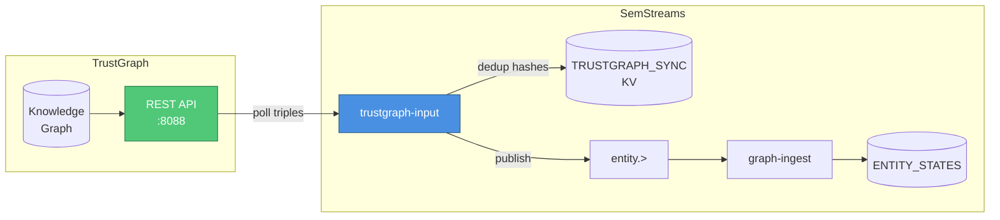
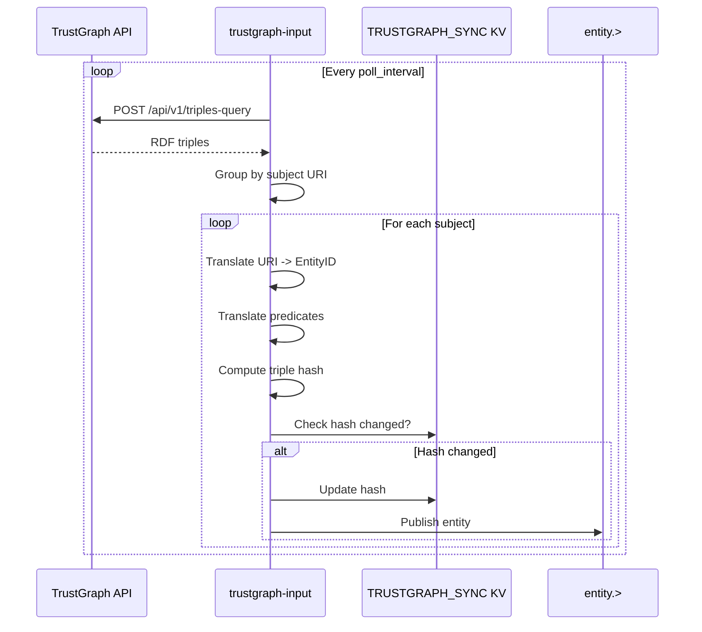

# TrustGraph Input Component

An input component that imports entities from TrustGraph's knowledge graph into SemStreams via REST API polling.

## Overview

The trustgraph-input component bridges TrustGraph's document-extracted knowledge into SemStreams' operational graph. TrustGraph excels at using LLMs to extract entities and relationships from documents (PDFs, reports, procedures). This component polls TrustGraph's triples-query API, translates RDF triples to SemStreams entity format, and publishes them to NATS for processing by graph-ingest.

This is the highest-value bridge component for organizations that want to combine document intelligence with real-time operational data.

## Architecture



## Features

- **REST API Polling**: Configurable interval polling of TrustGraph triples-query endpoint
- **Vocabulary Translation**: Automatic conversion of RDF URIs to SemStreams 6-part entity IDs
- **Change Detection**: SHA256 hash-based deduplication prevents re-processing unchanged entities
- **Subject Grouping**: Groups triples by subject URI to assemble complete entities
- **Prometheus Metrics**: Full observability with triples imported, entities published, poll errors
- **Graceful Lifecycle**: Clean startup/shutdown with proper resource cleanup

## Quick Start

```yaml
components:
  - name: tg-import
    type: trustgraph-input
    config:
      endpoint: "http://trustgraph:8088"
      poll_interval: "60s"
      source: "trustgraph"
      ports:
        outputs:
          - name: entity
            type: nats
            subject: "entity.>"
```

## Configuration

### Basic Configuration

```yaml
components:
  - name: tg-import
    type: trustgraph-input
    config:
      endpoint: "http://trustgraph:8088"
      poll_interval: "60s"
      collections: ["intelligence", "procedures"]
      source: "trustgraph"
```

### Advanced Configuration

```yaml
components:
  - name: tg-import
    type: trustgraph-input
    config:
      endpoint: "http://trustgraph:8088"
      api_key_env: "TRUSTGRAPH_API_KEY"
      poll_interval: "30s"
      timeout: "60s"
      limit: 5000

      # Filter what to import
      collections: ["intelligence"]
      kg_core_ids: ["core-threats", "core-procedures"]
      subject_filter: "http://trustgraph.ai/e/"
      predicate_filter:
        - "http://www.w3.org/1999/02/22-rdf-syntax-ns#type"
        - "http://www.w3.org/2000/01/rdf-schema#label"

      source: "trustgraph"

      # Vocabulary translation
      vocab:
        uri_mappings:
          "trustgraph.ai":
            org: "acme"
            platform: "intel"
            domain: "knowledge"
            system: "trustgraph"
            type: "entity"
        predicate_mappings:
          "entity.classification.type": "http://www.w3.org/1999/02/22-rdf-syntax-ns#type"
          "entity.metadata.label": "http://www.w3.org/2000/01/rdf-schema#label"
        default_org: "external"

      ports:
        outputs:
          - name: entity
            type: jetstream
            subject: "entity.>"
            stream_name: "ENTITY"
```

### Configuration Options

| Option | Type | Default | Description |
|--------|------|---------|-------------|
| `endpoint` | string | `http://localhost:8088` | TrustGraph REST API base URL |
| `api_key` | string | - | API key for TrustGraph authentication |
| `api_key_env` | string | - | Environment variable containing API key |
| `poll_interval` | duration | `60s` | Interval between API polls |
| `timeout` | duration | `30s` | HTTP request timeout |
| `collections` | []string | - | TrustGraph collections to import from |
| `kg_core_ids` | []string | - | Specific knowledge core IDs to import |
| `subject_filter` | string | - | URI prefix filter for subjects |
| `predicate_filter` | []string | - | Predicate URIs to include (empty = all) |
| `limit` | int | `1000` | Maximum triples per poll (1-10000) |
| `source` | string | `trustgraph` | Source identifier stamped on imported triples |
| `vocab` | object | - | Vocabulary translation settings |
| `ports` | object | (default) | Output port configuration |

## Vocabulary Translation

The component translates between TrustGraph RDF URIs and SemStreams 6-part entity IDs.

### URI to Entity ID

```
TrustGraph URI:
  http://trustgraph.ai/e/supply-chain-risk

SemStreams Entity ID (with uri_mappings):
  acme.intel.knowledge.trustgraph.entity.supply-chain-risk
```

### Translation Rules

1. Domain maps to org segment via `uri_mappings`
2. Path segments fill remaining entity ID parts
3. Missing segments use defaults from mapping configuration
4. Hyphens preserved (valid in entity IDs)

### Predicate Translation

```yaml
vocab:
  predicate_mappings:
    # SemStreams predicate -> RDF URI
    "entity.classification.type": "http://www.w3.org/1999/02/22-rdf-syntax-ns#type"
    "entity.metadata.label": "http://www.w3.org/2000/01/rdf-schema#label"
    "relation.part_of": "http://purl.obolibrary.org/obo/BFO_0000050"
```

Unmapped predicates use structural fallback: `http://{org-base}/predicate/{predicate}`

## NATS Topology

### Output

| Destination | Type | Description |
|-------------|------|-------------|
| `entity.>` | NATS/JetStream | Entity messages for graph-ingest |

### Sync State (KV)

| Bucket | Key Pattern | Description |
|--------|-------------|-------------|
| `TRUSTGRAPH_SYNC` | `input:hash:{entity_id}` | SHA256 hash of triple set for deduplication |

## Data Flow



## Metrics

### Prometheus Metrics

| Metric | Type | Description |
|--------|------|-------------|
| `semstreams_trustgraph_input_triples_imported_total` | Counter | Total triples imported |
| `semstreams_trustgraph_input_entities_published_total` | Counter | Total entities published |
| `semstreams_trustgraph_input_polls_total` | Counter | Total poll operations |
| `semstreams_trustgraph_input_poll_errors_total` | Counter | Total poll failures |
| `semstreams_trustgraph_input_poll_duration_seconds` | Histogram | Poll operation duration |

### Health Status

```go
health := component.Health()
// Healthy: running && last poll within 2x poll_interval
// ErrorCount: cumulative poll errors
// Uptime: time since start
```

## Deployment Patterns

### Import Only (Most Common)

Use TrustGraph for document intelligence, SemStreams for operational reasoning:

```yaml
components:
  - name: tg-import
    type: trustgraph-input
    config:
      endpoint: "http://trustgraph:8088"
      poll_interval: "60s"

  - name: graph-ingest
    type: graph-ingest
    # ... processes imported entities
```

### Bidirectional Sync

When also deploying trustgraph-output, ensure matching vocab configs and loop prevention:

```yaml
components:
  - name: tg-import
    type: trustgraph-input
    config:
      source: "trustgraph"  # This source gets excluded by output
      vocab:
        # ... matching vocab config

  - name: tg-export
    type: trustgraph-output
    config:
      exclude_sources: ["trustgraph"]  # Prevents re-export loop
      vocab:
        # ... matching vocab config
```

## Troubleshooting

### No Entities Imported

**Symptoms**: Poll completes but no entities published

**Checks**:
1. Verify TrustGraph has data: `curl http://trustgraph:8088/api/v1/triples-query`
2. Check subject_filter isn't too restrictive
3. Review logs for "Poll completed" with triple/entity counts

### All Entities Filtered as Duplicates

**Symptoms**: Entities imported once, never updated

**Checks**:
1. Verify TRUSTGRAPH_SYNC bucket exists
2. Check if source data actually changed in TrustGraph
3. Clear sync bucket to force re-import: delete keys matching `input:hash:*`

### Connection Errors

**Symptoms**: Poll errors in logs

**Checks**:
1. Verify endpoint URL is reachable
2. Check API key if TrustGraph requires authentication
3. Increase timeout for slow networks

### Entity IDs Look Wrong

**Symptoms**: Imported entities have unexpected IDs

**Checks**:
1. Verify uri_mappings match your TrustGraph URI patterns
2. Check default_org setting
3. Review vocabulary translation in debug logs

## Example: Threat Intelligence Import

Import cybersecurity threat data from TrustGraph for correlation with network sensors:

```yaml
components:
  - name: threat-import
    type: trustgraph-input
    config:
      endpoint: "http://trustgraph:8088"
      poll_interval: "5m"
      collections: ["threat-intel"]
      source: "trustgraph"

      vocab:
        uri_mappings:
          "trustgraph.ai":
            org: "acme"
            platform: "security"
            domain: "threats"
            system: "trustgraph"
            type: "indicator"
        predicate_mappings:
          "threat.severity": "http://example.org/threat#severity"
          "threat.affects": "http://example.org/threat#affects"
```

Result: Threat indicators from document analysis become SemStreams entities that rules can correlate with real-time sensor data.

## See Also

- [TrustGraph Output Component](../../output/trustgraph/README.md) - Export entities to TrustGraph
- [TrustGraph Integration Guide](../../docs/integration/trustgraph-integration.md) - Complete integration documentation
- [Vocabulary Translation](../../vocabulary/trustgraph/README.md) - URI/EntityID translation details
- [Graph Ingest Component](../../processor/graph-ingest/README.md) - Entity processing
- [TrustGraph Documentation](https://docs.trustgraph.ai) - External TrustGraph docs
