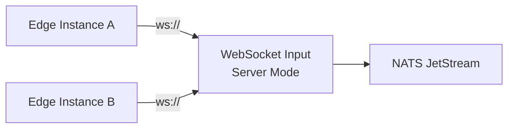
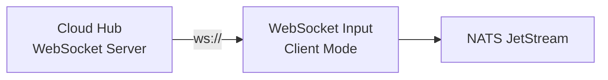
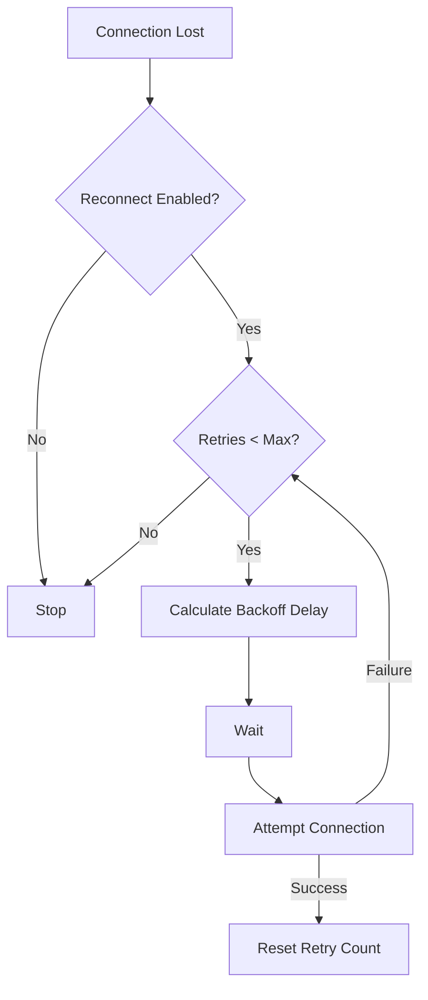
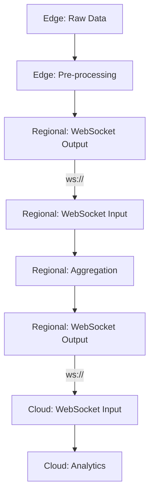

# WebSocket Input

Receives federated data from remote SemStreams instances over WebSocket connections.

## Purpose

The WebSocket Input component enables SemStreams federation by receiving event data from remote instances over WebSocket
connections. It complements the WebSocket Output component to create edge-to-cloud, multi-region, and hierarchical
processing topologies. The component handles authentication, backpressure, automatic reconnection, and bidirectional
communication patterns.

## Operation Modes

### Server Mode

Listen for incoming WebSocket connections from multiple remote instances. Operates as a data hub receiving streams
from distributed edge devices or regional aggregators.



### Client Mode

Connect to a remote WebSocket server and receive data. Operates as a data consumer pulling streams from a central
hub or upstream service.



## Configuration

### Server Mode Example

```yaml
type: input
name: websocket_input
config:
  mode: server
  server:
    http_port: 8081
    path: /ingest
    max_connections: 100
    read_buffer_size: 4096
    write_buffer_size: 4096
    enable_compression: true
    allowed_origins:
      - https://edge-device-01.example.com
      - https://edge-device-02.example.com
  auth:
    type: bearer
    bearer_token_env: WS_INGEST_TOKEN
  backpressure:
    enabled: true
    queue_size: 1000
    on_full: drop_oldest
  ports:
    outputs:
      - name: ws_data
        subject: federated.data
        type: nats
      - name: ws_control
        subject: federated.control
        type: nats
```

### Client Mode Example

```yaml
type: input
name: websocket_input
config:
  mode: client
  client:
    url: ws://hub.example.com:8080/stream
    reconnect:
      enabled: true
      max_retries: 10
      initial_interval: 1s
      max_interval: 60s
      multiplier: 2.0
  auth:
    type: bearer
    bearer_token_env: WS_CLIENT_TOKEN
  backpressure:
    enabled: true
    queue_size: 1000
    on_full: drop_oldest
  ports:
    outputs:
      - name: ws_data
        subject: federated.data
        type: nats
```

## Authentication Options

### Bearer Token (Recommended)

Use environment variable for secure token storage.

```bash
export WS_INGEST_TOKEN="sk-1234567890abcdef"
```

Configuration:

```yaml
auth:
  type: bearer
  bearer_token_env: WS_INGEST_TOKEN
```

### Basic Authentication

Use environment variables for username and password.

```bash
export WS_USERNAME="semstreams"
export WS_PASSWORD="secret123"
```

Configuration:

```yaml
auth:
  type: basic
  basic_username_env: WS_USERNAME
  basic_password_env: WS_PASSWORD
```

### No Authentication

```yaml
auth:
  type: none
```

## Bidirectional Communication

Enable request/reply patterns for control messages. The component supports backpressure signaling, selective
subscription, historical queries, status requests, and dynamic routing announcements.

```yaml
bidirectional:
  enabled: true
  request_timeout: 5s
  max_concurrent_requests: 10
```

### Message Protocol

All WebSocket messages use a JSON envelope with type discrimination:

```json
{
  "type": "data",
  "id": "data-001",
  "timestamp": 1704844800000,
  "payload": {"sensor_id": "temp-01", "value": 23.5}
}
```

Supported message types:

- **data**: Application data published to NATS
- **request**: Control plane request
- **reply**: Control plane reply
- **ack**: Successful receipt acknowledgment
- **nack**: Delivery failure notification
- **slow**: Backpressure signal indicating overload

## Backpressure Handling

The component maintains an internal message queue to decouple WebSocket reception from NATS publishing. When the
queue fills up, configurable policies determine message handling.

### Drop Oldest (Default)

Discard oldest message to make room for new arrivals.

```yaml
backpressure:
  enabled: true
  queue_size: 1000
  on_full: drop_oldest
```

### Drop Newest

Discard incoming message when queue is full.

```yaml
backpressure:
  enabled: true
  queue_size: 1000
  on_full: drop_newest
```

### Block

Wait until queue has space before accepting new messages.

```yaml
backpressure:
  enabled: true
  queue_size: 1000
  on_full: block
```

When queue utilization exceeds 80%, the component automatically sends slow signals to upstream connections,
enabling adaptive rate limiting.

## Reconnection Logic (Client Mode)

Automatic reconnection with exponential backoff when connection is lost.



Backoff calculation: `delay = initial_interval * (multiplier ^ attempts)` capped at `max_interval`.

Example progression with default settings:

1. Attempt 1: Wait 1 second
2. Attempt 2: Wait 2 seconds
3. Attempt 3: Wait 4 seconds
4. Attempt 4: Wait 8 seconds
5. Attempt 5+: Wait 60 seconds (max)

## Input/Output Ports

### Input Ports

None. This is an input component that receives data from external WebSocket connections.

### Output Ports

| Port | Subject | Type | Description |
|------|---------|------|-------------|
| ws_data | federated.data | nats | Data messages received via WebSocket |
| ws_control | federated.control | nats | Control messages (requests/replies) |

Both ports support NATS and JetStream types. Configure `type: jetstream` for durable message delivery.

## Example Use Cases

### Edge-to-Cloud Data Collection

Deploy WebSocket Input in server mode on cloud infrastructure to receive sensor data from distributed edge devices.

```yaml
# Cloud instance
mode: server
server:
  http_port: 8081
  path: /ingest
  max_connections: 500
auth:
  type: bearer
  bearer_token_env: CLOUD_INGEST_TOKEN
```

### Multi-Region Replication

Connect regional instances bidirectionally for data replication and disaster recovery.

```yaml
# Region A (server)
mode: server
server:
  http_port: 8081

# Region B (client)
mode: client
client:
  url: ws://region-a.example.com:8081/stream
```

### Hierarchical Processing Pipeline

Receive pre-processed data from regional aggregators for final analysis and storage.



### Real-Time Event Streaming

Subscribe to live event streams from external services or third-party providers.

```yaml
mode: client
client:
  url: wss://events.provider.com/live
  reconnect:
    enabled: true
    max_retries: 0  # Unlimited retries
auth:
  type: bearer
  bearer_token_env: PROVIDER_API_KEY
```

## Metrics

The component exposes comprehensive Prometheus metrics for observability:

```prometheus
# Message throughput
websocket_input_messages_received_total{component,type}
websocket_input_messages_published_total{component,subject}
websocket_input_messages_dropped_total{component,reason}

# Connection state
websocket_input_connections_active{component}
websocket_input_connections_total{component}
websocket_input_reconnect_attempts_total{component}

# Request/Reply (bidirectional mode)
websocket_input_requests_sent_total{component,method}
websocket_input_replies_received_total{component,status}
websocket_input_request_timeouts_total{component}
websocket_input_request_duration_seconds{component,method}

# Queue state
websocket_input_queue_depth{component}
websocket_input_queue_utilization{component}

# Errors
websocket_input_errors_total{component,type}
```

## Health Checks

Component health status varies by operation mode:

### Server Mode

Healthy if running and accepting connections. Reports connection count and queue utilization.

```json
{
  "healthy": true,
  "status": "listening",
  "details": {
    "mode": "server",
    "connections": {
      "active": 5,
      "total": 37
    },
    "queue": {
      "depth": 45,
      "utilization": 0.045
    }
  }
}
```

### Client Mode

Healthy if connected to remote server. Unhealthy if disconnected and max retries exceeded.

```json
{
  "healthy": true,
  "status": "connected",
  "details": {
    "mode": "client",
    "remote_url": "ws://hub.example.com:8080/stream",
    "queue": {
      "depth": 12,
      "utilization": 0.012
    }
  }
}
```

## Security

### TLS/SSL Support

Use reverse proxy (nginx, Caddy) for TLS termination in production environments.

```nginx
server {
    listen 443 ssl;
    server_name ingest.example.com;

    ssl_certificate /etc/ssl/certs/ingest.crt;
    ssl_certificate_key /etc/ssl/private/ingest.key;

    location /ingest {
        proxy_pass http://localhost:8081;
        proxy_http_version 1.1;
        proxy_set_header Upgrade $http_upgrade;
        proxy_set_header Connection "upgrade";
    }
}
```

### CORS Configuration

Restrict cross-origin requests by specifying allowed origins:

```yaml
server:
  allowed_origins:
    - https://app.example.com
    - https://dashboard.example.com
```

Empty `allowed_origins` enforces same-origin policy. Use `["*"]` to allow all origins (development only).

## Error Handling

Errors are classified using the SemStreams error framework:

- **Fatal**: Invalid mode, missing required configuration (prevents startup)
- **Transient**: Connection errors, read errors, publish errors (triggers reconnection)
- **Invalid**: Message parse errors, unknown message types (dropped and counted)

All errors increment the `websocket_input_errors_total` metric with appropriate type labels.

## Thread Safety

All public methods are safe for concurrent use. Message processing uses dedicated goroutines:

- Server mode: One goroutine per client connection
- Client mode: One read goroutine + one reconnect goroutine
- Common: One message processor goroutine

Internal state is protected by appropriate mutexes and atomic operations.
