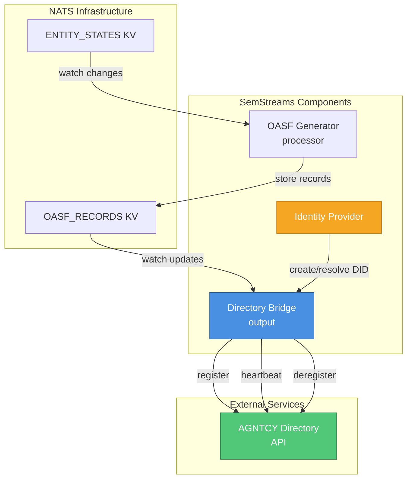
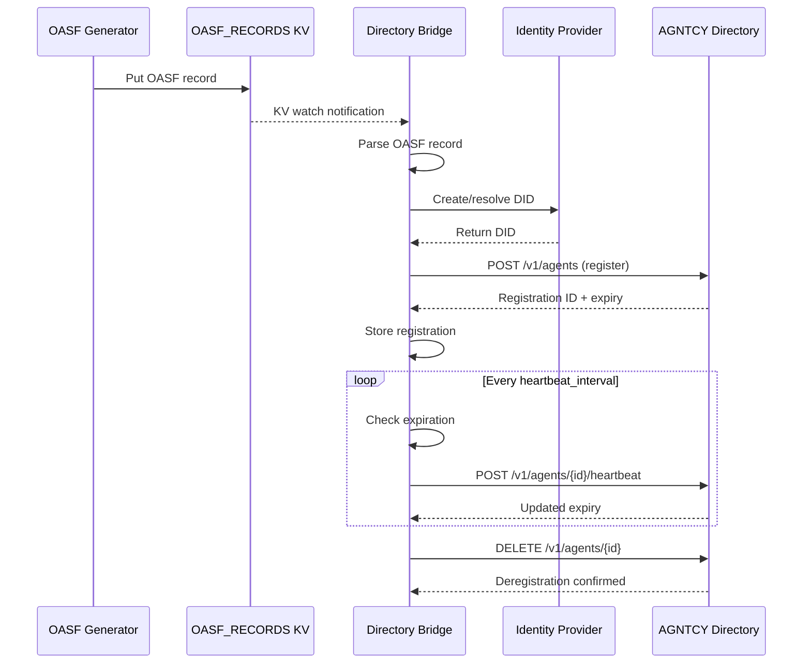

# Directory Bridge Output Component

An output component that registers SemStreams agents with AGNTCY directories using OASF (Open Agent Specification
Framework) records.

## Overview

The directory-bridge component enables SemStreams agents to participate in the Internet of Agents ecosystem by
automatically registering them with AGNTCY directory services. It watches for OASF records generated by the
oasf-generator processor and maintains persistent registrations through periodic heartbeats and DID-based identity
verification.

This component implements Phase 2 of the AGNTCY integration strategy, providing federated discovery capabilities
so external systems can find and invoke SemStreams agents through standard directories.

## Architecture



## Features

- **Automatic Registration**: Watches OASF KV bucket and registers agents as records are created/updated
- **DID Identity**: Creates decentralized identifiers (DIDs) for agents using pluggable identity providers
- **Heartbeat Management**: Maintains registrations with periodic heartbeats before TTL expiration
- **Graceful Deregistration**: Removes all agent registrations on component shutdown
- **Retry Logic**: Configurable retry behavior for failed registration attempts
- **Multiple Providers**: Supports local (did:key) and AGNTCY identity providers

## Configuration

### Basic Configuration

```yaml
components:
  - name: dir-bridge
    type: directory-bridge
    config:
      directory_url: "https://directory.agntcy.dev"
      heartbeat_interval: "30s"
      registration_ttl: "5m"
      identity_provider: "local"
      oasf_kv_bucket: "OASF_RECORDS"
```

### Advanced Configuration

```yaml
components:
  - name: dir-bridge
    type: directory-bridge
    config:
      directory_url: "https://directory.example.com"
      heartbeat_interval: "30s"
      registration_ttl: "5m"
      identity_provider: "local"
      oasf_kv_bucket: "OASF_RECORDS"
      retry_count: 3
      retry_delay: "1s"

      ports:
        inputs:
          - name: oasf_records
            subject: "oasf.record.generated.>"
            type: kv-watch
            required: true
            description: "Watch for generated OASF records"

        outputs:
          - name: registration_events
            subject: "directory.registration.*"
            type: jetstream
            required: false
            description: "Emit registration events"
```

### Configuration Options

| Option | Type | Default | Description |
|--------|------|---------|-------------|
| `directory_url` | string | - | AGNTCY directory service base URL |
| `heartbeat_interval` | duration | `30s` | How often to send heartbeats |
| `registration_ttl` | duration | `5m` | Registration time-to-live |
| `identity_provider` | string | `local` | Identity provider type (local, agntcy) |
| `oasf_kv_bucket` | string | `OASF_RECORDS` | KV bucket to watch for OASF records |
| `retry_count` | int | `3` | Number of retries for failed operations |
| `retry_delay` | duration | `1s` | Initial delay between retries |
| `ports` | object | (default) | Input/output port configuration |

## NATS Topology

### Input Sources

| Source | Type | Purpose |
|--------|------|---------|
| `OASF_RECORDS` | KV Watch | Watches for agent OASF records from oasf-generator |

### Output Destinations

| Destination | Type | Purpose |
|-------------|------|---------|
| `directory.registration.*` | JetStream | Optional registration event notifications |

### Data Flow



## Registration Lifecycle

### 1. Detection Phase

The component watches the OASF_RECORDS KV bucket for changes:

```go
watcher, err := kv.Watch(ctx, ">", jetstream.IgnoreDeletes())
```

When an OASF record is created or updated, the watcher receives a notification.

### 2. Identity Resolution Phase

For each agent being registered, the component creates or resolves a DID identity:

```go
identity, err := identityProvider.CreateIdentity(ctx, identity.CreateIdentityOptions{
    DisplayName: record.Name,
})
agentDID := identity.DIDString()
```

Supported identity providers:

- **local**: Creates `did:key` identities using Ed25519 key pairs
- **agntcy**: Resolves identities through AGNTCY identity service (future)

### 3. Registration Phase

The component sends a registration request to the AGNTCY directory:

```json
POST /v1/agents
{
  "agent_did": "did:key:z6Mk...",
  "oasf_record": { ... },
  "ttl": 300,
  "metadata": {
    "semstreams_entity_id": "acme.ops.agentic.system.agent.001",
    "source": "semstreams"
  }
}
```

Response contains registration ID and expiration time:

```json
{
  "success": true,
  "registration_id": "reg_abc123",
  "expires_at": "2026-02-13T15:30:00Z"
}
```

### 4. Heartbeat Phase

A background goroutine periodically sends heartbeats to maintain registrations before they expire:

```go
// Heartbeat loop runs at configured interval
ticker := time.NewTicker(heartbeatInterval)

// Only send heartbeat if expiry is approaching
if time.Until(registration.ExpiresAt) < heartbeatInterval*2 {
    client.Heartbeat(ctx, &HeartbeatRequest{
        RegistrationID: registration.RegistrationID,
        AgentDID:       registration.AgentDID,
    })
}
```

### 5. Deregistration Phase

On component shutdown, all active registrations are removed:

```go
for _, registration := range registrations {
    client.Deregister(ctx, &DeregistrationRequest{
        RegistrationID: registration.RegistrationID,
        AgentDID:       registration.AgentDID,
    })
}
```

## Usage Example

### Complete Integration Example

```yaml
# flow.yaml
components:
  # Generate OASF records from agent entities
  - name: oasf-gen
    type: oasf-generator
    config:
      entity_kv_bucket: ENTITY_STATES
      oasf_kv_bucket: OASF_RECORDS
      watch_pattern: "*.agent.*"

  # Register agents with AGNTCY directory
  - name: dir-bridge
    type: directory-bridge
    config:
      directory_url: "https://directory.agntcy.dev"
      heartbeat_interval: "30s"
      registration_ttl: "5m"
      identity_provider: "local"
      oasf_kv_bucket: "OASF_RECORDS"
```

### Programmatic Usage

```go
import (
    directorybridge "github.com/c360studio/semstreams/output/directory-bridge"
    "github.com/c360studio/semstreams/component"
)

// Register component with registry
func init() {
    directorybridge.Register(registry)
}

// Create component instance
config := directorybridge.DefaultConfig()
config.DirectoryURL = "https://directory.example.com"
config.HeartbeatInterval = "30s"

rawConfig, _ := json.Marshal(config)
comp, err := directorybridge.NewComponent(rawConfig, component.Dependencies{
    NATSClient: natsClient,
    Logger:     logger,
})

// Initialize and start
comp.Initialize()
comp.Start(ctx)

// Check active registrations
registrations := comp.GetRegistrations()
for _, reg := range registrations {
    fmt.Printf("Agent %s registered as %s\n", reg.EntityID, reg.RegistrationID)
}
```

### Querying Registration Status

```go
// Get specific registration
registration := component.GetRegistration("acme.ops.agentic.system.agent.001")
if registration != nil {
    fmt.Printf("DID: %s\n", registration.AgentDID)
    fmt.Printf("Expires: %s\n", registration.ExpiresAt)
    fmt.Printf("Last Heartbeat: %s\n", registration.LastHeartbeat)
}

// List all registrations
registrations := component.GetRegistrations()
fmt.Printf("Active registrations: %d\n", len(registrations))
```

## API Reference

### DirectoryClient

HTTP client for AGNTCY directory API operations.

```go
type DirectoryClient struct {
    baseURL    string
    httpClient *http.Client
}

// Register registers an agent with the directory
func (c *DirectoryClient) Register(ctx context.Context, req *RegistrationRequest) (*RegistrationResponse, error)

// Heartbeat sends a heartbeat to renew a registration
func (c *DirectoryClient) Heartbeat(ctx context.Context, req *HeartbeatRequest) (*HeartbeatResponse, error)

// Deregister removes an agent from the directory
func (c *DirectoryClient) Deregister(ctx context.Context, req *DeregistrationRequest) error

// Discover searches the directory for agents
func (c *DirectoryClient) Discover(ctx context.Context, query *DiscoveryQuery) (*DiscoveryResponse, error)
```

### RegistrationManager

Manages the lifecycle of agent registrations including heartbeats.

```go
type RegistrationManager struct {
    client           *DirectoryClient
    identityProvider identity.Provider
    config           Config
    logger           *slog.Logger
}

// RegisterAgent registers an agent with the directory
func (rm *RegistrationManager) RegisterAgent(ctx context.Context, entityID string,
    record *oasfgenerator.OASFRecord, agentIdentity *identity.AgentIdentity) error

// UpdateRegistration updates an existing registration with new OASF data
func (rm *RegistrationManager) UpdateRegistration(ctx context.Context, entityID string,
    record *oasfgenerator.OASFRecord) error

// Deregister removes an agent from the directory
func (rm *RegistrationManager) Deregister(ctx context.Context, entityID string) error

// GetRegistration returns the registration for an entity
func (rm *RegistrationManager) GetRegistration(entityID string) *Registration

// ListRegistrations returns all active registrations
func (rm *RegistrationManager) ListRegistrations() []*Registration
```

### Registration

Represents an active directory registration.

```go
type Registration struct {
    EntityID       string                      // SemStreams entity ID
    RegistrationID string                      // Directory registration ID
    AgentDID       string                      // Agent's DID
    OASFRecord     *oasfgenerator.OASFRecord  // Agent's OASF specification
    RegisteredAt   time.Time                   // Registration creation time
    ExpiresAt      time.Time                   // Registration expiration time
    LastHeartbeat  time.Time                   // Last heartbeat timestamp
    Retries        int                         // Number of registration retries
}
```

## Testing

### Unit Tests

```bash
# Run unit tests
cd output/directory-bridge
go test -v

# Run with race detector
go test -race -v

# Run specific test
go test -v -run TestComponent_Initialize
```

### Integration Tests

Integration tests require NATS infrastructure via testcontainers:

```bash
# Run integration tests
go test -tags=integration -v

# Test directory registration flow
go test -tags=integration -v -run TestComponent_Registration
```

### Mock Directory Server

For testing without external dependencies, use the mock directory implementation:

```go
import "github.com/c360studio/semstreams/output/directory-bridge"

// Create mock directory
mock := directorybridge.NewMockDirectory()

// Configure component to use mock
config.DirectoryURL = mock.URL()

// Verify registrations
registrations := mock.GetRegistrations()
assert.Equal(t, 1, len(registrations))
```

## Metrics

The component exposes health and data flow metrics through the standard component interface:

```go
// Health metrics
health := component.Health()
fmt.Printf("Healthy: %v\n", health.Healthy)
fmt.Printf("Uptime: %s\n", health.Uptime)
fmt.Printf("Errors: %d\n", health.ErrorCount)

// Data flow metrics
flow := component.DataFlow()
fmt.Printf("Error Rate: %.2f%%\n", flow.ErrorRate*100)
fmt.Printf("Last Activity: %s\n", flow.LastActivity)
```

### Prometheus Metrics

When integrated with Prometheus observability:

| Metric | Type | Description |
|--------|------|-------------|
| `directory_bridge_registrations_total` | Counter | Total successful registrations |
| `directory_bridge_registration_errors_total` | Counter | Total registration failures |
| `directory_bridge_heartbeats_sent_total` | Counter | Total heartbeats sent |
| `directory_bridge_heartbeat_errors_total` | Counter | Total heartbeat failures |
| `directory_bridge_active_registrations` | Gauge | Currently active registrations |
| `directory_bridge_registration_duration_seconds` | Histogram | Registration operation duration |

## Troubleshooting

### Registration Failures

**Symptom**: Agents not appearing in directory

**Common Causes**:

1. **Missing OASF records**: Verify oasf-generator is running and producing records
2. **Directory URL misconfigured**: Check `directory_url` in configuration
3. **Network issues**: Verify connectivity to directory service
4. **Identity provider errors**: Check identity provider configuration

**Diagnostics**:

```go
// Check for OASF records in KV
oasfKV, _ := natsClient.GetKeyValueBucket(ctx, "OASF_RECORDS")
keys, _ := oasfKV.Keys(ctx)
fmt.Printf("OASF records: %d\n", len(keys))

// Check component health
health := component.Health()
if !health.Healthy {
    fmt.Printf("Component unhealthy: %s\n", health.Status)
    fmt.Printf("Errors: %d\n", health.ErrorCount)
}
```

### Heartbeat Issues

**Symptom**: Registrations expiring unexpectedly

**Common Causes**:

1. **Heartbeat interval too long**: Set to less than 1/2 of TTL
2. **Component stopped**: Verify component is running
3. **Network interruptions**: Check for transient connectivity issues

**Solution**:

```yaml
# Ensure heartbeat interval is well below TTL
heartbeat_interval: "30s"   # Heartbeat every 30s
registration_ttl: "5m"      # Expire after 5 minutes
```

### KV Watcher Not Receiving Updates

**Symptom**: New OASF records not triggering registrations

**Common Causes**:

1. **Bucket doesn't exist**: OASF_RECORDS bucket not created
2. **Watch pattern mismatch**: Watcher pattern doesn't match keys
3. **Consumer name collision**: Multiple instances using same consumer

**Solution**:

```yaml
# For testing, add unique consumer suffix
consumer_name_suffix: "-test-1"

# For production, ensure unique component names
name: dir-bridge-prod
```

### Identity Provider Errors

**Symptom**: "Failed to create identity" errors in logs

**Common Causes**:

1. **Invalid provider type**: Check `identity_provider` configuration
2. **Provider initialization failed**: Review startup logs
3. **Cryptographic operation failed**: Verify system entropy

**Solution**:

```yaml
# Use local provider for development
identity_provider: "local"

# For AGNTCY provider (future)
identity_provider: "agntcy"
identity_service_url: "https://identity.agntcy.dev"
```

## Performance Considerations

### Heartbeat Optimization

- Heartbeats only sent when expiration approaches (within 2x heartbeat interval)
- Batch heartbeats for multiple registrations in single loop iteration
- Failed heartbeats don't block other registrations

### Memory Usage

- Registration manager maintains in-memory map of active registrations
- OASF records stored in NATS KV, not duplicated in memory
- KV watcher uses bounded channel to prevent memory growth

### Network Efficiency

- HTTP client reuses connections with 30-second timeout
- Response bodies limited to 1MB to prevent memory exhaustion
- Graceful shutdown ensures all deregistrations complete

## Security Considerations

### DID Identity

Agents registered with the directory receive cryptographically verifiable DID identities:

- **Local provider**: Creates `did:key` using Ed25519 key pairs
- **Private keys**: Stored securely by identity provider implementation
- **Verifiable**: External systems can cryptographically verify agent identity

### Network Security

- HTTPS required for production directory URLs
- HTTP client validates TLS certificates
- No sensitive data in OASF metadata (use extensions for custom fields)

### Access Control

Directory-level access control is handled by the AGNTCY directory service. The bridge component:

- Presents agent DIDs for authentication
- Respects directory rate limits and policies
- Includes metadata for audit trails

## See Also

- [ADR-019: AGNTCY Integration](../../docs/architecture/adr-019-agntcy-integration.md) - Architecture decision
  record
- [OASF Integration Guide](../../docs/concepts/20-oasf-integration.md) - Complete OASF ecosystem documentation
- [OASF Generator Component](../../processor/oasf-generator/README.md) - Generates OASF records from entities
- [Identity Package](../../agentic/identity/README.md) - DID and verifiable credential management
- [Component Lifecycle](../../docs/concepts/05-component-lifecycle.md) - Component lifecycle patterns
- [AGNTCY Documentation](https://docs.agntcy.org) - External AGNTCY project documentation
- [OASF Schema](https://schema.oasf.outshift.com) - Open Agent Specification Framework schema
