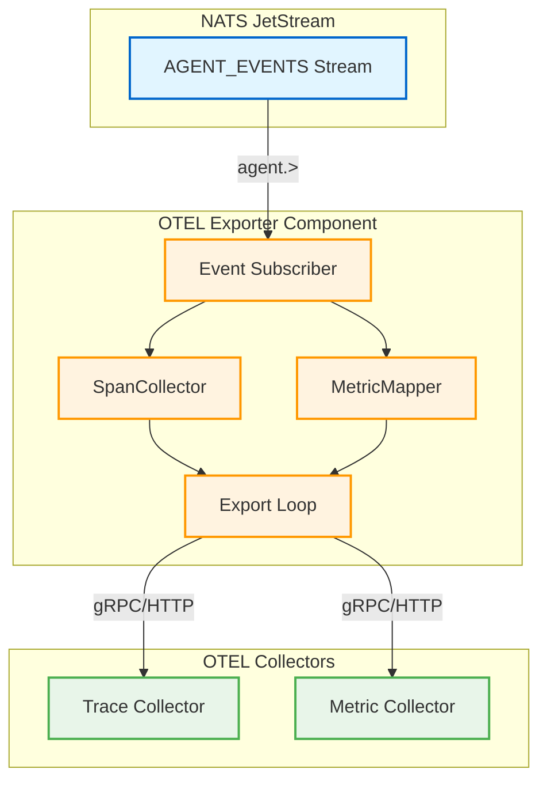
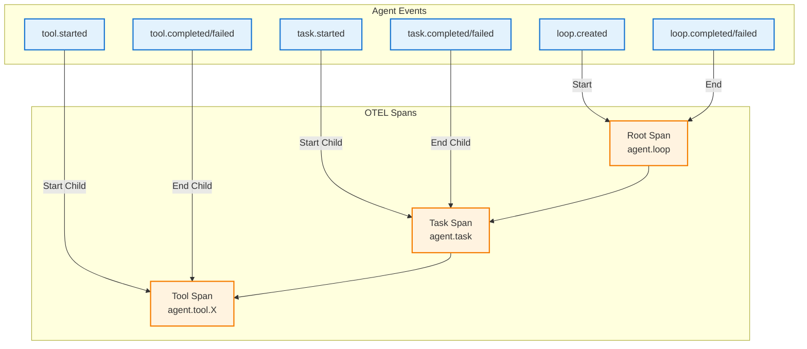
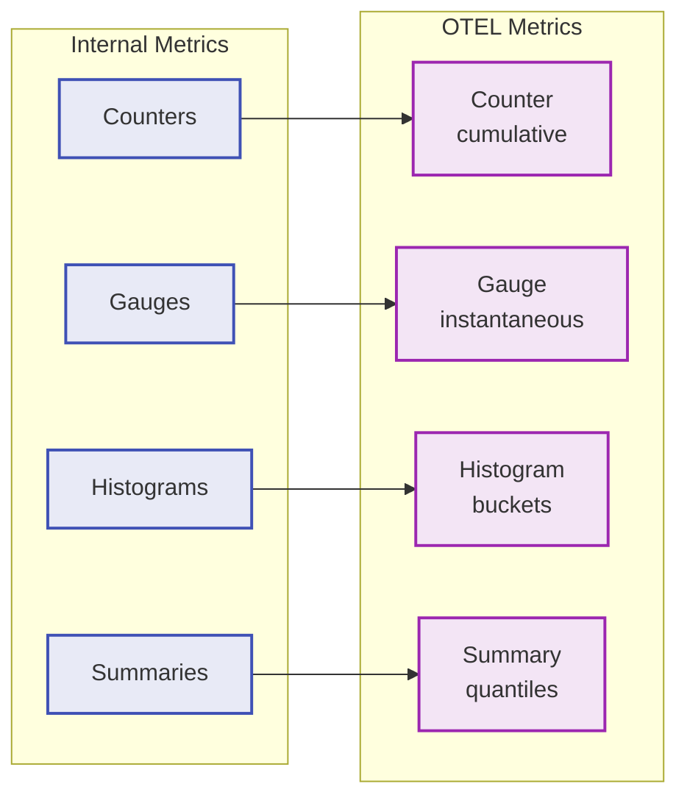

# OTEL Exporter Component

The OTEL exporter component exports agent telemetry to OpenTelemetry collectors. It subscribes to agent
lifecycle events from NATS JetStream and converts them into OpenTelemetry spans and metrics for observability
and distributed tracing.

## Overview

This component implements the AGNTCY integration pattern for observability, collecting telemetry from agentic
workflows and making it available to standard OTEL tooling (Jaeger, Zipkin, Prometheus, etc.).

**Key Features:**

- Automatic span collection from agent lifecycle events
- Hierarchical trace construction (loop → task → tool)
- Metric mapping from internal to OTEL format
- Batched export with configurable intervals
- Sampling support for high-volume scenarios
- Protocol support for gRPC and HTTP

## Architecture



### Data Flow

1. **Event Ingestion**: Subscribe to `agent.>` subject on `AGENT_EVENTS` stream
2. **Span Collection**: Convert lifecycle events to OTEL spans with trace hierarchy
3. **Metric Mapping**: Transform internal metrics to OTEL metric format
4. **Batch Export**: Periodically export completed spans and metrics to collectors
5. **Trace Correlation**: Link spans via trace ID derived from loop ID

## Configuration

### Basic Configuration

```json
{
  "type": "output",
  "name": "otel-exporter",
  "config": {
    "endpoint": "localhost:4317",
    "protocol": "grpc",
    "service_name": "semstreams",
    "service_version": "1.0.0",
    "export_traces": true,
    "export_metrics": true
  }
}
```

### Configuration Options

| Option | Type | Default | Description |
|--------|------|---------|-------------|
| `endpoint` | string | `localhost:4317` | OTEL collector endpoint address |
| `protocol` | string | `grpc` | Export protocol (`grpc` or `http`) |
| `service_name` | string | `semstreams` | Service name for traces and metrics |
| `service_version` | string | `1.0.0` | Service version |
| `export_traces` | bool | `true` | Enable trace export |
| `export_metrics` | bool | `true` | Enable metric export |
| `export_logs` | bool | `false` | Enable log export (future) |
| `batch_timeout` | string | `5s` | Batch export interval |
| `max_batch_size` | int | `512` | Maximum items per batch |
| `max_export_batch_size` | int | `512` | Maximum items per export |
| `export_timeout` | string | `30s` | Timeout for export operations |
| `insecure` | bool | `true` | Allow insecure connections |
| `headers` | object | `{}` | Additional headers for export |
| `resource_attributes` | object | `{}` | Additional resource attributes |
| `sampling_rate` | float | `1.0` | Trace sampling rate (0.0-1.0) |

### Advanced Configuration

```json
{
  "config": {
    "endpoint": "otel-collector.monitoring.svc.cluster.local:4317",
    "protocol": "grpc",
    "service_name": "agent-orchestrator",
    "service_version": "2.1.0",
    "export_traces": true,
    "export_metrics": true,
    "batch_timeout": "10s",
    "sampling_rate": 0.1,
    "headers": {
      "X-API-Key": "secret-key"
    },
    "resource_attributes": {
      "deployment.environment": "production",
      "service.namespace": "agents"
    }
  }
}
```

## Span Collection

The SpanCollector converts agent lifecycle events into hierarchical OTEL spans with automatic trace linking.

### Event to Span Mapping



### Span Hierarchy

Each agent execution creates a trace with the following structure:

```
Root Span (agent.loop)
├── Task Span 1 (agent.task)
│   ├── Tool Span A (agent.tool.query_graph)
│   └── Tool Span B (agent.tool.update_memory)
├── Task Span 2 (agent.task)
│   └── Tool Span C (agent.tool.call_llm)
└── Task Span 3 (agent.task)
```

### Span Attributes

Each span includes contextual attributes based on the event type:

**Root Span (agent.loop):**

- `agent.loop_id`: Loop identifier
- `agent.entity_id`: Agent entity ID
- `agent.role`: Agent role
- `service.name`: Service name
- `service.version`: Service version

**Task Span (agent.task):**

- `agent.loop_id`: Parent loop ID
- `agent.task_id`: Task identifier
- `task.duration_ms`: Task duration
- `task.*`: Additional task metadata

**Tool Span (agent.tool.{name}):**

- `agent.loop_id`: Parent loop ID
- `agent.task_id`: Parent task ID
- `tool.name`: Tool name
- `tool.duration_ms`: Tool execution duration
- `tool.*`: Additional tool metadata

### Trace Correlation

Traces are correlated using deterministic trace IDs derived from the loop ID:

```go
TraceID = hashToHex(loop_id, 32)  // 32-character hex string
SpanID  = hashToHex(span_key, 16) // 16-character hex string
```

This ensures:

- Consistent trace IDs across distributed components
- Automatic span linking without explicit context propagation
- Replay-friendly trace reconstruction

## Metric Mapping

The MetricMapper converts internal metrics to OpenTelemetry format, supporting multiple metric types.

### Supported Metric Types



### Metric Examples

**Counter (Cumulative):**

```json
{
  "name": "agent.tasks_completed",
  "type": "counter",
  "value": 42,
  "attributes": {
    "agent.loop_id": "loop-123",
    "agent.role": "planner"
  }
}
```

**Gauge (Instantaneous):**

```json
{
  "name": "agent.active_tasks",
  "type": "gauge",
  "value": 3,
  "attributes": {
    "agent.loop_id": "loop-123"
  }
}
```

**Histogram (Distribution):**

```json
{
  "name": "agent.task_duration_ms",
  "type": "histogram",
  "count": 100,
  "sum": 5420.5,
  "buckets": [
    {"upper_bound": 10, "count": 5},
    {"upper_bound": 50, "count": 45},
    {"upper_bound": 100, "count": 85},
    {"upper_bound": 500, "count": 100}
  ]
}
```

**Summary (Quantiles):**

```json
{
  "name": "agent.tool_latency_ms",
  "type": "summary",
  "count": 1000,
  "sum": 12500.0,
  "quantiles": [
    {"quantile": 0.5, "value": 10.2},
    {"quantile": 0.9, "value": 25.6},
    {"quantile": 0.99, "value": 48.3}
  ]
}
```

### Prometheus Integration

The MetricMapper supports mapping from Prometheus-style metrics:

```go
mapper.MapFromPrometheus(&PrometheusMetric{
    Name:   "http_requests_total",
    Help:   "Total HTTP requests",
    Type:   "counter",
    Labels: map[string]string{"method": "GET", "status": "200"},
    Value:  1523,
})
```

## NATS Topology

### Input Subjects

The exporter subscribes to agent events from JetStream:

| Port Name | Stream | Subject | Type | Description |
|-----------|--------|---------|------|-------------|
| `agent_events` | `AGENT_EVENTS` | `agent.>` | JetStream | All agent lifecycle events |

### Event Subject Hierarchy

```
agent.
├── loop.
│   ├── created
│   ├── completed
│   └── failed
├── task.
│   ├── started
│   ├── completed
│   └── failed
└── tool.
    ├── started
    ├── completed
    └── failed
```

### Consumer Configuration

The exporter creates a durable consumer with the following configuration:

```go
ConsumerConfig{
    Name:          "otel-exporter",
    Durable:       "otel-exporter",
    FilterSubject: "agent.>",
    AckPolicy:     jetstream.AckExplicitPolicy,
    DeliverPolicy: jetstream.DeliverNewPolicy,
}
```

## Integration with OTEL Collectors

### Collector Configuration

To receive data from the exporter, configure your OTEL collector with the appropriate receivers:

```yaml
receivers:
  otlp:
    protocols:
      grpc:
        endpoint: 0.0.0.0:4317
      http:
        endpoint: 0.0.0.0:4318

processors:
  batch:
    timeout: 10s
    send_batch_size: 512

exporters:
  jaeger:
    endpoint: jaeger:14250
  prometheus:
    endpoint: 0.0.0.0:8889

service:
  pipelines:
    traces:
      receivers: [otlp]
      processors: [batch]
      exporters: [jaeger]
    metrics:
      receivers: [otlp]
      processors: [batch]
      exporters: [prometheus]
```

### Docker Compose Example

```yaml
version: '3.8'
services:
  otel-collector:
    image: otel/opentelemetry-collector:latest
    command: ["--config=/etc/otel-collector-config.yaml"]
    volumes:
      - ./otel-collector-config.yaml:/etc/otel-collector-config.yaml
    ports:
      - "4317:4317"  # OTLP gRPC
      - "4318:4318"  # OTLP HTTP
      - "8889:8889"  # Prometheus exporter

  jaeger:
    image: jaegertracing/all-in-one:latest
    ports:
      - "16686:16686"  # Jaeger UI
      - "14250:14250"  # OTLP receiver

  prometheus:
    image: prom/prometheus:latest
    volumes:
      - ./prometheus.yml:/etc/prometheus/prometheus.yml
    ports:
      - "9090:9090"
```

### Viewing Traces

After starting the collectors, access the Jaeger UI at `http://localhost:16686` to view distributed traces:

1. Select service: `semstreams` (or your configured service name)
2. Find traces by operation: `agent.loop`, `agent.task`, `agent.tool.*`
3. View trace timeline with parent-child relationships
4. Inspect span attributes for debugging

## Usage Example

### Flow Configuration

```yaml
components:
  - type: output
    name: agent-telemetry
    config:
      endpoint: "localhost:4317"
      protocol: "grpc"
      service_name: "agent-orchestrator"
      export_traces: true
      export_metrics: true
      sampling_rate: 1.0
      ports:
        inputs:
          - name: agent_events
            type: jetstream
            stream_name: AGENT_EVENTS
            subject: "agent.>"
```

### Programmatic Usage

```go
package main

import (
    "context"
    "encoding/json"
    "time"

    "github.com/c360studio/semstreams/component"
    "github.com/c360studio/semstreams/output/otel"
)

func main() {
    // Create configuration
    cfg := otel.DefaultConfig()
    cfg.Endpoint = "localhost:4317"
    cfg.ServiceName = "my-agent-system"
    cfg.SamplingRate = 0.1 // Sample 10% of traces

    rawConfig, _ := json.Marshal(cfg)

    // Create component
    comp, err := otel.NewComponent(rawConfig, component.Dependencies{
        NATSClient: natsClient,
        GetLogger:  func() *slog.Logger { return logger },
    })
    if err != nil {
        panic(err)
    }

    // Initialize
    otelComp := comp.(*otel.Component)
    if err := otelComp.Initialize(); err != nil {
        panic(err)
    }

    // Start
    ctx := context.Background()
    if err := otelComp.Start(ctx); err != nil {
        panic(err)
    }

    // Run for duration
    time.Sleep(10 * time.Minute)

    // Stop
    if err := otelComp.Stop(30 * time.Second); err != nil {
        panic(err)
    }
}
```

### Custom Exporter Implementation

For production use, implement the `Exporter` interface with the OTEL Go SDK:

```go
import (
    "go.opentelemetry.io/otel/exporters/otlp/otlptrace/otlptracegrpc"
    "go.opentelemetry.io/otel/exporters/otlp/otlpmetric/otlpmetricgrpc"
)

type OTELSDKExporter struct {
    traceExporter  *otlptracegrpc.Exporter
    metricExporter *otlpmetricgrpc.Exporter
}

func (e *OTELSDKExporter) ExportSpans(ctx context.Context, spans []*otel.SpanData) error {
    // Convert SpanData to OTEL SDK spans and export
    return e.traceExporter.ExportSpans(ctx, convertSpans(spans))
}

func (e *OTELSDKExporter) ExportMetrics(ctx context.Context, metrics []*otel.MetricData) error {
    // Convert MetricData to OTEL SDK metrics and export
    return e.metricExporter.ExportMetrics(ctx, convertMetrics(metrics))
}

func (e *OTELSDKExporter) Shutdown(ctx context.Context) error {
    if err := e.traceExporter.Shutdown(ctx); err != nil {
        return err
    }
    return e.metricExporter.Shutdown(ctx)
}
```

## Testing

### Unit Tests

Run unit tests for the component:

```bash
# Run all tests
task test

# Run with race detector
task test:race

# Run otel package tests specifically
go test -v ./output/otel/...
```

### Integration Tests

The package includes integration tests that verify:

- Configuration validation
- Component lifecycle (Initialize, Start, Stop)
- Span collection from agent events
- Metric mapping
- Export batch processing
- Error handling

```bash
# Run integration tests
task test:integration
```

### Mock Exporter

For testing, use the provided `MockExporter`:

```go
func TestWithMockExporter(t *testing.T) {
    // Create component
    comp := createComponent(t)
    otelComp := comp.(*otel.Component)
    otelComp.Initialize()

    // Set mock exporter
    mockExp := &otel.MockExporter{}
    otelComp.SetExporter(mockExp)

    // Start and process events
    ctx := context.Background()
    otelComp.Start(ctx)

    // Verify exports
    spans := mockExp.GetExportedSpans()
    if len(spans) == 0 {
        t.Error("expected spans to be exported")
    }

    metrics := mockExp.GetExportedMetrics()
    if len(metrics) == 0 {
        t.Error("expected metrics to be exported")
    }
}
```

### Test Coverage

The package maintains high test coverage:

- Configuration validation: 100%
- Component lifecycle: 100%
- Span collection: 95%
- Metric mapping: 95%
- Event processing: 90%

## Performance Considerations

### Batching

The exporter uses batched exports to optimize performance:

- **Default batch interval**: 5 seconds
- **Max batch size**: 512 items
- **Configurable** via `batch_timeout` and `max_batch_size`

Tune these settings based on your traffic:

- High volume: Reduce `batch_timeout`, increase `max_batch_size`
- Low volume: Increase `batch_timeout` to reduce export overhead

### Sampling

For high-throughput scenarios, use sampling to reduce data volume:

```json
{
  "sampling_rate": 0.1  // Sample 10% of traces
}
```

Sampling is applied at the root span (loop) level, ensuring complete traces are either fully sampled or fully
dropped.

### Memory Usage

The component maintains:

- **Active spans**: In-memory until completion
- **Completed spans**: Batched until export
- **Metrics**: Aggregated per metric name

Adjust `batch_timeout` to control memory footprint for completed data.

## Troubleshooting

### No Traces in Collector

1. **Check collector endpoint**: Verify `endpoint` matches your collector address
2. **Verify protocol**: Ensure `protocol` is `grpc` or `http` as supported by collector
3. **Check network connectivity**: Use `telnet localhost 4317` to test connectivity
4. **Review logs**: Enable debug logging to see export attempts
5. **Verify sampling**: Ensure `sampling_rate` is not too low

### Spans Not Linked

1. **Check event order**: Ensure events arrive in order (created before completed)
2. **Verify loop IDs**: Confirm events share the same `loop_id`
3. **Review span collector stats**: Check `active_spans` and `completed_spans` counters

### Export Failures

1. **Check timeout settings**: Increase `export_timeout` if exports fail
2. **Verify collector health**: Ensure collector is running and accepting data
3. **Review headers**: Check if `headers` are required for authentication
4. **Enable insecure mode**: Set `insecure: true` for development

### High Memory Usage

1. **Reduce batch interval**: Decrease `batch_timeout` to export more frequently
2. **Increase sampling**: Lower `sampling_rate` to reduce span volume
3. **Monitor active spans**: Check for stuck spans that never complete

## References

- [ADR-019: AGNTCY Integration](/Users/coby/Code/c360/semstreams/docs/adr/019-agntcy-integration.md)
- [OpenTelemetry Specification](https://opentelemetry.io/docs/specs/)
- [OTEL Go SDK](https://pkg.go.dev/go.opentelemetry.io/otel)
- [OTEL Collector Documentation](https://opentelemetry.io/docs/collector/)
- [Jaeger Tracing](https://www.jaegertracing.io/)
- [Prometheus Monitoring](https://prometheus.io/)

## Contributing

When contributing to the OTEL exporter:

1. **Maintain test coverage**: Add tests for new features
2. **Follow OTEL conventions**: Align with OpenTelemetry semantic conventions
3. **Update documentation**: Keep this README in sync with code changes
4. **Performance test**: Verify batching and export performance under load
5. **Validate integration**: Test with real OTEL collectors (Jaeger, Zipkin, etc.)

## License

Part of the SemStreams project. See project LICENSE for details.
