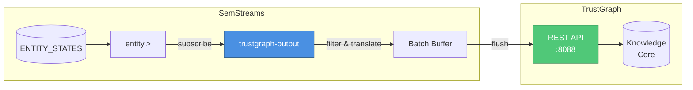
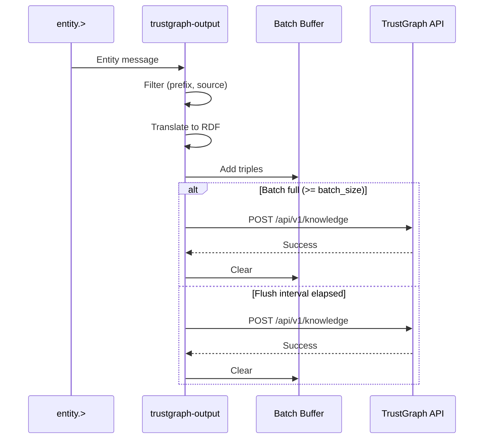

# TrustGraph Output Component

An output component that exports SemStreams entities to TrustGraph knowledge cores as RDF triples via REST API.

## Overview

The trustgraph-output component bridges SemStreams operational data into TrustGraph's knowledge graph. This enables real-time sensor readings, telemetry, and events to be available in TrustGraph's GraphRAG queries, combining document intelligence with live operational context.

When paired with trustgraph-input, this component enables bidirectional knowledge flow between the two systems with built-in loop prevention.

## Architecture



## Features

- **NATS Subscription**: Subscribes to entity change subjects
- **Entity Filtering**: Filter by entity ID prefix and source (loop prevention)
- **Vocabulary Translation**: Automatic conversion of SemStreams entities to RDF triples
- **Batch Export**: Configurable batch size and flush interval for efficient API calls
- **Loop Prevention**: Excludes entities imported from TrustGraph to prevent circular exports
- **Retry with Backoff**: Failed batches preserved for retry on transient errors
- **Prometheus Metrics**: Full observability with entities received/exported, batch counts, errors

## Quick Start

```yaml
components:
  - name: tg-export
    type: trustgraph-output
    config:
      endpoint: "http://trustgraph:8088"
      kg_core_id: "semstreams-ops"
      collection: "operational"
      ports:
        inputs:
          - name: entity
            type: nats
            subject: "entity.>"
```

## Configuration

### Basic Configuration

```yaml
components:
  - name: tg-export
    type: trustgraph-output
    config:
      endpoint: "http://trustgraph:8088"
      kg_core_id: "semstreams-operational"
      collection: "operational"
      batch_size: 100
      flush_interval: "5s"
```

### Advanced Configuration

```yaml
components:
  - name: tg-export
    type: trustgraph-output
    config:
      endpoint: "http://trustgraph:8088"
      api_key_env: "TRUSTGRAPH_API_KEY"
      timeout: "60s"

      # TrustGraph target
      kg_core_id: "semstreams-ops"
      user: "semstreams"
      collection: "operational"

      # Batching
      batch_size: 200
      flush_interval: "10s"

      # Filtering
      entity_prefixes:
        - "acme.ops."
        - "acme.sensors."
      exclude_sources:
        - "trustgraph"  # Prevents re-export loop

      # Vocabulary translation
      vocab:
        org_mappings:
          "acme": "https://data.acme-corp.com/"
        predicate_mappings:
          "sensor.measurement.celsius": "http://www.w3.org/ns/sosa/hasSimpleResult"
          "sensor.observation.time": "http://www.w3.org/ns/sosa/resultTime"
          "geo.location.zone": "http://www.w3.org/ns/sosa/isHostedBy"
        default_uri_base: "http://semstreams.local/e/"

      ports:
        inputs:
          - name: entity
            type: jetstream
            subject: "entity.>"
            stream_name: "ENTITY"
```

### Configuration Options

| Option | Type | Default | Description |
|--------|------|---------|-------------|
| `endpoint` | string | `http://localhost:8088` | TrustGraph REST API base URL |
| `api_key` | string | - | API key for TrustGraph authentication |
| `api_key_env` | string | - | Environment variable containing API key |
| `timeout` | duration | `30s` | HTTP request timeout |
| `kg_core_id` | string | `semstreams-operational` | TrustGraph knowledge core ID |
| `user` | string | `semstreams` | TrustGraph user for knowledge core ops |
| `collection` | string | `operational` | TrustGraph collection name |
| `batch_size` | int | `100` | Triples per batch (1-5000) |
| `flush_interval` | duration | `5s` | Maximum time before batch flush |
| `entity_prefixes` | []string | - | Entity ID prefixes to export (empty = all) |
| `exclude_sources` | []string | `["trustgraph"]` | Sources to exclude (loop prevention) |
| `vocab` | object | - | Vocabulary translation settings |
| `ports` | object | (default) | Input port configuration |

## Loop Prevention

When both trustgraph-input and trustgraph-output are deployed, loop prevention is critical to avoid circular data flow.

### How It Works

1. **trustgraph-input** stamps all imported triples with `Source: "trustgraph"`
2. **trustgraph-output** checks `exclude_sources` before exporting
3. Entities where ALL triples have an excluded source are filtered out
4. Mixed-source entities (some local, some imported) are still exported

### Configuration

```yaml
# Input component
- name: tg-import
  type: trustgraph-input
  config:
    source: "trustgraph"  # Stamps imported triples

# Output component
- name: tg-export
  type: trustgraph-output
  config:
    exclude_sources:
      - "trustgraph"  # Excludes entities from import
```

### Edge Cases

| Scenario | Behavior |
|----------|----------|
| All triples from TrustGraph | Filtered (not exported) |
| All triples from local sensors | Exported |
| Mixed: some TrustGraph, some local | Exported (at least one non-excluded source) |

## Vocabulary Translation

The component translates SemStreams entities to TrustGraph RDF format.

### Entity ID to URI

```
SemStreams Entity ID:
  acme.ops.environmental.sensor.temperature.zone-7

TrustGraph URI (with org_mappings):
  https://data.acme-corp.com/ops/environmental/sensor/temperature/zone-7
```

### Triple Translation

```
SemStreams Triple:
  Subject: acme.ops.environmental.sensor.temperature.zone-7
  Predicate: sensor.measurement.celsius
  Object: 45.2

TrustGraph Triple:
  s: { v: "https://data.acme-corp.com/.../zone-7", e: true }
  p: { v: "http://www.w3.org/ns/sosa/hasSimpleResult", e: true }
  o: { v: "45.2", e: false }  # Literal value
```

### Predicate Mapping

```yaml
vocab:
  predicate_mappings:
    # SemStreams predicate -> RDF URI
    "sensor.measurement.celsius": "http://www.w3.org/ns/sosa/hasSimpleResult"
    "sensor.observation.time": "http://www.w3.org/ns/sosa/resultTime"
    "entity.classification.type": "http://www.w3.org/1999/02/22-rdf-syntax-ns#type"
```

## NATS Topology

### Input

| Source | Type | Description |
|--------|------|-------------|
| `entity.>` | NATS/JetStream | Entity change messages from graph components |

## Batching Behavior

The component batches triples for efficient API calls:



### Flush Triggers

1. **Batch size reached**: Immediate flush when `batch_size` triples accumulated
2. **Interval elapsed**: Flush at `flush_interval` regardless of batch size
3. **Component shutdown**: Final flush before stopping

### Error Handling

- Failed batches are preserved and prepended to next batch
- Buffer capped at 2x batch_size to prevent unbounded growth
- Oldest triples dropped if buffer overflows

## Metrics

### Prometheus Metrics

| Metric | Type | Description |
|--------|------|-------------|
| `semstreams_trustgraph_output_entities_received_total` | Counter | Total entities received from NATS |
| `semstreams_trustgraph_output_entities_exported_total` | Counter | Total entities successfully exported |
| `semstreams_trustgraph_output_entities_filtered_total` | Counter | Total entities filtered out |
| `semstreams_trustgraph_output_triples_exported_total` | Counter | Total triples exported |
| `semstreams_trustgraph_output_batches_sent_total` | Counter | Total batches sent to TrustGraph |
| `semstreams_trustgraph_output_export_errors_total` | Counter | Total export failures |
| `semstreams_trustgraph_output_export_duration_seconds` | Histogram | Export operation duration |

### Health Status

```go
health := component.Health()
// Healthy: component running
// ErrorCount: cumulative export errors
// Uptime: time since start
```

## Troubleshooting

### No Entities Exported

**Symptoms**: Entities received but none exported

**Checks**:
1. Check entity_prefixes filter isn't too restrictive
2. Verify entities have at least one non-excluded source
3. Review logs for "entities filtered" counts

### Export Errors

**Symptoms**: `export_errors_total` increasing

**Checks**:
1. Verify TrustGraph endpoint is reachable
2. Check kg_core_id exists in TrustGraph
3. Verify user has write permissions to collection
4. Increase timeout for slow networks

### Batch Never Flushes

**Symptoms**: No batches sent despite entities received

**Checks**:
1. Verify flush_interval is reasonable (not too long)
2. Check batch_size isn't larger than expected entity volume
3. Review logs for batch accumulation

### Loop Detection Issues

**Symptoms**: Entities continuously cycling between systems

**Checks**:
1. Verify trustgraph-input sets `source: "trustgraph"`
2. Verify trustgraph-output has `exclude_sources: ["trustgraph"]`
3. Check for source field mismatch (case sensitivity)

### Wrong URIs Generated

**Symptoms**: TrustGraph shows unexpected URIs

**Checks**:
1. Verify org_mappings match your entity ID prefixes
2. Check default_uri_base setting
3. Review predicate_mappings for correctness

## Example: Sensor Data Export

Export temperature sensor readings to TrustGraph for GraphRAG queries:

```yaml
components:
  - name: sensor-export
    type: trustgraph-output
    config:
      endpoint: "http://trustgraph:8088"
      kg_core_id: "operational-sensors"
      collection: "iot"
      batch_size: 50
      flush_interval: "10s"

      entity_prefixes:
        - "acme.ops.environmental.sensor."

      vocab:
        org_mappings:
          "acme": "https://sensors.acme-corp.com/"
        predicate_mappings:
          "sensor.measurement.celsius": "http://www.w3.org/ns/sosa/hasSimpleResult"
          "sensor.measurement.humidity": "http://www.w3.org/ns/sosa/hasSimpleResult"
          "sensor.observation.time": "http://www.w3.org/ns/sosa/resultTime"
          "geo.location.zone": "http://www.w3.org/ns/sosa/isHostedBy"
```

Result: TrustGraph agents can now answer questions like "What is the current temperature in zone 7?" by combining document SOPs with live sensor data.

## See Also

- [TrustGraph Input Component](../../input/trustgraph/README.md) - Import entities from TrustGraph
- [TrustGraph Integration Guide](../../docs/integration/trustgraph-integration.md) - Complete integration documentation
- [Vocabulary Translation](../../vocabulary/trustgraph/README.md) - URI/EntityID translation details
- [TrustGraph Documentation](https://docs.trustgraph.ai) - External TrustGraph docs
