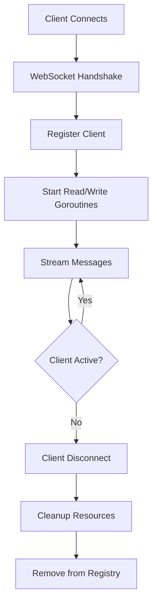

# WebSocket Output Component

Real-time streaming of NATS messages to WebSocket clients with configurable delivery guarantees.

## Purpose

The WebSocket output component runs a WebSocket server that broadcasts incoming NATS messages to connected
clients in real-time. It supports multiple concurrent clients with automatic reconnection handling, per-client
write timeouts, and configurable delivery modes (at-most-once or at-least-once). Designed for real-time
dashboards, monitoring systems, and event visualization.

## Configuration

### Basic Configuration

```yaml
type: websocket
ports:
  inputs:
    - name: nats_input
      type: nats
      subject: semantic.>
      required: true
  outputs:
    - name: websocket_server
      type: network
      subject: http://0.0.0.0:8081/ws
```

### Advanced Configuration

```yaml
type: websocket
delivery_mode: at-least-once
ack_timeout: 5s
ports:
  inputs:
    - name: events
      type: nats
      subject: events.>
    - name: metrics
      type: nats
      subject: metrics.>
  outputs:
    - name: websocket_server
      type: network
      subject: http://0.0.0.0:8081/ws
```

### Configuration Options

| Field | Type | Default | Description |
|-------|------|---------|-------------|
| `delivery_mode` | string | `at-most-once` | Delivery reliability (`at-most-once`, `at-least-once`) |
| `ack_timeout` | duration | `5s` | Timeout for client acknowledgments |
| `ports.inputs[].subject` | string | `semantic.>` | NATS subject patterns to subscribe |
| `ports.outputs[].subject` | string | `http://0.0.0.0:8081/ws` | WebSocket server endpoint |

## Input/Output Ports

### Input Ports

**Type**: `nats`

Subscribes to NATS subjects and receives messages for broadcast to WebSocket clients. Multiple input ports
are supported for subscribing to different subject patterns.

**Example**:

```yaml
inputs:
  - name: graph_updates
    type: nats
    subject: graph.entities.>
  - name: alerts
    type: nats
    subject: alerts.critical
```

### Output Ports

**Type**: `network`

Exposes a WebSocket server endpoint that clients connect to for receiving real-time messages. The endpoint
is encoded as a URL in the `subject` field.

**Example**:

```yaml
outputs:
  - name: websocket_server
    type: network
    subject: http://0.0.0.0:8081/ws
```

**URL Format**: `http://<host>:<port><path>`

- **host**: Binding address (use `0.0.0.0` for all interfaces)
- **port**: TCP port (1024-65535)
- **path**: WebSocket endpoint path (e.g., `/ws`, `/stream`)

## Connection Management

### Client Lifecycle



### Concurrent Client Handling

Each connected client receives:

1. **Read goroutine**: Handles ping/pong keepalive and acknowledgment messages
2. **Write goroutine**: Forwards NATS messages to the client
3. **Dedicated mutex**: Prevents concurrent writes (gorilla/websocket requirement)
4. **Message buffer**: Circular buffer for pending acknowledgments (at-least-once mode)

### Reconnection Handling

Clients are automatically removed and cleaned up when:

- Write timeout exceeded (default: 10s)
- Read timeout exceeded (default: 60s)
- Ping/pong keepalive fails (interval: 30s)
- Network errors or connection closes

Reconnection is the client's responsibility. The server accepts new connections at any time.

## Delivery Modes

### At-Most-Once Delivery

**Default mode**. Messages are sent without waiting for acknowledgment.

**Characteristics**:

- Fire-and-forget semantics
- Lowest latency
- No message buffering
- Client may miss messages if slow or disconnected

**Use when**: Real-time visualization where occasional message loss is acceptable.

### At-Least-Once Delivery

**Reliable mode**. Messages require client acknowledgment before considered delivered.

**Characteristics**:

- Client must send `ack` or `nack` messages
- Pending messages tracked in circular buffer
- Timeout-based failure detection
- Future support for retries

**Use when**: Critical events, alerts, or state updates that must not be lost.

### Message Protocol

All messages are wrapped in a `MessageEnvelope`:

```json
{
  "type": "data",
  "id": "msg-1707654321000-42",
  "timestamp": 1707654321000,
  "payload": { /* your data */ }
}
```

**Client acknowledgment** (at-least-once mode):

```json
{
  "type": "ack",
  "id": "msg-1707654321000-42",
  "timestamp": 1707654321100
}
```

**Negative acknowledgment**:

```json
{
  "type": "nack",
  "id": "msg-1707654321000-42",
  "timestamp": 1707654321100
}
```

**Backpressure signal**:

```json
{
  "type": "slow",
  "timestamp": 1707654321100
}
```

## Example Use Cases

### Real-Time Dashboard

Stream knowledge graph updates to a web dashboard for live visualization.

```yaml
type: websocket
ports:
  inputs:
    - name: graph_updates
      type: nats
      subject: graph.entities.>
    - name: query_results
      type: nats
      subject: graph.queries.>
  outputs:
    - name: dashboard
      type: network
      subject: http://0.0.0.0:8080/dashboard
```

### Live Monitoring

Broadcast system metrics and logs to monitoring clients.

```yaml
type: websocket
delivery_mode: at-most-once
ports:
  inputs:
    - name: metrics
      type: nats
      subject: metrics.>
    - name: logs
      type: nats
      subject: logs.>
  outputs:
    - name: monitor
      type: network
      subject: http://0.0.0.0:9090/monitor
```

### Critical Alerts

Ensure critical alerts are reliably delivered to connected clients.

```yaml
type: websocket
delivery_mode: at-least-once
ack_timeout: 10s
ports:
  inputs:
    - name: alerts
      type: nats
      subject: alerts.critical
  outputs:
    - name: alert_stream
      type: network
      subject: http://0.0.0.0:8000/alerts
```

### Event Broadcasting

Broadcast application events to multiple client types.

```yaml
type: websocket
ports:
  inputs:
    - name: events
      type: nats
      subject: events.>
  outputs:
    - name: event_stream
      type: network
      subject: http://0.0.0.0:8081/events
```

## Client Example

### JavaScript WebSocket Client

```javascript
const ws = new WebSocket('ws://localhost:8081/ws');

ws.onopen = () => {
  console.log('Connected to WebSocket server');
};

ws.onmessage = (event) => {
  const envelope = JSON.parse(event.data);

  if (envelope.type === 'data') {
    console.log('Received:', envelope.payload);

    // Send acknowledgment (at-least-once mode)
    ws.send(JSON.stringify({
      type: 'ack',
      id: envelope.id,
      timestamp: Date.now()
    }));
  }
};

ws.onerror = (error) => {
  console.error('WebSocket error:', error);
};

ws.onclose = () => {
  console.log('Disconnected, reconnecting...');
  setTimeout(() => {
    // Reconnect logic
  }, 1000);
};
```

### Go WebSocket Client

```go
import (
    "encoding/json"
    "log"
    "github.com/gorilla/websocket"
)

type MessageEnvelope struct {
    Type      string          `json:"type"`
    ID        string          `json:"id"`
    Timestamp int64           `json:"timestamp"`
    Payload   json.RawMessage `json:"payload"`
}

func connect() {
    conn, _, err := websocket.DefaultDialer.Dial("ws://localhost:8081/ws", nil)
    if err != nil {
        log.Fatal(err)
    }
    defer conn.Close()

    for {
        _, data, err := conn.ReadMessage()
        if err != nil {
            log.Printf("Read error: %v", err)
            return
        }

        var envelope MessageEnvelope
        if err := json.Unmarshal(data, &envelope); err != nil {
            log.Printf("Parse error: %v", err)
            continue
        }

        if envelope.Type == "data" {
            log.Printf("Received: %s", envelope.Payload)

            // Send acknowledgment
            ack := map[string]any{
                "type":      "ack",
                "id":        envelope.ID,
                "timestamp": time.Now().UnixMilli(),
            }
            if err := conn.WriteJSON(ack); err != nil {
                log.Printf("Ack error: %v", err)
            }
        }
    }
}
```

## Observability

### Health Status

```go
health := output.Health()
// Healthy: true if server accepting connections
// ErrorCount: Write errors across all clients
// Uptime: Time since Start()
```

### Data Flow Metrics

```go
dataFlow := output.DataFlow()
// MessagesPerSecond: Broadcast rate
// BytesPerSecond: Total byte throughput
// ErrorRate: Client error percentage
// LastActivity: Last message timestamp
```

### Prometheus Metrics

| Metric | Type | Description |
|--------|------|-------------|
| `semstreams_websocket_messages_received_total` | Counter | Messages received from NATS |
| `semstreams_websocket_messages_sent_total` | Counter | Messages sent to clients |
| `semstreams_websocket_bytes_sent_total` | Counter | Total bytes sent |
| `semstreams_websocket_clients_connected` | Gauge | Current active clients |
| `semstreams_websocket_client_connections_total` | Counter | Total connections |
| `semstreams_websocket_client_disconnections_total` | Counter | Total disconnections |
| `semstreams_websocket_broadcast_duration_seconds` | Histogram | Broadcast latency |
| `semstreams_websocket_message_size_bytes` | Histogram | Message size distribution |
| `semstreams_websocket_errors_total` | Counter | Error counts by type |
| `semstreams_websocket_server_uptime_seconds` | Gauge | Server uptime |

## Performance Characteristics

- **Throughput**: 1,000+ messages/second to 100+ concurrent clients
- **Memory**: O(clients) + O(pending messages per client)
- **Latency**: Sub-millisecond for local clients, ~10ms for network clients
- **Concurrency**: One goroutine pair (read/write) per client

### Capacity Planning

**Message rate**: With 100 clients and 1KB messages at 100 msg/s broadcast rate:

- Network bandwidth: ~10 MB/s
- Memory overhead: ~100 MB (1MB buffer per client)
- Goroutines: ~200 (2 per client)

## Security Considerations

### Production Deployment

Use a reverse proxy (nginx, Caddy) for:

- TLS/SSL termination
- Authentication/authorization
- Rate limiting
- CORS policy enforcement

**Example nginx configuration**:

```nginx
location /ws {
    proxy_pass http://localhost:8081;
    proxy_http_version 1.1;
    proxy_set_header Upgrade $http_upgrade;
    proxy_set_header Connection "upgrade";
    proxy_set_header Host $host;
    proxy_set_header X-Real-IP $remote_addr;
}
```

### TLS Support

Enable TLS at the platform level via security configuration:

```yaml
security:
  tls:
    server:
      enabled: true
      mode: manual
      cert_file: /path/to/cert.pem
      key_file: /path/to/key.pem
```

Or use ACME for automatic certificate management:

```yaml
security:
  tls:
    server:
      enabled: true
      mode: acme
      acme:
        enabled: true
        email: admin@example.com
        domains:
          - websocket.example.com
```

## Limitations

Current version limitations:

- No per-client subject filtering (all clients receive all messages)
- No client-to-server message handling (server push only)
- No message compression (gzip/deflate)
- No built-in authentication (use reverse proxy)
- Retry logic not yet implemented for at-least-once mode

## Thread Safety

The component is fully thread-safe:

- Per-client write mutex prevents concurrent writes (gorilla/websocket requirement)
- Client map protected by `sync.RWMutex`
- Atomic operations for metrics counters
- `sync.Once` for cleanup operations
- `sync.WaitGroup` for goroutine lifecycle tracking
