# Graph Query Coordinator

Query coordinator that orchestrates retrieval operations across the graph subsystem using PathRAG, GraphRAG, and
static routing patterns.

## Overview

The graph-query component serves as the central coordination layer for all graph query operations. It provides three
primary capabilities:

- **PathRAG**: Multi-hop graph traversal with path tracking and relevance scoring
- **GraphRAG**: Community-aware search leveraging graph clustering for semantic and structural queries
- **Static Routing**: Query-type-to-subject mapping for distributed graph components

The component implements graceful degradation, enabling partial functionality when optional dependencies like
community indices are unavailable during cluster startup.

## Architecture

```mermaid
flowchart TD
    Client[Query Client] -->|NATS Request| GQ[graph-query]

    GQ -->|Entity Queries| GI[graph-ingest]
    GQ -->|Relationships| GX[graph-index]
    GQ -->|Semantic Search| GE[graph-embedding]
    GQ -->|Communities| GC[graph-clustering]

    GQ -->|PathRAG| PathSearcher[PathSearcher<br/>BFS Traversal]
    GQ -->|GraphRAG| GraphRAG[GraphRAG Engine<br/>Community Search]
    GQ -->|Route| Router[StaticRouter<br/>Subject Mapping]

    PathSearcher -->|Fetch Entities| GI
    PathSearcher -->|Fetch Relationships| GX

    GraphRAG -->|Community Lookup| Cache[CommunityCache<br/>KV Watcher]
    GraphRAG -->|Load Entities| GI
    GraphRAG -->|Semantic Search| GE

    Cache -->|Watch| KV[(COMMUNITY_INDEX<br/>KV Bucket)]

    style GQ fill:#4a90e2,color:#fff
    style PathSearcher fill:#7cb342,color:#fff
    style GraphRAG fill:#7cb342,color:#fff
    style Cache fill:#ffa726,color:#fff
```



## Features

### PathRAG Traversal

BFS-based graph traversal with comprehensive path tracking:

- Multi-hop exploration with configurable depth limits
- Direction control: outgoing, incoming, or bidirectional
- Predicate filtering for focused traversal
- Decay-weighted relevance scoring (0.8 per hop)
- Full path reconstruction from start to discovered entities
- Max nodes and max paths limits for bounded execution

### GraphRAG Search

Tiered search strategy with automatic fallback:

**Tier 0: Path Intent Detection**

- Keyword classifier detects path traversal patterns in natural language
- Resolves partial entity IDs to canonical form
- Executes PathRAG without requiring embeddings

**Tier 1: Semantic Search**

- Neural embedding-based similarity via graph-embedding component
- Returns entities ranked by semantic relevance
- Automatic community attribution

**Tier 2: Text-Based Fallback**

- Community summary scoring using statistical methods
- Keyword matching across summaries and entity properties
- Works without embeddings for degraded scenarios

### Static Routing

Fixed query-type-to-subject mappings for all graph operations:

| Query Type | Target Component | Subject Pattern |
|------------|------------------|-----------------|
| entity, entityBatch, entityPrefix | graph-ingest | `graph.ingest.query.*` |
| outgoing, incoming, alias, predicate | graph-index | `graph.index.query.*` |
| spatial, temporal | graph-spatial, graph-temporal | `graph.*.query.*` |
| semantic, similar | graph-embedding | `graph.embedding.query.*` |
| community | graph-clustering | `graph.clustering.query.*` |

## Configuration

```json
{
  "type": "processor",
  "name": "graph-query",
  "config": {
    "ports": {
      "inputs": [
        {"name": "query_entity", "type": "nats-request", "subject": "graph.query.entity"},
        {"name": "query_relationships", "type": "nats-request", "subject": "graph.query.relationships"},
        {"name": "query_path_search", "type": "nats-request", "subject": "graph.query.pathSearch"},
        {"name": "local_search", "type": "nats-request", "subject": "graph.query.localSearch"},
        {"name": "global_search", "type": "nats-request", "subject": "graph.query.globalSearch"}
      ]
    },
    "query_timeout": "5s",
    "max_depth": 10,
    "startup_attempts": 10,
    "startup_interval": "500ms",
    "recheck_interval": "5s"
  }
}
```

### Configuration Fields

| Field | Type | Default | Description |
|-------|------|---------|-------------|
| `ports` | `PortConfig` | Required | Input port definitions for query subscriptions |
| `query_timeout` | `time.Duration` | `5s` | Timeout for inter-component NATS requests |
| `max_depth` | `int` | `10` | Maximum BFS traversal depth for PathRAG |
| `startup_attempts` | `int` | `10` | Bucket availability check attempts at startup |
| `startup_interval` | `time.Duration` | `500ms` | Interval between startup availability checks |
| `recheck_interval` | `time.Duration` | `5s` | Interval for rechecking missing buckets after startup |

## Query Types

### Entity Queries

**Query Entity by ID**

```json
{
  "subject": "graph.query.entity",
  "data": {"id": "acme.ops.robotics.gcs.drone.001"}
}
```

**Query Entity by Alias**

```json
{
  "subject": "graph.query.entityByAlias",
  "data": {"aliasOrID": "drone001"}
}
```

Resolves alias to canonical ID via graph-index, then fetches entity.

**Hierarchy Stats**

```json
{
  "subject": "graph.query.hierarchyStats",
  "data": {"prefix": "acme.ops"}
}
```

Returns child node counts grouped by next hierarchy level.

### Relationship Queries

**Outgoing/Incoming Relationships**

```json
{
  "subject": "graph.query.relationships",
  "data": {
    "entity_id": "acme.ops.robotics.gcs.drone.001",
    "direction": "outgoing"
  }
}
```

Direction: `outgoing` (default), `incoming`.

### PathRAG

**Path Search Request**

```json
{
  "subject": "graph.query.pathSearch",
  "data": {
    "start_entity": "acme.ops.robotics.gcs.drone.001",
    "max_depth": 3,
    "max_nodes": 100,
    "direction": "outgoing",
    "predicates": ["connectedTo", "partOf"],
    "timeout": "10s",
    "max_paths": 50
  }
}
```

**Response Format**

```json
{
  "entities": [
    {"id": "acme.ops.robotics.gcs.drone.001", "type": "entity", "score": 1.0},
    {"id": "acme.ops.robotics.nav.module.042", "type": "entity", "score": 0.8}
  ],
  "paths": [
    [],
    [
      {"from": "acme.ops.robotics.gcs.drone.001", "predicate": "hasComponent",
       "to": "acme.ops.robotics.nav.module.042"}
    ]
  ],
  "truncated": false
}
```

### GraphRAG

**Local Search**

Community-scoped search starting from a known entity:

```json
{
  "subject": "graph.query.localSearch",
  "data": {
    "entity_id": "acme.ops.robotics.gcs.drone.001",
    "query": "navigation system",
    "level": 0
  }
}
```

**Global Search**

Cross-community search with tiered strategy:

```json
{
  "subject": "graph.query.globalSearch",
  "data": {
    "query": "autonomous navigation systems",
    "level": 1,
    "max_communities": 5,
    "include_summaries": true,
    "include_relationships": false,
    "include_sources": false
  }
}
```

**Global Search Response**

```json
{
  "entities": [...],
  "community_summaries": [
    {
      "community_id": "L0_C3",
      "summary": "Navigation and control systems...",
      "keywords": ["navigation", "control", "autonomous"],
      "level": 0,
      "relevance": 0.95
    }
  ],
  "count": 42,
  "duration_ms": 245
}
```

### Semantic Queries

**Semantic Search**

```json
{
  "subject": "graph.query.semantic",
  "data": {
    "query": "flight control algorithms",
    "limit": 50
  }
}
```

**Similar Entities**

```json
{
  "subject": "graph.query.similar",
  "data": {
    "entity_id": "acme.ops.robotics.nav.module.042",
    "limit": 20
  }
}
```

### Spatial/Temporal Queries

**Spatial Query**

```json
{
  "subject": "graph.query.spatial",
  "data": {
    "min_lat": 37.7,
    "max_lat": 37.8,
    "min_lon": -122.5,
    "max_lon": -122.4
  }
}
```

**Temporal Query**

```json
{
  "subject": "graph.query.temporal",
  "data": {
    "start_time": "2026-01-01T00:00:00Z",
    "end_time": "2026-02-01T00:00:00Z"
  }
}
```

## Graceful Degradation

The component uses resource watchers to handle missing optional dependencies:

1. **Startup Phase**: Attempts to connect to COMMUNITY_INDEX bucket (10 attempts over 5 seconds by default)
2. **Degraded Mode**: If bucket unavailable, PathRAG and static routing work, GraphRAG disabled
3. **Recovery**: Background checking continues at `recheck_interval`
4. **Restoration**: When bucket becomes available, GraphRAG is automatically enabled

Lifecycle reporting tracks degraded states via `COMPONENT_STATUS` KV bucket:

- `waiting_for_COMMUNITY_INDEX`: Checking for bucket during startup
- `degraded_missing_COMMUNITY_INDEX`: Bucket unavailable, GraphRAG disabled
- `idle`: All dependencies available, normal operation
- `querying`: Processing queries (throttled reporting)

## Input Ports

| Port Name | Type | Subject | Purpose |
|-----------|------|---------|---------|
| `query_entity` | nats-request | `graph.query.entity` | Entity lookup by ID |
| `query_entity_by_alias` | nats-request | `graph.query.entityByAlias` | Entity resolution by alias |
| `query_relationships` | nats-request | `graph.query.relationships` | Relationship queries |
| `query_path_search` | nats-request | `graph.query.pathSearch` | PathRAG traversal |
| `query_hierarchy_stats` | nats-request | `graph.query.hierarchyStats` | Hierarchy statistics |
| `query_prefix` | nats-request | `graph.query.prefix` | Prefix-based entity lookup |
| `query_spatial` | nats-request | `graph.query.spatial` | Spatial bounding box queries |
| `query_temporal` | nats-request | `graph.query.temporal` | Temporal range queries |
| `query_semantic` | nats-request | `graph.query.semantic` | Neural semantic search |
| `query_similar` | nats-request | `graph.query.similar` | Similar entity search |
| `local_search` | nats-request | `graph.query.localSearch` | Community-scoped search |
| `global_search` | nats-request | `graph.query.globalSearch` | Cross-community NL search |

## Output Ports

None. The component uses request/reply pattern and returns results directly to callers.

## Metrics

Prometheus metrics exported for observability:

| Metric | Type | Labels | Description |
|--------|------|--------|-------------|
| `graph_query_duration_seconds` | Histogram | `query_type` | Query latency distribution |
| `graph_query_cache_hits_total` | Counter | - | Community cache hits |
| `graph_query_cache_misses_total` | Counter | - | Community cache misses |
| `graph_query_storage_hits_total` | Counter | - | Storage fallback successes |
| `graph_query_storage_misses_total` | Counter | - | Storage fallback failures |

## PathRAG Algorithm Details

The PathSearcher implements BFS with parent tracking:

1. **Verification**: Confirm start entity exists via graph-ingest
2. **BFS Traversal**: Follow relationships via graph-index queries
3. **Parent Tracking**: Record (parent, predicate) for each discovered entity
4. **Scoring**: Calculate decay score: `score = 0.8^depth`
5. **Path Reconstruction**: Walk parent chain backwards, reverse to get forward path

**Limits**:

- `max_depth`: Stop traversal at depth limit (default: 10)
- `max_nodes`: Stop after visiting N entities (default: 100)
- `max_paths`: Limit returned paths (default: unlimited)

**Direction Control**:

- `outgoing`: Follow edges from entity to targets
- `incoming`: Follow edges from sources to entity
- `both`: Merge outgoing and incoming (deduplication by target + predicate)

**Predicate Filtering**: Empty array means all predicates; non-empty filters to specified predicates only.

## GraphRAG Search Strategy

### Tiered Search

**Tier 0: Path Intent** (Structural tier, no embeddings required)

- Classify query for path traversal patterns
- Resolve partial entity IDs via suffix matching
- Execute PathRAG if start node identified

**Tier 1: Semantic Search** (Requires graph-embedding)

- Query graph-embedding with natural language
- Receive entity IDs ranked by embedding similarity
- Map entities to communities via cache
- Load full entity data via graph-ingest

**Tier 2: Text-Based Fallback** (Works without embeddings)

- Score communities by summary/keyword matching
- Select top-N communities by score
- Load all entities from selected communities
- Filter entities by query term matching

### Local Search

1. Lookup entity's community at requested level (cache, then storage fallback)
2. If not in community, fall back to semantic search
3. Load all community members via batch query
4. Filter members by query terms

## Thread Safety

The component is safe for concurrent use. Query handlers process requests concurrently via NATS subscription workers.
Internal state is protected by read-write mutexes.

## See Also

- [PathRAG Implementation](pathrag.go): BFS traversal algorithm
- [GraphRAG Implementation](graphrag.go): Community-aware search
- [Static Router](router.go): Query-type-to-subject mapping
- [Community Cache](community_cache.go): KV watcher for community index
- [Graph Package](../../graph/): EntityState, Graphable interface
- [Clustering Package](../../graph/clustering/): Community detection
- [Embedding Package](../../graph/embedding/): Semantic search
