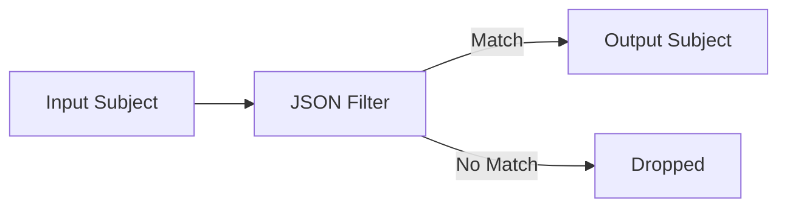

# JSON Filter Processor

Protocol-layer message filtering based on field values and comparison rules.

## Purpose

The JSON filter processor enables field-based filtering of GenericJSON messages using flexible comparison operators.
It evaluates filter rules against message data and publishes matching messages to output subjects, providing
pre-semantic data routing and volume reduction before expensive domain processing.

## Configuration

```yaml
type: json_filter
config:
  ports:
    inputs:
      - name: nats_input
        type: nats
        subject: sensor.raw
        interface: core .json.v1
        required: true
    outputs:
      - name: nats_output
        type: nats
        subject: sensor.filtered
        interface: core .json.v1
        required: true
  rules:
    - field: temperature
      operator: gte
      value: 30
    - field: status
      operator: eq
      value: active
```

### Configuration Fields

**ports** (required): Port configuration for input and output subjects

- **inputs**: Array of input port definitions (must use `core .json.v1` interface)
- **outputs**: Array of output port definitions (supports multiple outputs)

**rules** (required): Array of filter rules (evaluated as logical AND)

- **field**: Field name to check (string, required)
- **operator**: Comparison operator (enum, required)
- **value**: Comparison value (any type, required)

### Supported Operators

| Operator | Description | Example |
|----------|-------------|---------|
| `eq` | Equals | `{field: "status", operator: "eq", value: "active"}` |
| `ne` | Not equals | `{field: "status", operator: "ne", value: "inactive"}` |
| `gt` | Greater than | `{field: "temperature", operator: "gt", value: 100}` |
| `gte` | Greater than or equal | `{field: "altitude", operator: "gte", value: 1000}` |
| `lt` | Less than | `{field: "pressure", operator: "lt", value: 500}` |
| `lte` | Less than or equal | `{field: "humidity", operator: "lte", value: 80}` |
| `contains` | Substring match | `{field: "message", operator: "contains", value: "error"}` |

## Input/Output Ports

### Input Ports

**Type**: NATS or JetStream subscriptions

**Interface**: `core .json.v1` (GenericJSON messages only)

**Behavior**: Subscribes to configured subjects and evaluates filter rules against each message

### Output Ports

**Type**: NATS or JetStream publishers

**Interface**: `core .json.v1` (passes through GenericJSON messages)

**Behavior**: Publishes messages that match all filter rules to configured output subjects

### Message Flow



**Rule Evaluation**: All rules must match (AND logic) for a message to pass

**Non-matching Messages**: Dropped and logged at Debug level

## Example Use Cases

### High-Temperature Sensor Filtering

Filter sensor data to only process readings above critical thresholds:

```yaml
rules:
  - field: temperature
    operator: gte
    value: 30
  - field: sensor_type
    operator: eq
    value: thermocouple
```

**Input Message**:

```json
{
  "type": {"domain": "core", "category": "json", "version": "v1"},
  "payload": {
    "data": {
      "sensor_id": "temp-001",
      "temperature": 32.5,
      "sensor_type": "thermocouple",
      "location": "warehouse-a"
    }
  }
}
```

**Result**: Message passes (temperature >= 30 AND sensor_type == "thermocouple")

### Status-Based Message Routing

Route messages based on operational status:

```yaml
rules:
  - field: status
    operator: eq
    value: critical
  - field: priority
    operator: gte
    value: 5
```

**Use Case**: Separate critical high-priority messages for immediate processing

### Error Log Filtering

Filter log messages containing specific error patterns:

```yaml
rules:
  - field: level
    operator: eq
    value: error
  - field: message
    operator: contains
    value: connection
```

**Use Case**: Extract connection-related errors from application logs

### Multi-Condition Data Validation

Ensure data meets multiple validity criteria:

```yaml
rules:
  - field: altitude
    operator: gte
    value: 0
  - field: altitude
    operator: lte
    value: 10000
  - field: status
    operator: ne
    value: offline
```

**Use Case**: Filter out invalid or offline sensor readings before graph ingestion

## Performance Characteristics

**Throughput**: 10,000+ messages/second per processor instance

**Evaluation Complexity**: O(n) where n is the number of rules

**Field Lookup**: O(1) map lookup for direct field access

**Type Conversion**: Minimal overhead for primitive types

## Observability

### Metrics

The processor exposes Prometheus metrics:

- `json_filter_messages_processed_total`: Total messages received
- `json_filter_messages_passed_total`: Messages matching all rules
- `json_filter_messages_filtered_total`: Messages dropped
- `json_filter_evaluation_duration_seconds`: Rule evaluation latency
- `json_filter_errors_total`: Parsing and evaluation errors

### Health Status

Health checks report:

- **Healthy**: Processor is running and processing messages
- **ErrorCount**: Total errors encountered
- **Uptime**: Time since processor started

### Data Flow Metrics

Flow metrics include:

- **ErrorRate**: Ratio of errors to processed messages
- **LastActivity**: Timestamp of most recent message processing

## Limitations

**Current Version Constraints**:

- No support for nested field access (e.g., `position.lat`)
- No logical OR between rules (all rules are AND)
- No regular expression matching (only exact/substring matching)
- No custom comparison functions
- Field lookup is limited to top-level fields in the `data` object

## Related Documentation

- [Processor Design Philosophy](/docs/PROCESSOR-DESIGN-PHILOSOPHY.md)
- [GenericJSON Interface](/message/generic_json.go)
- [Component Port Configuration](/component/port.go)
