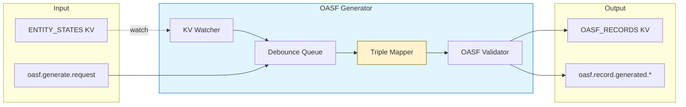
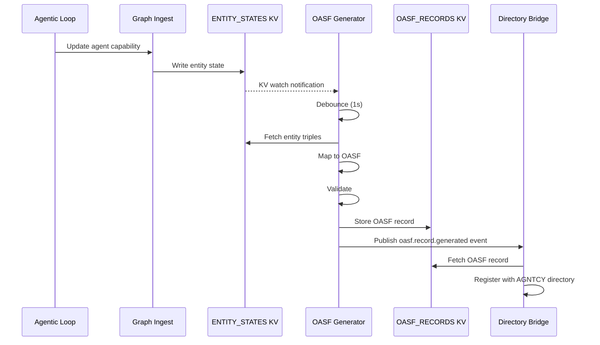

# OASF Generator

A SemStreams processor component that generates OASF (Open Agent Specification Framework) records from agent entity
capabilities stored in the knowledge graph. OASF is the standard format for describing agent capabilities in the AGNTCY
(Internet of Agents) ecosystem.

## Overview

The OASF generator bridges SemStreams' semantic knowledge graph to the AGNTCY directory infrastructure. It watches for
agent entity changes in the ENTITY_STATES KV bucket and automatically generates OASF records that can be used for
agent discovery and registration in federated agent directories.

### Key Features

- **Automatic Generation**: Watches entity state changes and generates OASF records on-demand
- **Debouncing**: Configurable debounce period prevents excessive regeneration during rapid updates
- **Semantic Mapping**: Maps SemStreams predicates to OASF fields using predefined mapping rules
- **Standards Compliance**: Generates OASF 1.0.0 compliant records with validation
- **Extensions Support**: Optional SemStreams-specific metadata for provenance tracking

## Architecture



### Component Flow

1. **Watch Phase**: Monitors ENTITY_STATES KV bucket for agent entity changes
2. **Debounce Phase**: Queues entities for generation with configurable delay to batch rapid updates
3. **Fetch Phase**: Retrieves entity triples from KV storage
4. **Filter Phase**: Skips entities without capability predicates (non-agent entities)
5. **Map Phase**: Converts SemStreams triples to OASF record structure
6. **Validate Phase**: Ensures generated record meets OASF schema requirements
7. **Store Phase**: Writes record to OASF_RECORDS KV bucket
8. **Publish Phase**: Emits generation event on `oasf.record.generated.*` subject

## Configuration

### Configuration Schema

```json
{
  "entity_kv_bucket": "ENTITY_STATES",
  "oasf_kv_bucket": "OASF_RECORDS",
  "watch_pattern": "*.agent.*",
  "generation_debounce": "1s",
  "default_agent_version": "1.0.0",
  "default_authors": ["system"],
  "include_extensions": true,
  "ports": {
    "inputs": [
      {
        "name": "entity_changes",
        "subject": "entity.state.>",
        "type": "kv-watch",
        "required": true,
        "description": "Watch for entity state changes via KV watch"
      },
      {
        "name": "generate_request",
        "subject": "oasf.generate.request",
        "type": "nats",
        "required": false,
        "description": "On-demand OASF generation requests"
      }
    ],
    "outputs": [
      {
        "name": "oasf_records",
        "subject": "oasf.record.generated.*",
        "type": "jetstream",
        "required": true,
        "description": "Generated OASF records"
      }
    ]
  }
}
```

### Configuration Options

| Option | Type | Default | Description |
|--------|------|---------|-------------|
| `entity_kv_bucket` | string | `ENTITY_STATES` | KV bucket to watch for entity state changes |
| `oasf_kv_bucket` | string | `OASF_RECORDS` | KV bucket to store generated OASF records |
| `watch_pattern` | string | `*` | Key pattern to watch (e.g., `*.agent.*` for agents only) |
| `generation_debounce` | duration | `1s` | Debounce period before generating after entity change |
| `default_agent_version` | string | `1.0.0` | Default semantic version when agent doesn't specify |
| `default_authors` | []string | `["system"]` | Default authors when not specified in entity metadata |
| `include_extensions` | bool | `true` | Include SemStreams-specific extensions in output |

## NATS Topology

### Input Resources

| Resource | Type | Pattern | Description |
|----------|------|---------|-------------|
| ENTITY_STATES | KV Bucket | `*` or custom | Watches for agent entity state changes |
| oasf.generate.request | Subject | - | Optional on-demand generation requests |

### Output Resources

| Resource | Type | Pattern | Description |
|----------|------|---------|-------------|
| OASF_RECORDS | KV Bucket | `<entity-id>` | Stores generated OASF records by entity ID |
| oasf.record.generated.* | Subject | `oasf.record.generated.<entity-id>` | Events published when records are generated |

### KV Storage Format

**ENTITY_STATES Bucket (Input)**

```json
{
  "id": "acme.ops.agentic.system.agent.architect",
  "triples": [
    {
      "subject": "acme.ops.agentic.system.agent.architect",
      "predicate": "agent.capability.name",
      "object": "Software Design",
      "context": "software-design",
      "source": "registration",
      "timestamp": "2024-01-15T10:30:00Z"
    }
  ],
  "updated_at": "2024-01-15T10:30:00Z"
}
```

**OASF_RECORDS Bucket (Output)**

```json
{
  "name": "agent-architect",
  "version": "1.0.0",
  "schema_version": "1.0.0",
  "authors": ["system"],
  "created_at": "2024-01-15T10:30:00Z",
  "description": "Designs software architecture",
  "skills": [
    {
      "id": "software-design",
      "name": "Software Design",
      "description": "Creates software architecture diagrams",
      "confidence": 0.95,
      "permissions": ["file_system_read"]
    }
  ],
  "domains": [
    {
      "name": "software-architecture"
    }
  ],
  "extensions": {
    "semstreams_entity_id": "acme.ops.agentic.system.agent.architect",
    "source": "semstreams"
  }
}
```

## Predicate Mapping

The generator maps SemStreams agentic vocabulary predicates to OASF fields using a two-pass algorithm that groups
related triples by context.

### Mapping Table

| SemStreams Predicate | OASF Field | Type | Notes |
|---------------------|------------|------|-------|
| `agent.capability.name` | `skills[].name` | string | Human-readable skill name |
| `agent.capability.description` | `skills[].description` | string | Detailed skill description |
| `agent.capability.expression` | `skills[].id` | string | Unique skill identifier |
| `agent.capability.confidence` | `skills[].confidence` | float64 | Self-assessed confidence (0.0-1.0) |
| `agent.capability.permission` | `skills[].permissions[]` | []string | Required permissions (can appear multiple times) |
| `agent.intent.goal` | `description` | string | Agent's primary purpose |
| `agent.intent.type` | `domains[].name` | string | Domain of operation |
| `agent.action.type` | `extensions.action_types[]` | []string | Action types (extension) |

### Context Grouping

Triples with the same `context` field are grouped together to form a single OASF skill. For example:

```go
// These triples share context "software-design" and form one skill
Triple{Predicate: "agent.capability.name", Object: "Software Design", Context: "software-design"}
Triple{Predicate: "agent.capability.expression", Object: "sw-design", Context: "software-design"}
Triple{Predicate: "agent.capability.confidence", Object: 0.95, Context: "software-design"}
```

Results in:

```json
{
  "id": "sw-design",
  "name": "Software Design",
  "confidence": 0.95
}
```

### Entity ID to Agent Name

The generator extracts a human-readable agent name from the 6-part federated entity ID:

```text
org.platform.domain.system.type.instance → type-instance

Example:
acme.ops.agentic.system.agent.architect → agent-architect
```

## Usage

### Flow Configuration

```yaml
components:
  - name: oasf-gen
    type: oasf-generator
    config:
      entity_kv_bucket: ENTITY_STATES
      oasf_kv_bucket: OASF_RECORDS
      watch_pattern: "*.agent.*"
      generation_debounce: "1s"
      include_extensions: true
```

### Programmatic Usage

```go
import (
    "context"
    "encoding/json"

    "github.com/c360studio/semstreams/component"
    oasfgen "github.com/c360studio/semstreams/processor/oasf-generator"
)

// Create component
config := oasfgen.DefaultConfig()
config.EntityKVBucket = "ENTITY_STATES"
config.OASFKVBucket = "OASF_RECORDS"

rawConfig, _ := json.Marshal(config)
comp, err := oasfgen.NewComponent(rawConfig, deps)
if err != nil {
    log.Fatal(err)
}

// Initialize and start
if err := comp.Initialize(); err != nil {
    log.Fatal(err)
}

ctx := context.Background()
if err := comp.Start(ctx); err != nil {
    log.Fatal(err)
}

// Component now watches for entity changes and generates OASF records
```

### On-Demand Generation

```go
// Manually trigger generation for a specific entity
entityID := "acme.ops.agentic.system.agent.architect"
if err := comp.GenerateForEntity(ctx, entityID); err != nil {
    log.Printf("Generation failed: %v", err)
}
```

## Testing

### Unit Tests

```bash
# Run unit tests
task test

# Run with race detection
task test:race

# Run specific package
go test ./processor/oasf-generator/...
```

### Integration Tests

The package includes integration tests that use testcontainers to spin up a real NATS JetStream instance:

```bash
# Run integration tests (requires Docker)
task test:integration

# Run only oasf-generator integration tests
go test -tags=integration ./processor/oasf-generator/... -v
```

### Test Coverage

Key test scenarios include:

- **Basic Capability Mapping**: Single skill with all fields
- **Multiple Skills**: Entities with multiple capabilities
- **Permission Aggregation**: Multiple permission triples grouped by context
- **Intent Mapping**: Goals and types to description and domains
- **Extension Handling**: SemStreams-specific metadata
- **Edge Cases**: Missing fields, invalid data, empty entities

### Example Test

```go
func TestMapper_MapTriplesToOASF_BasicCapability(t *testing.T) {
    mapper := NewMapper("1.0.0", []string{"system"}, true)

    agentID := "acme.ops.agentic.system.agent.architect"
    triples := []message.Triple{
        {
            Subject:   agentID,
            Predicate: agentic.CapabilityName,
            Object:    "Software Design",
            Context:   "software-design",
        },
        {
            Subject:   agentID,
            Predicate: agentic.CapabilityExpression,
            Object:    "software-design",
            Context:   "software-design",
        },
    }

    record, err := mapper.MapTriplesToOASF(agentID, triples)
    if err != nil {
        t.Fatalf("MapTriplesToOASF() error = %v", err)
    }

    if len(record.Skills) != 1 {
        t.Errorf("expected 1 skill, got %d", len(record.Skills))
    }
}
```

## OASF Record Structure

### Schema Version

The generator produces OASF 1.0.0 compliant records. The schema version is set automatically.

### Required Fields

- `name`: Agent name (extracted from entity ID)
- `version`: Semantic version (from config or entity metadata)
- `schema_version`: Always "1.0.0"
- `authors`: List of creators (from config or entity metadata)
- `created_at`: RFC-3339 timestamp
- `skills[].id`: Unique skill identifier
- `skills[].name`: Human-readable skill name

### Optional Fields

- `description`: Agent's purpose (from `agent.intent.goal`)
- `skills[].description`: Skill details
- `skills[].confidence`: Self-assessed confidence (0.0-1.0)
- `skills[].permissions[]`: Required permissions
- `domains[]`: Operating domains
- `extensions`: Provider-specific metadata

### Validation Rules

The generator validates all records before storage:

1. **Name**: Non-empty string
2. **Version**: Valid semantic version
3. **Skills**: At least one skill with ID and name
4. **Confidence**: Between 0.0 and 1.0 if specified
5. **Timestamps**: Valid RFC-3339 format

## Integration Points

### Upstream Components

- **Graph Ingest**: Writes entity states that trigger OASF generation
- **Agentic Loop**: Updates agent capabilities through graph operations
- **Rule Engine**: Can trigger entity state changes

### Downstream Components

- **Directory Bridge**: Consumes OASF records for AGNTCY directory registration
- **Identity Bridge**: Associates OASF records with DID identities
- **SLIM Gateway**: Includes OASF metadata in inter-agent messages

### Data Flow Example



## Performance Characteristics

### Debouncing

The generator uses time-based debouncing to batch rapid entity updates:

- **Default**: 1 second debounce
- **Behavior**: Multiple updates within debounce period trigger single generation
- **Trade-off**: Reduces processing load at cost of slight delay in record updates

### Concurrency

- **KV Watcher**: Single goroutine per component instance
- **Generation**: Sequential processing of queued entities
- **Thread-Safe**: All state access protected by mutexes

### Memory Usage

- **Pending Queue**: Minimal (map of entity IDs to timestamps)
- **Triples Cache**: No caching, fetched on-demand from KV
- **Record Size**: Typically < 5KB per OASF record

## Error Handling

### Non-Agent Entities

Entities without `agent.capability.*` predicates are silently skipped:

```go
// Logs debug message, does not generate OASF record
if !hasCapabilityPredicates(triples) {
    logger.Debug("Entity has no capability predicates, skipping")
    return nil
}
```

### Missing Entity States

If an entity is deleted between watch notification and fetch:

```go
// Returns nil error, does not block processing
if IsKVNotFoundError(err) {
    return nil
}
```

### Validation Failures

Invalid OASF records fail with detailed error:

```go
if err := record.Validate(); err != nil {
    return fmt.Errorf("validate OASF record: %w", err)
}
```

### Publication Failures

Event publication failures are logged but don't fail generation:

```go
if err := publishEvent(ctx, eventSubject, eventData); err != nil {
    logger.Warn("Failed to publish event", slog.Any("error", err))
    // Record still stored in KV, considered success
}
```

## Metrics

The component exposes Prometheus metrics through the SemStreams metrics registry:

- `semstreams_oasf_generator_entities_changed_total`: Counter of entity change notifications
- `semstreams_oasf_generator_records_generated_total`: Counter of successfully generated records
- `semstreams_oasf_generator_errors_total`: Counter of generation errors
- `semstreams_oasf_generator_generation_duration_seconds`: Histogram of generation time

## References

- **ADR-019**: [AGNTCY Integration Architecture Decision Record](/docs/architecture/adr-019-agntcy-integration.md)
- **OASF Spec**: [AGNTCY OASF Documentation](https://docs.agntcy.org/pages/syntaxes/oasf)
- **Agentic Vocabulary**: [SemStreams Agentic Predicates](/vocabulary/agentic/)
- **Entity ID Format**: [SemStreams Entity ID Specification](/docs/concepts/entity-id.md)

## See Also

- **Directory Bridge**: Component that registers OASF records with AGNTCY directories
- **Graph Ingest**: Upstream component that creates entity states
- **Payload Registry**: [Pattern documentation](/docs/concepts/15-payload-registry.md) for message serialization
